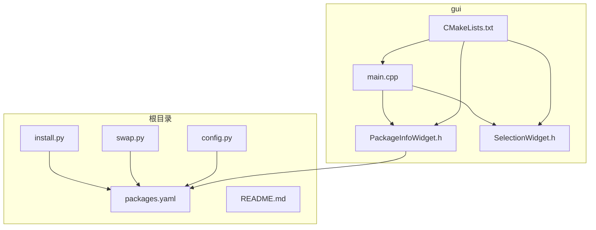
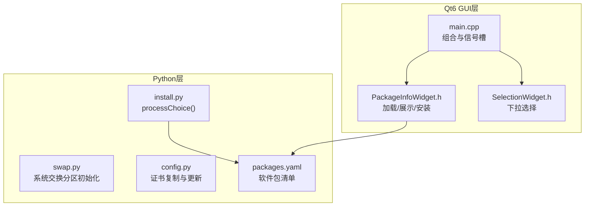
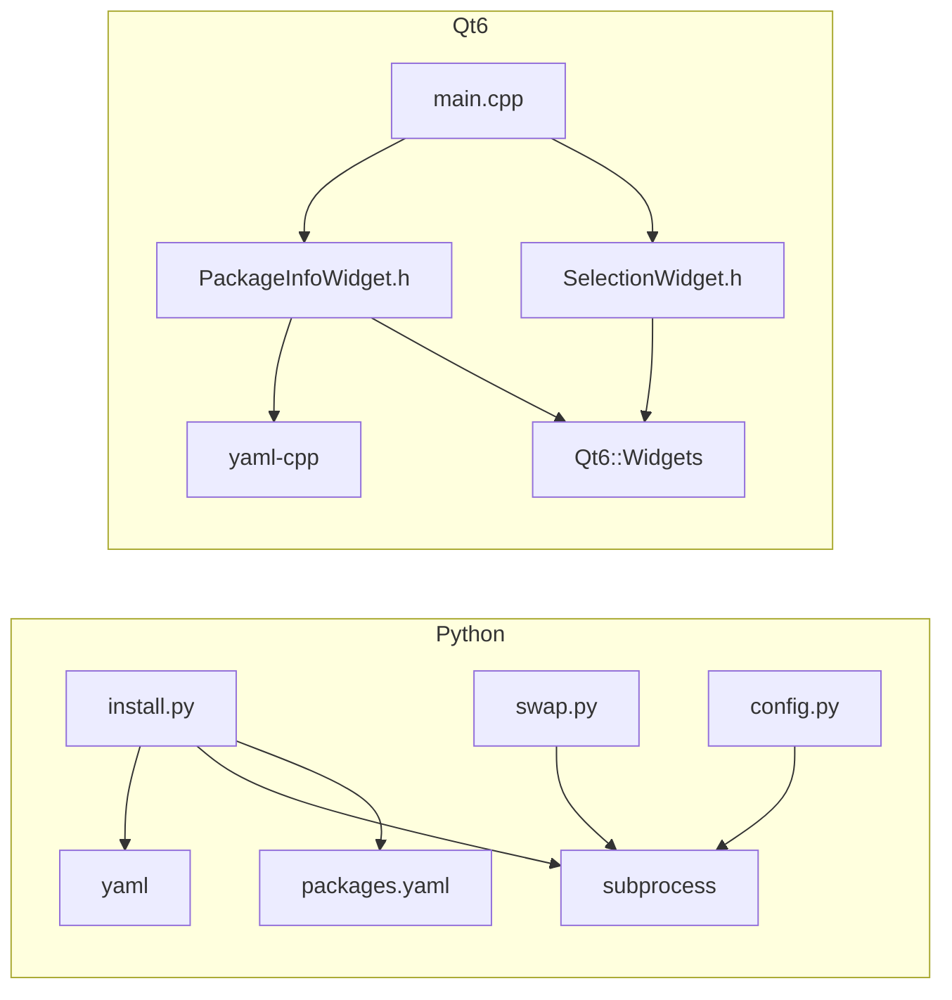

# API参考

<cite>
**本文档引用的文件**
- [config.py](file://config.py)
- [install.py](file://install.py)
- [swap.py](file://swap.py)
- [packages.yaml](file://packages.yaml)
- [README.md](file://README.md)
- [gui/main.cpp](file://gui/main.cpp)
- [gui/PackageInfoWidget.h](file://gui/PackageInfoWidget.h)
- [gui/SelectionWidget.h](file://gui/SelectionWidget.h)
- [gui/CMakeLists.txt](file://gui/CMakeLists.txt)
</cite>

## 目录
1. [简介](#简介)
2. [项目结构](#项目结构)
3. [核心组件](#核心组件)
4. [架构总览](#架构总览)
5. [详细组件分析](#详细组件分析)
6. [依赖分析](#依赖分析)
7. [性能考虑](#性能考虑)
8. [故障排查指南](#故障排查指南)
9. [结论](#结论)
10. [附录](#附录)

## 简介
本API参考文档面向Install项目，覆盖以下内容：
- Python脚本公共接口：install.py、swap.py、config.py中的函数与入口行为说明（含参数、返回值、异常处理与使用示例）
- Qt6 GUI组件公共接口：PackageInfoWidget、SelectionWidget、MainWindow的信号槽机制与事件处理方法
- 完整API使用示例与集成指南
- 错误码定义与调试信息

本项目提供两类能力：
- 命令行安装流程：通过packages.yaml配置选择安装软件包或执行配置命令
- Qt6图形界面：展示软件包信息、选择软件包并执行安装命令，同时实时输出标准输出与错误流

## 项目结构
项目采用分层组织方式：
- 根目录：Python安装逻辑与配置脚本
- gui子目录：Qt6 GUI应用源码与构建配置
- packages.yaml：软件包清单与配置

图表来源
- [install.py:1-36](file://install.py#L1-L36)
- [swap.py:1-10](file://swap.py#L1-L10)
- [config.py:1-8](file://config.py#L1-L8)
- [packages.yaml:1-50](file://packages.yaml#L1-L50)
- [gui/main.cpp:1-73](file://gui/main.cpp#L1-L73)
- [gui/PackageInfoWidget.h:1-145](file://gui/PackageInfoWidget.h#L1-L145)
- [gui/SelectionWidget.h:1-40](file://gui/SelectionWidget.h#L1-L40)
- [gui/CMakeLists.txt:1-26](file://gui/CMakeLists.txt#L1-L26)

章节来源
- [README.md:1-7](file://README.md#L1-L7)
- [packages.yaml:1-50](file://packages.yaml#L1-L50)

## 核心组件
本节概述Python脚本与Qt6 GUI组件的公共接口与职责。

- install.py
  - 负责解析packages.yaml并根据用户选择执行安装或配置命令
  - 提供processChoice(selection)用于处理不同类型的安装任务
  - 提供命令行交互菜单，支持循环选择直至退出

- swap.py
  - 提供系统交换分区初始化与启用的自动化流程
  - 以命令行入口直接运行

- config.py
  - 提供证书复制与系统证书更新的自动化流程
  - 以命令行入口直接运行

- Qt6 GUI组件
  - PackageInfoWidget：加载packages.yaml，展示软件包信息，触发安装命令并输出结果
  - SelectionWidget：提供下拉选项选择器，支持当前选项变更事件
  - MainWindow：组合多个SelectionWidget与按钮，连接信号槽并执行命令

章节来源
- [install.py:1-36](file://install.py#L1-L36)
- [swap.py:1-10](file://swap.py#L1-L10)
- [config.py:1-8](file://config.py#L1-L8)
- [gui/PackageInfoWidget.h:1-145](file://gui/PackageInfoWidget.h#L1-L145)
- [gui/SelectionWidget.h:1-40](file://gui/SelectionWidget.h#L1-L40)
- [gui/main.cpp:1-73](file://gui/main.cpp#L1-L73)

## 架构总览
整体架构由Python安装逻辑与Qt6 GUI两部分组成，二者共享packages.yaml作为数据源。

图表来源
- [install.py:1-36](file://install.py#L1-L36)
- [swap.py:1-10](file://swap.py#L1-L10)
- [config.py:1-8](file://config.py#L1-L8)
- [packages.yaml:1-50](file://packages.yaml#L1-L50)
- [gui/PackageInfoWidget.h:1-145](file://gui/PackageInfoWidget.h#L1-L145)
- [gui/SelectionWidget.h:1-40](file://gui/SelectionWidget.h#L1-L40)
- [gui/main.cpp:1-73](file://gui/main.cpp#L1-L73)

## 详细组件分析

### Python安装模块 install.py
- 模块作用
  - 解析packages.yaml，构建交互式菜单
  - 根据selection类型执行git下载安装或执行配置命令列表
  - 提供命令行交互入口

- 公共函数
  - processChoice(selection)
    - 参数
      - selection: dict，包含键值对：type、name、url、version、cmd等
    - 返回值
      - 无返回值；通过系统调用执行安装或配置命令
    - 异常处理
      - 不支持的类型时打印提示信息
    - 使用示例
      - 参考命令行入口，读取packages.yaml后逐项处理

- 命令行入口
  - 读取packages.yaml并构建菜单字典
  - 循环输出菜单并接收用户输入
  - 输入0退出；其他输入对应选择并调用processChoice

- 复杂度与性能
  - 菜单构建与遍历为线性复杂度
  - 子进程调用为I/O密集型，受网络与系统资源影响

- 错误与调试
  - 类型校验失败时输出提示
  - 子进程调用未显式捕获异常，建议在生产环境增加try/except与日志记录

章节来源
- [install.py:1-36](file://install.py#L1-L36)
- [packages.yaml:1-50](file://packages.yaml#L1-L50)

### 交换分区模块 swap.py
- 模块作用
  - 自动创建并启用交换分区文件，写入fstab以开机自动挂载

- 命令行入口
  - 执行以下步骤：创建目录、dd生成文件、设置权限、格式化、启用、写入fstab
  - 默认大小为16G

- 参数与返回值
  - 无显式函数；以入口脚本形式运行

- 异常处理
  - 未进行显式异常处理；建议在生产环境增加权限检查与错误回滚

- 使用示例
  - python swap.py

- 错误与调试
  - 建议在关键步骤前后输出调试信息，并对权限不足与磁盘空间不足等情况进行处理

章节来源
- [swap.py:1-10](file://swap.py#L1-L10)
- [README.md:4-7](file://README.md#L4-L7)

### 证书配置模块 config.py
- 模块作用
  - 复制开发证书到系统证书目录并更新系统信任

- 命令行入口
  - 执行证书复制与系统证书更新命令

- 参数与返回值
  - 无显式函数；以入口脚本形式运行

- 异常处理
  - 未进行显式异常处理；建议增加权限与路径存在性检查

- 使用示例
  - python config.py

- 错误与调试
  - 建议输出每一步执行状态与错误信息

章节来源
- [config.py:1-8](file://config.py#L1-L8)

### Qt6 GUI组件 PackageInfoWidget
- 组件作用
  - 加载packages.yaml并展示软件包详情
  - 提供“选择软件包”与“安装”按钮
  - 启动命令并实时输出标准输出与错误流，显示进程完成状态

- 公共接口
  - 构造函数
    - 参数：parent（可选）
    - 行为：初始化布局、标题、文本框、按钮并连接信号槽
  - loadPackageInfo()
    - 行为：从packages.yaml读取并解析YAML，填充包名与详情映射
    - 返回值：bool，成功返回true，失败弹出错误对话框并返回false
    - 异常处理：捕获YAML解析异常并弹出错误对话框
  - showPackageSelection()
    - 行为：弹出输入对话框选择软件包，更新按钮文本与详情显示
    - 返回值：void
  - updatePackageInfo(packageName)
    - 参数：packageName（字符串）
    - 行为：根据包名更新文本框内容
    - 返回值：void
  - runCommand()
    - 行为：启动QProcess执行命令，连接标准输出/错误槽与完成槽
    - 返回值：void
  - onReadyReadStandardOutput()
    - 行为：读取标准输出并追加到文本框
    - 返回值：void
  - onReadyReadStandardError()
    - 行为：读取标准错误并追加到文本框
    - 返回值：void
  - onFinished(exitCode, exitStatus)
    - 行为：在文本框中追加完成信息
    - 返回值：void

- 信号槽机制
  - QPushButton::clicked -> showPackageSelection()/runCommand()
  - QProcess::readyReadStandardOutput -> onReadyReadStandardOutput()
  - QProcess::readyReadStandardError -> onReadyReadStandardError()
  - QProcess::finished -> onFinished()

- 事件处理
  - 构造阶段：初始化UI与连接信号槽
  - 用户点击：触发选择或安装流程
  - 进程事件：实时输出与完成状态

- 复杂度与性能
  - YAML解析与文本更新为线性复杂度
  - QProcess I/O为异步事件驱动

- 错误与调试
  - 文件打开失败与YAML解析异常均弹出错误对话框
  - 使用qDebug输出调试信息

章节来源
- [gui/PackageInfoWidget.h:1-145](file://gui/PackageInfoWidget.h#L1-L145)

### Qt6 GUI组件 SelectionWidget
- 组件作用
  - 提供下拉选项选择器，支持设置选项列表与获取当前选中项

- 公共接口
  - 构造函数
    - 参数：parent（可选）
    - 行为：初始化布局与QComboBox，连接currentIndexChanged信号到槽函数
  - setOptions(options)
    - 参数：options（QStringList）
    - 行为：清空并添加选项
    - 返回值：void
  - getSelectedOption()
    - 行为：返回当前选中项
    - 返回值：QString

- 信号槽机制
  - QComboBox::currentIndexChanged -> onOptionChanged(index)

- 事件处理
  - 用户选择变化时输出选中项并可扩展为发出自定义信号

- 复杂度与性能
  - 选项设置与查询为O(n)与O(1)操作

- 错误与调试
  - 当前未进行显式错误处理；可在构造阶段检查父对象有效性

章节来源
- [gui/SelectionWidget.h:1-40](file://gui/SelectionWidget.h#L1-L40)

### Qt6 GUI组件 MainWindow
- 组件作用
  - 组合四个SelectionWidget与一个按钮，连接按钮点击信号到runCommand槽
  - 启动QProcess执行示例命令并输出调试信息

- 公共接口
  - 构造函数
    - 行为：创建四个SelectionWidget实例，设置选项列表，添加到布局，创建按钮并连接信号槽
  - runCommand()
    - 行为：创建QProcess并启动示例命令，等待启动结果并输出调试信息
    - 返回值：void

- 信号槽机制
  - QPushButton::clicked -> MainWindow::runCommand()

- 事件处理
  - 按钮点击：启动命令并输出调试信息

- 复杂度与性能
  - 事件处理为O(1)，命令执行为I/O密集型

- 错误与调试
  - 对进程启动失败进行调试输出

章节来源
- [gui/main.cpp:1-73](file://gui/main.cpp#L1-L73)

### 数据模型 packages.yaml
- 结构说明
  - 根节点为字典，键为软件包名称，值包含type、name、des、url、version等字段
  - 支持两种安装类型：git与config
  - config类型包含命令列表cmd

- 字段定义
  - type: 字符串，安装类型（git/config/wget）
  - name: 字符串，软件包文件名
  - des: 字符串，描述
  - url: 字符串，下载地址或仓库地址
  - version: 字符串，版本号
  - cmd: 列表，配置命令集合

- 使用示例
  - Python侧通过yaml.load读取并遍历
  - Qt侧通过yaml-cpp解析并展示详情

- 错误与调试
  - YAML解析异常需捕获并提示
  - 文件不存在或不可读需提示

章节来源
- [packages.yaml:1-50](file://packages.yaml#L1-L50)

## 依赖分析
- Python层
  - install.py依赖yaml与subprocess
  - swap.py与config.py依赖subprocess
  - 三者均依赖packages.yaml

- Qt6层
  - main.cpp依赖PackageInfoWidget与SelectionWidget
  - PackageInfoWidget依赖yaml-cpp与QProcess
  - CMakeLists.txt配置Qt6 Widgets与yaml-cpp链接

图表来源
- [install.py:1-36](file://install.py#L1-L36)
- [swap.py:1-10](file://swap.py#L1-L10)
- [config.py:1-8](file://config.py#L1-L8)
- [packages.yaml:1-50](file://packages.yaml#L1-L50)
- [gui/main.cpp:1-73](file://gui/main.cpp#L1-L73)
- [gui/PackageInfoWidget.h:1-145](file://gui/PackageInfoWidget.h#L1-L145)
- [gui/SelectionWidget.h:1-40](file://gui/SelectionWidget.h#L1-L40)
- [gui/CMakeLists.txt:1-26](file://gui/CMakeLists.txt#L1-L26)

章节来源
- [gui/CMakeLists.txt:1-26](file://gui/CMakeLists.txt#L1-L26)

## 性能考虑
- Python安装流程
  - I/O瓶颈主要来自网络下载与apt安装，建议在生产环境增加超时与重试策略
  - 子进程调用应避免阻塞主线程，可考虑异步执行

- Qt6 GUI
  - QProcess异步读取标准输出与错误，避免阻塞UI线程
  - YAML解析在构造阶段一次性完成，后续仅进行文本更新

- 资源管理
  - 建议在Python侧对subprocess调用增加超时与错误码处理
  - Qt侧对QProcess生命周期进行管理，避免内存泄漏

## 故障排查指南
- Python安装流程
  - packages.yaml格式错误：检查YAML语法与字段完整性
  - 权限不足：确认sudo权限与网络访问
  - 下载失败：检查url与网络连通性
  - apt安装失败：查看系统日志与依赖冲突

- Qt6 GUI
  - 文件无法打开：确认packages.yaml路径正确且可读
  - YAML解析异常：检查YAML内容与编码
  - QProcess启动失败：检查命令是否存在与权限
  - 输出乱码：确保UTF-8编码与终端支持

- 常见错误码与含义
  - 0：成功
  - 非0：失败（具体取决于子进程返回码）

- 调试建议
  - 在关键位置输出qDebug或print信息
  - 对异常进行捕获并记录堆栈
  - 使用最小化复现步骤定位问题

章节来源
- [install.py:1-36](file://install.py#L1-L36)
- [gui/PackageInfoWidget.h:1-145](file://gui/PackageInfoWidget.h#L1-L145)
- [gui/main.cpp:1-73](file://gui/main.cpp#L1-L73)

## 结论
本API参考文档梳理了Install项目的Python安装逻辑与Qt6 GUI组件，明确了各模块的公共接口、信号槽机制与事件处理方法，并提供了使用示例与故障排查建议。建议在生产环境中增强异常处理、权限检查与日志记录，以提升稳定性与可观测性。

## 附录
- 集成指南
  - Python安装流程：确保已安装python3、yaml与subprocess可用，准备packages.yaml
  - Qt6 GUI：确保已安装Qt6 Widgets与yaml-cpp，使用CMake编译并安装目标
  - 交换分区：以root权限运行swap.py
  - 证书配置：确保证书文件存在并以root权限运行config.py

- API使用示例
  - Python安装：运行install.py，按提示选择软件包
  - Qt6 GUI：编译并运行gui工程，点击按钮执行命令
  - 交换分区：运行swap.py
  - 证书配置：运行config.py

- 参考文件
  - [packages.yaml:1-50](file://packages.yaml#L1-L50)
  - [README.md:1-7](file://README.md#L1-L7)