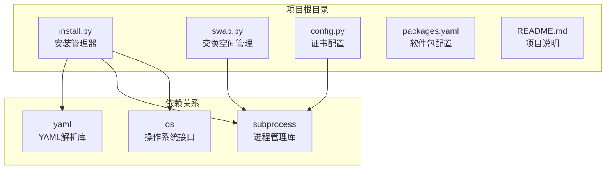
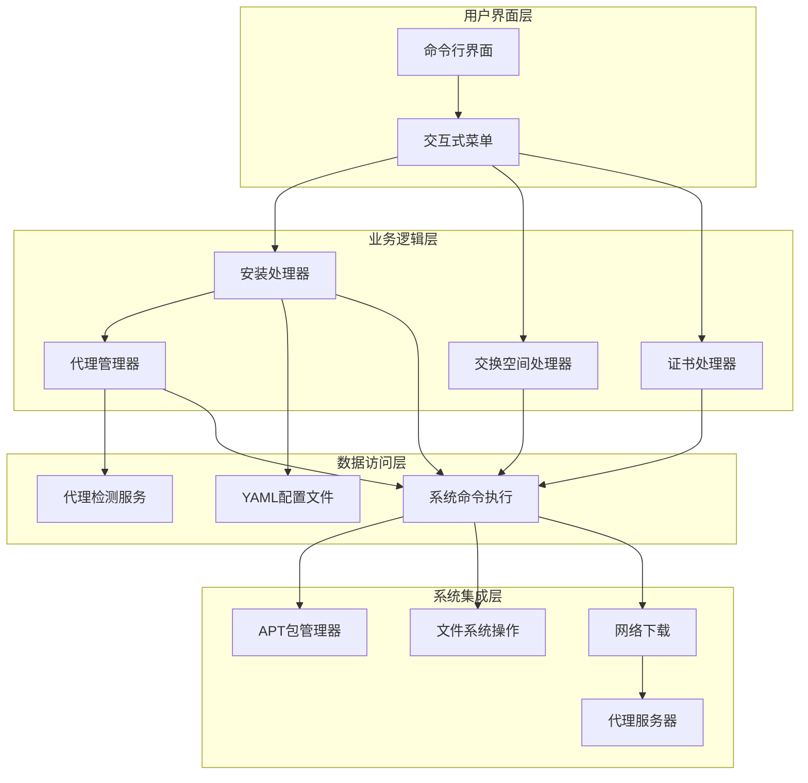
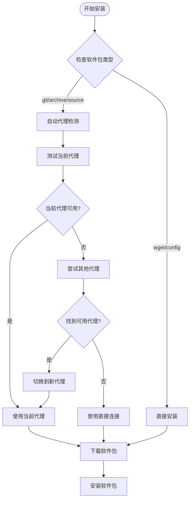
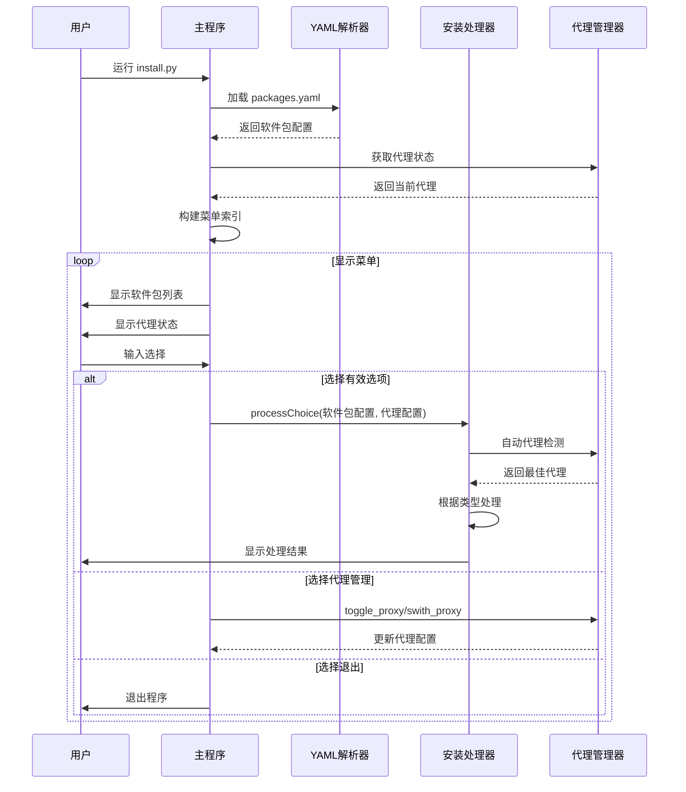
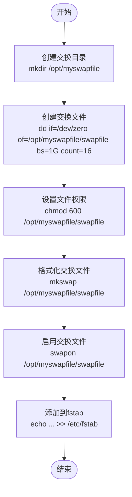
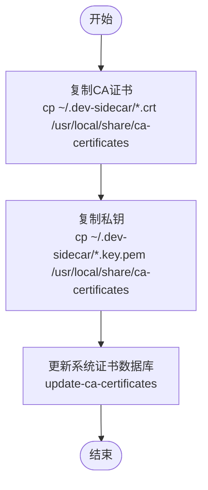
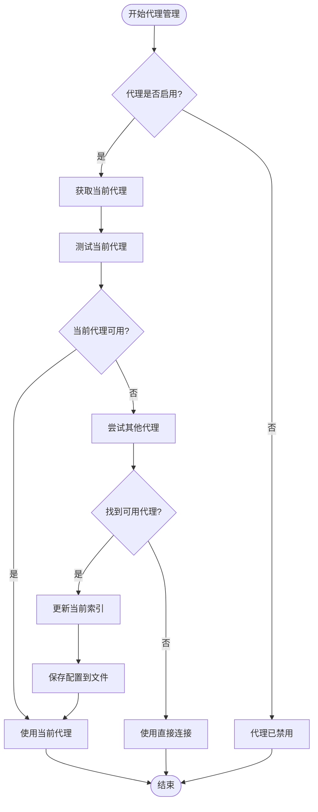
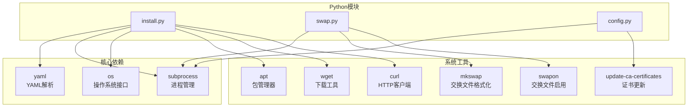

# Python API参考文档

<cite>
**本文档中引用的文件**
- [install.py](file://install.py)
- [swap.py](file://swap.py)
- [config.py](file://config.py)
- [packages.yaml](file://packages.yaml)
- [README.md](file://README.md)
</cite>

## 更新摘要
**变更内容**
- 新增代理管理API函数章节，包含代理检测、自动切换、手动选择等核心功能
- 更新processChoice函数文档，增加代理自动切换机制说明
- 新增代理配置结构和使用示例
- 扩展软件包类型支持，包括wget、archive、source类型

## 目录
1. [简介](#简介)
2. [项目结构](#项目结构)
3. [核心组件](#核心组件)
4. [架构概览](#架构概览)
5. [详细组件分析](#详细组件分析)
6. [代理管理API](#代理管理api)
7. [依赖分析](#依赖分析)
8. [性能考虑](#性能考虑)
9. [故障排除指南](#故障排除指南)
10. [结论](#结论)

## 简介

本项目是一个用于系统工具一键安装的Python脚本集合，主要包含三个核心模块：`install.py`、`swap.py`和`config.py`。该项目提供了以下功能：

- **安装管理器** (`install.py`): 支持从GitHub下载二进制包或直接下载URL链接的软件包，并自动安装到系统中
- **交换空间管理** (`swap.py`): 创建和启用16GB的交换文件，提高系统内存管理能力
- **证书配置** (`config.py`): 配置开发环境所需的CA证书

**更新** 新增完整的代理管理系统，支持代理检测、自动切换、手动选择等功能，提供多代理源的智能路由能力。

## 项目结构

项目采用简单的模块化设计，每个Python文件都是独立的可执行脚本：



**图表来源**
- [install.py:1-329](file://install.py#L1-L329)
- [swap.py:1-10](file://swap.py#L1-L10)
- [config.py:1-8](file://config.py#L1-L8)

**章节来源**
- [install.py:1-329](file://install.py#L1-L329)
- [swap.py:1-10](file://swap.py#L1-L10)
- [config.py:1-8](file://config.py#L1-L8)
- [packages.yaml:1-74](file://packages.yaml#L1-L74)

## 核心组件

### 安装管理器 (install.py)

安装管理器是项目的核心组件，负责处理各种类型的软件包安装任务。它提供了统一的接口来处理不同来源的软件包，并集成了智能代理管理功能。

**主要功能特性**:
- 支持GitHub托管的二进制包安装
- 支持直接URL链接的软件包下载
- 提供交互式菜单选择界面
- 自动处理软件包依赖和安装
- **智能代理管理**: 自动检测和切换代理，提高下载成功率

**更新** 新增对wget、archive、source等多种软件包类型的完整支持，以及智能代理切换机制。

**章节来源**
- [install.py:107-229](file://install.py#L107-L229)
- [install.py:293-329](file://install.py#L293-L329)

### 交换空间管理器 (swap.py)

交换空间管理器专门用于创建和配置系统的交换文件，以增强内存管理能力。

**主要功能**:
- 创建16GB大小的交换文件
- 配置适当的权限和格式化
- 启用交换文件并写入fstab配置

**章节来源**
- [swap.py:3-10](file://swap.py#L3-L10)

### 证书配置器 (config.py)

证书配置器用于配置开发环境中所需的CA证书，确保HTTPS连接的安全性。

**主要功能**:
- 复制自定义CA证书到系统证书目录
- 更新系统证书数据库
- 支持开发环境的SSL/TLS配置

**章节来源**
- [config.py:3-7](file://config.py#L3-L7)

## 架构概览

项目采用模块化架构，每个组件都有明确的职责分工，其中安装管理器集成了智能代理管理功能：



**图表来源**
- [install.py:107-229](file://install.py#L107-L229)
- [install.py:232-274](file://install.py#L232-L274)
- [swap.py:3-10](file://swap.py#L3-L10)
- [config.py:3-7](file://config.py#L3-L7)

## 详细组件分析

### processChoice 函数详解

`processChoice` 是安装管理器的核心函数，负责根据软件包类型执行相应的安装逻辑，并集成了智能代理管理功能。

#### 函数签名
```python
def processChoice(selection, dic):
```

#### 参数结构

**selection 字典**支持多种软件包类型：

**Git类型软件包结构**:
| 字段名 | 类型 | 必需 | 描述 |
|--------|------|------|------|
| `type` | string | 是 | 软件包类型，必须为 'git' |
| `name` | string | 是 | 软件包文件名 |
| `url` | string | 是 | GitHub仓库URL |
| `version` | string | 是 | 版本号 |

**Wget类型软件包结构**:
| 字段名 | 类型 | 必需 | 描述 |
|--------|------|------|------|
| `type` | string | 是 | 软件包类型，必须为 'wget' |
| `des` | string | 是 | 描述信息 |
| `url` | string | 是 | 直接下载URL |

**Config类型软件包结构**:
| 字段名 | 类型 | 必需 | 描述 |
|--------|------|------|------|
| `type` | string | 是 | 软件包类型，必须为 'config' |
| `des` | string | 是 | 描述信息 |
| `cmd` | list | 是 | 要执行的命令列表 |

**Archive类型软件包结构**:
| 字段名 | 类型 | 必需 | 描述 |
|--------|------|------|------|
| `type` | string | 是 | 软件包类型，必须为 'archive' |
| `name` | string | 是 | 压缩包文件名 |
| `url` | string | 是 | GitHub仓库URL |
| `version` | string | 是 | 版本号 |
| `install_path` | string | 否 | 安装路径，默认为 '/opt' |
| `setup_cmd` | string | 否 | 环境配置命令 |

**Source类型软件包结构**:
| 字段名 | 类型 | 必需 | 描述 |
|--------|------|------|------|
| `type` | string | 是 | 软件包类型，必须为 'source' |
| `des` | string | 是 | 描述信息 |
| `workspace` | string | 否 | 工作空间路径，默认为 '~/source_build' |
| `repos_url` | string | 是 | 源码仓库URL |
| `setup_cmd` | string | 否 | 环境配置命令 |

**更新** 新增对wget、archive、source三种软件包类型的支持，以及智能代理自动切换机制。

**章节来源**
- [install.py:107-229](file://install.py#L107-L229)
- [packages.yaml:18-74](file://packages.yaml#L18-L74)

#### 支持的软件包类型

1. **Git类型** (`type: 'git'`)
   - 从GitHub releases页面下载指定版本的二进制包
   - 自动安装到系统中
   - 支持版本控制和源码管理

2. **Wget类型** (`type: 'wget'`)
   - 直接从指定URL下载软件包
   - 适用于非GitHub托管的软件包
   - 支持直接的HTTP/HTTPS下载

3. **Config类型** (`type: 'config'`)
   - 执行预定义的系统配置命令
   - 支持多条命令的批量执行
   - 适用于系统设置和配置修改

4. **Archive类型** (`type: 'archive'`)
   - 下载压缩包并自动解压
   - 支持tar.bz2格式的ROS2等大型软件包
   - 可自定义安装路径

5. **Source类型** (`type: 'source'`)
   - 完整的源码编译安装流程
   - 包含系统设置、依赖安装、编译等步骤
   - 适用于ROS2等需要源码编译的软件

#### 代理自动切换机制

对于git、archive和source类型的软件包，`processChoice`函数会自动执行代理检测和切换：



**图表来源**
- [install.py:107-114](file://install.py#L107-L114)
- [install.py:56-94](file://install.py#L56-L94)

#### 返回值
- **返回类型**: `None`
- **行为**: 直接执行系统命令，不返回任何值
- **副作用**: 修改系统状态（安装软件包、执行配置命令）

#### 异常处理机制

当前实现的异常处理相对简单：
- 不支持的类型会输出错误信息但不会抛出异常
- 系统命令执行失败时不会进行错误捕获
- 缺乏详细的错误日志记录
- **代理检测失败时会回退到直接连接模式**

**章节来源**
- [install.py:107-229](file://install.py#L107-L229)

### 命令行入口点工作流程

安装管理器的命令行入口点提供了完整的交互式安装体验，集成了代理管理功能：



**图表来源**
- [install.py:293-329](file://install.py#L293-L329)
- [install.py:232-274](file://install.py#L232-L274)

#### 参数处理流程

1. **配置文件加载**: 从 `packages.yaml` 读取软件包配置和代理配置
2. **代理状态获取**: 通过 `show_proxy_status` 获取当前代理状态
3. **菜单构建**: 将配置转换为用户友好的菜单格式
4. **用户输入**: 接收用户的数字选择或特殊命令
5. **代理管理**: 支持代理开关切换和手动选择
6. **安装执行**: 调用 `processChoice` 处理安装，自动集成代理管理

**章节来源**
- [install.py:293-329](file://install.py#L293-L329)

### 交换空间管理器详细分析

交换空间管理器提供了简化的交换文件管理功能：



**图表来源**
- [swap.py:3-10](file://swap.py#L3-L10)

#### 功能特性
- **自动创建**: 一次性创建完整的交换文件系统
- **持久化配置**: 将交换文件添加到 `/etc/fstab` 实现开机自动挂载
- **权限管理**: 正确设置交换文件的访问权限

**章节来源**
- [swap.py:3-10](file://swap.py#L3-L10)

### 证书配置器详细分析

证书配置器专注于开发环境的SSL/TLS配置：



**图表来源**
- [config.py:3-7](file://config.py#L3-L7)

#### 配置流程
1. **证书复制**: 将自定义CA证书复制到系统证书目录
2. **权限设置**: 确保证书文件具有正确的访问权限
3. **数据库更新**: 更新系统的证书信任数据库

**章节来源**
- [config.py:3-7](file://config.py#L3-L7)

## 代理管理API

**新增** 项目集成了完整的代理管理系统，提供以下核心API函数：

### 代理配置结构

代理配置存储在 `packages.yaml` 文件的 `proxy` 部分：

```yaml
proxy:
  enabled: true          # 代理是否启用
  current_index: 4       # 当前使用的代理索引
  urls:                  # 代理URL列表
    - ""                 # 直接连接（空字符串）
    - https://gh-proxy.com/
    - https://v6.gh-proxy.org/
    - https://fastly.gh-proxy.com/
    - https://edgeone.gh-proxy.com/
    - https://ghproxy.cn/
    # ... 更多代理URL
```

### 核心代理管理函数

#### get_current_proxy 函数

获取当前激活的代理URL。

**函数签名**
```python
def get_current_proxy(dic):
```

**参数**
- `dic`: 完整的配置字典，包含代理配置

**返回值**
- `string`: 当前代理URL，如果未启用代理则返回空字符串

**使用示例**
```python
# 获取当前代理
current_proxy = get_current_proxy(config_dict)
print(f"当前代理: {current_proxy}")
```

**章节来源**
- [install.py:7-16](file://install.py#L7-L16)

#### get_all_proxies 函数

获取所有可用的代理URL列表。

**函数签名**
```python
def get_all_proxies(dic):
```

**参数**
- `dic`: 完整的配置字典，包含代理配置

**返回值**
- `list`: 包含所有代理URL的列表，包括直接连接选项

**使用示例**
```python
# 获取所有代理
all_proxies = get_all_proxies(config_dict)
for i, proxy in enumerate(all_proxies):
    print(f"{i}: {proxy if proxy else '直接连接'}")
```

**章节来源**
- [install.py:19-23](file://install.py#L19-L23)

#### test_proxy 函数

测试指定代理是否可用，优先使用wget进行连接测试。

**函数签名**
```python
def test_proxy(proxy_url, test_url="https://github.com"):
```

**参数**
- `proxy_url`: 要测试的代理URL
- `test_url`: 测试连接的目标URL，默认为GitHub

**返回值**
- `bool`: 如果代理可用返回True，否则返回False

**异常处理**
- 捕获并处理子进程执行异常
- 支持wget和curl两种测试方式
- 超时时间为10秒（wget）和15秒（curl）

**使用示例**
```python
# 测试代理可用性
is_available = test_proxy("https://gh-proxy.com/")
if is_available:
    print("代理可用")
else:
    print("代理不可用")
```

**章节来源**
- [install.py:26-53](file://install.py#L26-L53)

#### find_working_proxy 函数

自动寻找可用的代理，支持从当前代理开始轮询所有代理。

**函数签名**
```python
def find_working_proxy(dic, selection):
```

**参数**
- `dic`: 完整的配置字典
- `selection`: 当前要安装的软件包配置

**返回值**
- `string`: 可用的代理URL，如果都不可用则返回空字符串

**功能特性**
- 检测代理是否启用
- 根据软件包类型选择合适的测试URL
- 支持从当前代理开始的循环检测
- 自动更新配置文件中的当前代理索引

**使用示例**
```python
# 寻找可用代理
working_proxy = find_working_proxy(config_dict, package_selection)
if working_proxy:
    print(f"找到可用代理: {working_proxy}")
else:
    print("没有可用代理，使用直接连接")
```

**章节来源**
- [install.py:56-94](file://install.py#L56-L94)

#### toggle_proxy 函数

切换代理的启用状态。

**函数签名**
```python
def toggle_proxy(dic):
```

**参数**
- `dic`: 完整的配置字典

**返回值**
- `dict`: 更新后的配置字典

**功能特性**
- 切换代理的enabled标志
- 自动更新packages.yaml文件
- 提供状态反馈信息

**使用示例**
```python
# 切换代理状态
config_dict = toggle_proxy(config_dict)
```

**章节来源**
- [install.py:232-244](file://install.py#L232-L244)

#### switch_proxy 函数

手动切换代理，提供交互式代理选择界面。

**函数签名**
```python
def switch_proxy(dic):
```

**参数**
- `dic`: 完整的配置字典

**返回值**
- `dict`: 更新后的配置字典

**功能特性**
- 显示所有可用代理列表
- 支持交互式选择
- 验证用户输入的有效性
- 自动更新配置文件

**使用示例**
```python
# 手动切换代理
config_dict = switch_proxy(config_dict)
```

**章节来源**
- [install.py:247-274](file://install.py#L247-L274)

#### show_proxy_status 函数

显示当前代理状态的友好格式。

**函数签名**
```python
def show_proxy_status(dic):
```

**参数**
- `dic`: 完整的配置字典

**返回值**
- `string`: 人类可读的代理状态描述

**功能特性**
- 检测代理启用状态
- 格式化显示当前代理
- 支持直接连接的特殊显示

**使用示例**
```python
# 显示代理状态
status = show_proxy_status(config_dict)
print(f"当前代理: {status}")
```

**章节来源**
- [install.py:277-291](file://install.py#L277-L291)

### 代理管理工作流程



**图表来源**
- [install.py:56-94](file://install.py#L56-L94)
- [install.py:232-244](file://install.py#L232-L244)
- [install.py:247-274](file://install.py#L247-L274)

## 依赖分析

项目依赖关系相对简单，主要依赖于标准库和系统工具：



**图表来源**
- [install.py:1-4](file://install.py#L1-L4)
- [swap.py:1](file://swap.py#L1)
- [config.py:1](file://config.py#L1)

### 外部依赖

| 模块 | 用途 | 版本要求 |
|------|------|----------|
| `yaml` | 解析YAML配置文件 | 任意版本 |
| `subprocess` | 执行系统命令 | Python标准库 |
| `os` | 文件系统操作 | Python标准库 |
| `wget` | HTTP下载工具 | 系统安装 |
| `curl` | HTTP客户端 | 系统安装 |

**章节来源**
- [install.py:1-4](file://install.py#L1-L4)
- [swap.py:1](file://swap.py#L1)
- [config.py:1](file://config.py#L1)

## 性能考虑

### 内存使用优化
- **流式处理**: 使用 `yaml.load()` 直接解析配置文件，避免不必要的内存占用
- **按需执行**: 只在需要时执行系统命令，减少资源消耗
- **代理缓存**: 代理状态在内存中缓存，避免重复文件读取

### 网络性能
- **智能代理检测**: 从当前代理开始轮询，减少测试时间
- **超时控制**: wget和curl分别设置合理的超时时间
- **直接连接回退**: 代理失败时快速回退到直接连接

### 系统资源管理
- **权限最小化**: 仅在必要时提升权限级别
- **临时文件管理**: 自动清理下载的临时文件
- **代理索引持久化**: 代理选择结果保存到配置文件

## 故障排除指南

### 常见问题及解决方案

#### 安装失败
**症状**: 软件包安装过程中出现错误
**可能原因**:
- 网络连接问题
- 权限不足
- 磁盘空间不足
- **代理配置错误**

**解决方法**:
1. 检查网络连接状态
2. 确认具有sudo权限
3. 清理磁盘空间
4. **检查代理配置文件格式**
5. **使用手动代理切换功能**

#### YAML解析错误
**症状**: 配置文件加载失败
**可能原因**:
- YAML语法错误
- 缩进不正确
- 字段缺失
- **代理配置格式错误**

**解决方法**:
1. 使用在线YAML验证器检查语法
2. 确保正确的缩进格式
3. 验证必需字段的存在
4. **检查代理配置的urls数组格式**

#### 代理检测失败
**症状**: 代理无法正常工作
**可能原因**:
- 代理服务器不可用
- 网络连接问题
- 代理配置错误
- **代理测试超时**

**解决方法**:
1. 检查代理服务器状态
2. 确认网络连接正常
3. 验证代理URL格式
4. **使用手动代理切换功能**
5. **检查代理配置文件的enabled标志**

#### 交换空间创建失败
**症状**: 交换文件无法创建或启用
**可能原因**:
- 磁盘空间不足
- 权限问题
- 已存在交换文件

**解决方法**:
1. 检查可用磁盘空间
2. 确认root权限
3. 清理现有交换文件

**章节来源**
- [install.py:26-53](file://install.py#L26-L53)
- [install.py:56-94](file://install.py#L56-L94)

## 结论

本项目提供了一个简洁而有效的系统工具安装解决方案，通过模块化的设计和清晰的职责分离，实现了以下目标：

### 主要优势
- **简单易用**: 直观的命令行界面和清晰的配置结构
- **功能完整**: 支持多种软件包类型和系统配置场景
- **智能代理**: 集成完整的代理检测和切换机制
- **可扩展性强**: 模块化架构便于添加新的软件包类型

### 代理管理特色
- **多代理支持**: 支持12个不同代理源的智能切换
- **自动检测**: 自动测试代理可用性并选择最佳代理
- **手动控制**: 提供交互式代理选择界面
- **状态持久化**: 代理配置自动保存到配置文件

### 改进建议
1. **增强错误处理**: 添加更完善的异常捕获和错误恢复机制
2. **日志记录**: 实现详细的日志记录功能
3. **配置验证**: 添加配置文件的结构验证
4. **进度反馈**: 为长时间运行的操作提供进度指示
5. **代理监控**: 实现实时代理状态监控功能

### 未来发展方向
- 支持更多软件包来源（如Snap、Flatpak等）
- 添加图形用户界面选项
- 实现增量更新和版本管理
- 集成自动化测试和持续集成
- **扩展代理管理功能，支持代理负载均衡和故障转移**