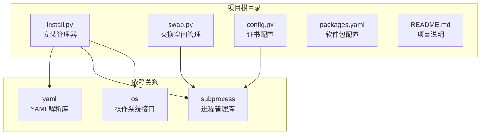
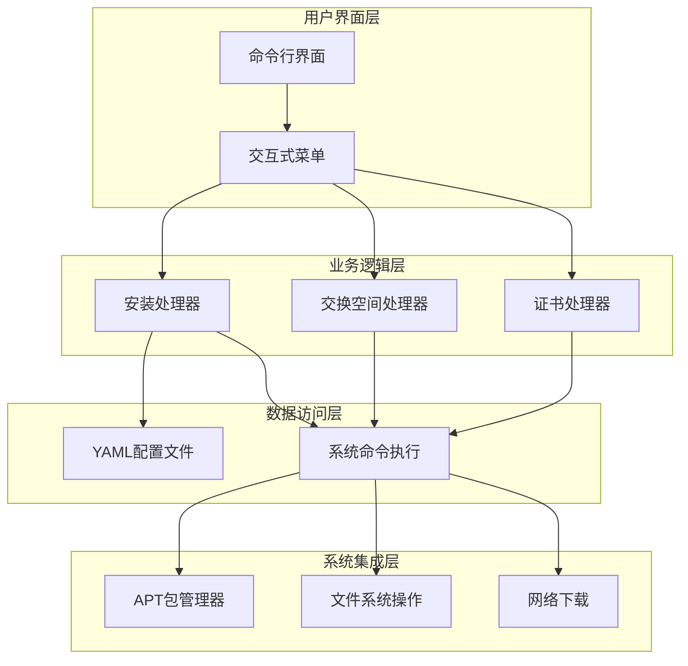
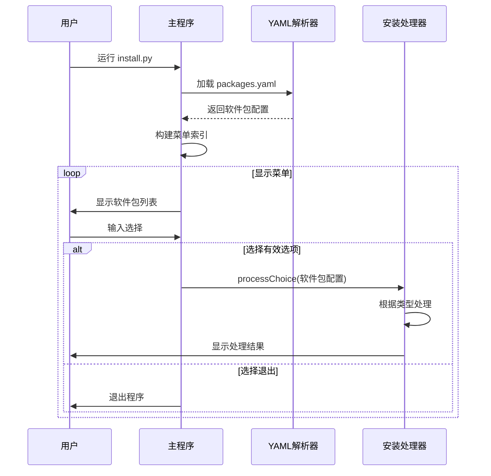
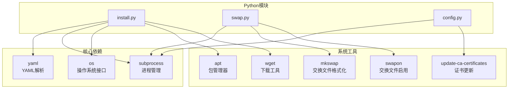

# Python API参考文档

<cite>
**本文档中引用的文件**
- [install.py](file://install.py)
- [swap.py](file://swap.py)
- [config.py](file://config.py)
- [packages.yaml](file://packages.yaml)
- [README.md](file://README.md)
</cite>

## 目录
1. [简介](#简介)
2. [项目结构](#项目结构)
3. [核心组件](#核心组件)
4. [架构概览](#架构概览)
5. [详细组件分析](#详细组件分析)
6. [依赖分析](#依赖分析)
7. [性能考虑](#性能考虑)
8. [故障排除指南](#故障排除指南)
9. [结论](#结论)

## 简介

本项目是一个用于系统工具一键安装的Python脚本集合，主要包含三个核心模块：`install.py`、`swap.py`和`config.py`。该项目提供了以下功能：

- **安装管理器** (`install.py`): 支持从GitHub下载二进制包或直接下载URL链接的软件包，并自动安装到系统中
- **交换空间管理** (`swap.py`): 创建和启用16GB的交换文件，提高系统内存管理能力
- **证书配置** (`config.py`): 配置开发环境所需的CA证书

## 项目结构

项目采用简单的模块化设计，每个Python文件都是独立的可执行脚本：



**图表来源**
- [install.py:1-36](file://install.py#L1-L36)
- [swap.py:1-10](file://swap.py#L1-L10)
- [config.py:1-8](file://config.py#L1-L8)

**章节来源**
- [install.py:1-36](file://install.py#L1-L36)
- [swap.py:1-10](file://swap.py#L1-L10)
- [config.py:1-8](file://config.py#L1-L8)
- [packages.yaml:1-50](file://packages.yaml#L1-L50)

## 核心组件

### 安装管理器 (install.py)

安装管理器是项目的核心组件，负责处理各种类型的软件包安装任务。它提供了统一的接口来处理不同来源的软件包。

**主要功能特性**:
- 支持GitHub托管的二进制包安装
- 支持直接URL链接的软件包下载
- 提供交互式菜单选择界面
- 自动处理软件包依赖和安装

**章节来源**
- [install.py:4-16](file://install.py#L4-L16)
- [install.py:17-35](file://install.py#L17-L35)

### 交换空间管理器 (swap.py)

交换空间管理器专门用于创建和配置系统的交换文件，以增强内存管理能力。

**主要功能**:
- 创建16GB大小的交换文件
- 配置适当的权限和格式化
- 启用交换文件并写入fstab配置

**章节来源**
- [swap.py:3-10](file://swap.py#L3-L10)

### 证书配置器 (config.py)

证书配置器用于配置开发环境中所需的CA证书，确保HTTPS连接的安全性。

**主要功能**:
- 复制自定义CA证书到系统证书目录
- 更新系统证书数据库
- 支持开发环境的SSL/TLS配置

**章节来源**
- [config.py:3-7](file://config.py#L3-L7)

## 架构概览

项目采用模块化架构，每个组件都有明确的职责分工：



**图表来源**
- [install.py:17-35](file://install.py#L17-L35)
- [swap.py:3-10](file://swap.py#L3-L10)
- [config.py:3-7](file://config.py#L3-L7)

## 详细组件分析

### processChoice 函数详解

`processChoice` 是安装管理器的核心函数，负责根据软件包类型执行相应的安装逻辑。

#### 函数签名
```python
def processChoice(selection):
```

#### 参数结构 (selection 字典)

selection 字典支持两种不同的结构：

**Git类型软件包结构**:
| 字段名 | 类型 | 必需 | 描述 |
|--------|------|------|------|
| `type` | string | 是 | 软件包类型，必须为 'git' |
| `name` | string | 是 | 软件包文件名 |
| `url` | string | 是 | GitHub仓库URL |
| `version` | string | 是 | 版本号 |

**Config类型软件包结构**:
| 字段名 | 类型 | 必需 | 描述 |
|--------|------|------|------|
| `type` | string | 是 | 软件包类型，必须为 'config' |
| `des` | string | 是 | 描述信息 |
| `cmd` | list | 是 | 要执行的命令列表 |

**章节来源**
- [install.py:4-16](file://install.py#L4-L16)
- [packages.yaml:2-7](file://packages.yaml#L2-L7)
- [packages.yaml:38-44](file://packages.yaml#L38-L44)

#### 支持的软件包类型

1. **Git类型** (`type: 'git'`)
   - 从GitHub releases页面下载指定版本的二进制包
   - 自动安装到系统中
   - 支持版本控制和源码管理

2. **Config类型** (`type: 'config'`)
   - 执行预定义的系统配置命令
   - 支持多条命令的批量执行
   - 适用于系统设置和配置修改

#### 返回值
- **返回类型**: `None`
- **行为**: 直接执行系统命令，不返回任何值
- **副作用**: 修改系统状态（安装软件包、执行配置命令）

#### 异常处理机制

当前实现的异常处理相对简单：
- 不支持的类型会输出错误信息但不会抛出异常
- 系统命令执行失败时不会进行错误捕获
- 缺乏详细的错误日志记录

**章节来源**
- [install.py:14-15](file://install.py#L14-L15)

### 命令行入口点工作流程

安装管理器的命令行入口点提供了完整的交互式安装体验：



**图表来源**
- [install.py:17-35](file://install.py#L17-L35)

#### 参数处理流程

1. **配置文件加载**: 从 `packages.yaml` 读取软件包配置
2. **菜单构建**: 将配置转换为用户友好的菜单格式
3. **用户输入**: 接收用户的数字选择
4. **配置查找**: 根据选择找到对应的软件包配置
5. **安装执行**: 调用 `processChoice` 处理安装

**章节来源**
- [install.py:17-35](file://install.py#L17-L35)

### 交换空间管理器详细分析

交换空间管理器提供了简化的交换文件管理功能：


**图表来源**
- [swap.py:3-10](file://swap.py#L3-L10)

#### 功能特性
- **自动创建**: 一次性创建完整的交换文件系统
- **持久化配置**: 将交换文件添加到 `/etc/fstab` 实现开机自动挂载
- **权限管理**: 正确设置交换文件的访问权限

**章节来源**
- [swap.py:3-10](file://swap.py#L3-L10)

### 证书配置器详细分析

证书配置器专注于开发环境的SSL/TLS配置：


**图表来源**
- [config.py:3-7](file://config.py#L3-L7)

#### 配置流程
1. **证书复制**: 将自定义CA证书复制到系统证书目录
2. **权限设置**: 确保证书文件具有正确的访问权限
3. **数据库更新**: 更新系统的证书信任数据库

**章节来源**
- [config.py:3-7](file://config.py#L3-L7)

## 依赖分析

项目依赖关系相对简单，主要依赖于标准库和系统工具：



**图表来源**
- [install.py:1-2](file://install.py#L1-L2)
- [swap.py:1](file://swap.py#L1)
- [config.py:1](file://config.py#L1)

### 外部依赖

| 模块 | 用途 | 版本要求 |
|------|------|----------|
| `yaml` | 解析YAML配置文件 | 任意版本 |
| `subprocess` | 执行系统命令 | Python标准库 |
| `os` | 文件系统操作 | Python标准库 |

**章节来源**
- [install.py:1-2](file://install.py#L1-L2)
- [swap.py:1](file://swap.py#L1)
- [config.py:1](file://config.py#L1)

## 性能考虑

### 内存使用优化
- **流式处理**: 使用 `yaml.load()` 直接解析配置文件，避免不必要的内存占用
- **按需执行**: 只在需要时执行系统命令，减少资源消耗

### 网络性能
- **直接下载**: Git类型软件包通过GitHub releases直接下载，避免中间代理
- **批量处理**: Config类型软件包支持批量命令执行，减少系统调用次数

### 系统资源管理
- **权限最小化**: 仅在必要时提升权限级别
- **临时文件管理**: 自动清理下载的临时文件

## 故障排除指南

### 常见问题及解决方案

#### 安装失败
**症状**: 软件包安装过程中出现错误
**可能原因**:
- 网络连接问题
- 权限不足
- 磁盘空间不足

**解决方法**:
1. 检查网络连接状态
2. 确认具有sudo权限
3. 清理磁盘空间

#### YAML解析错误
**症状**: 配置文件加载失败
**可能原因**:
- YAML语法错误
- 缩进不正确
- 字段缺失

**解决方法**:
1. 使用在线YAML验证器检查语法
2. 确保正确的缩进格式
3. 验证必需字段的存在

#### 交换空间创建失败
**症状**: 交换文件无法创建或启用
**可能原因**:
- 磁盘空间不足
- 权限问题
- 已存在交换文件

**解决方法**:
1. 检查可用磁盘空间
2. 确认root权限
3. 清理现有交换文件

**章节来源**
- [install.py:14-15](file://install.py#L14-L15)

## 结论

本项目提供了一个简洁而有效的系统工具安装解决方案。通过模块化的设计和清晰的职责分离，实现了以下目标：

### 主要优势
- **简单易用**: 直观的命令行界面和清晰的配置结构
- **功能完整**: 支持多种软件包类型和系统配置场景
- **可扩展性强**: 模块化架构便于添加新的软件包类型

### 改进建议
1. **增强错误处理**: 添加更完善的异常捕获和错误恢复机制
2. **日志记录**: 实现详细的日志记录功能
3. **配置验证**: 添加配置文件的结构验证
4. **进度反馈**: 为长时间运行的操作提供进度指示

### 未来发展方向
- 支持更多软件包来源（如Snap、Flatpak等）
- 添加图形用户界面选项
- 实现增量更新和版本管理
- 集成自动化测试和持续集成