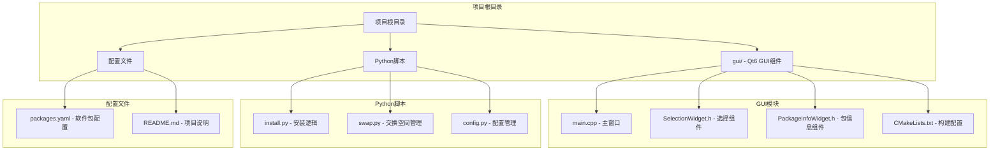
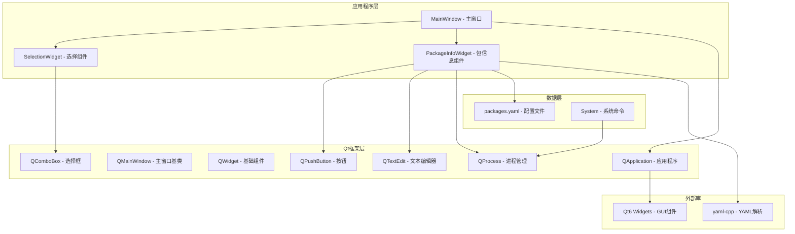
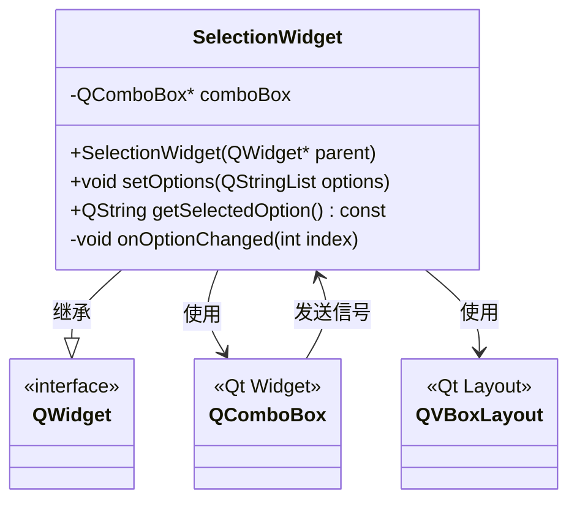
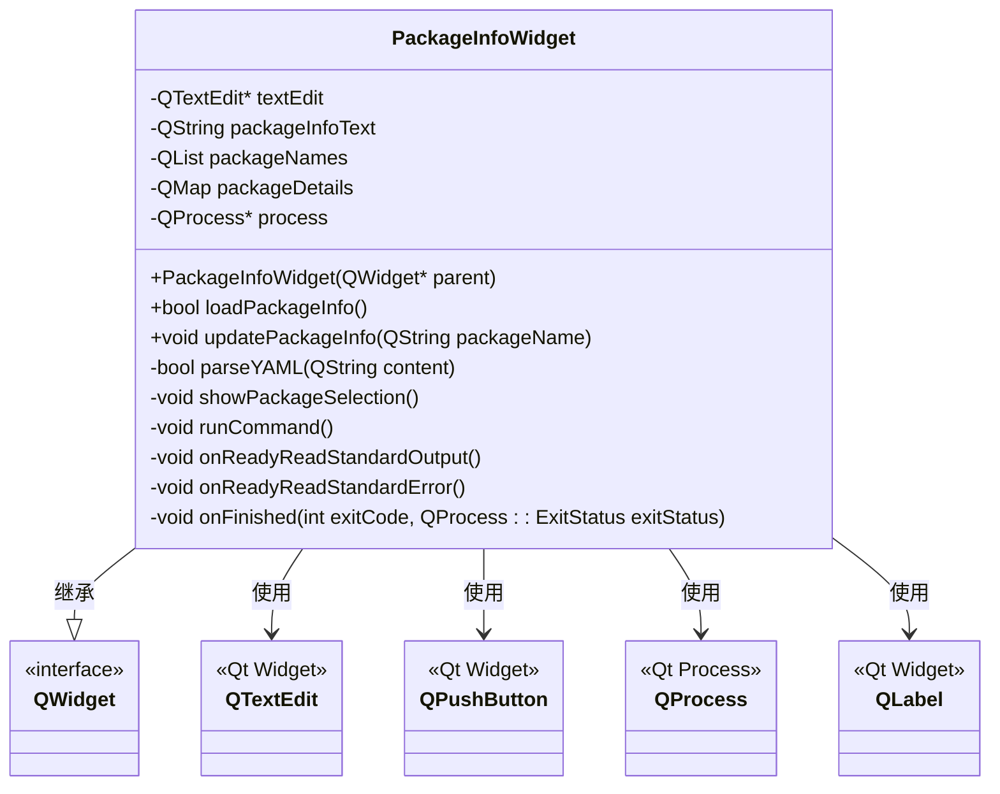
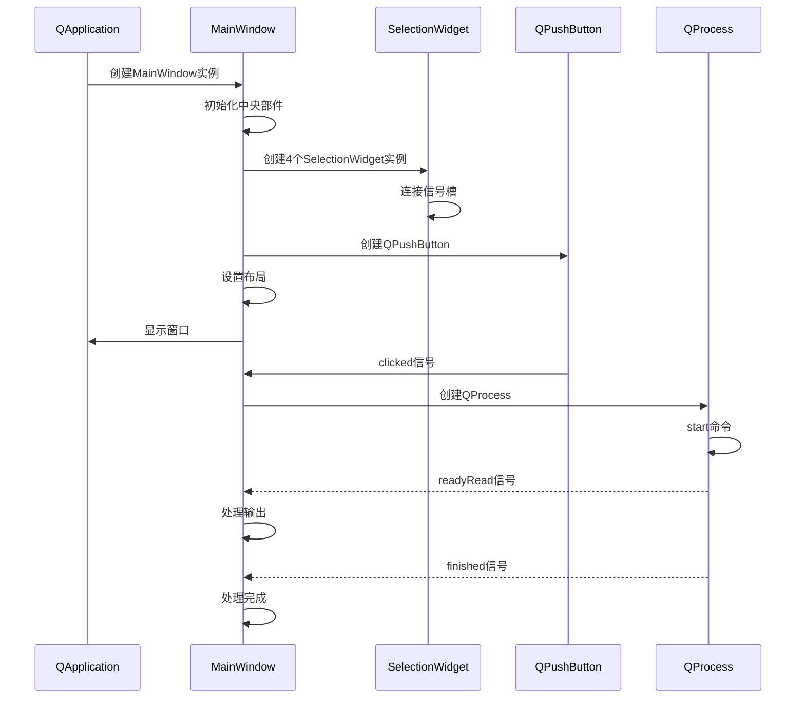
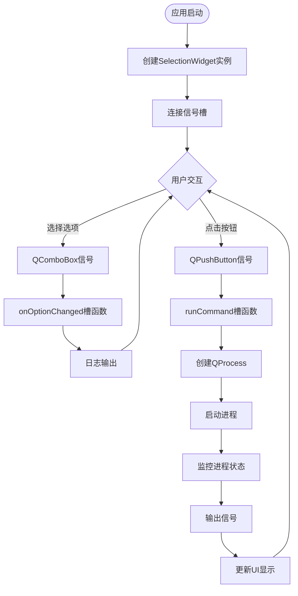
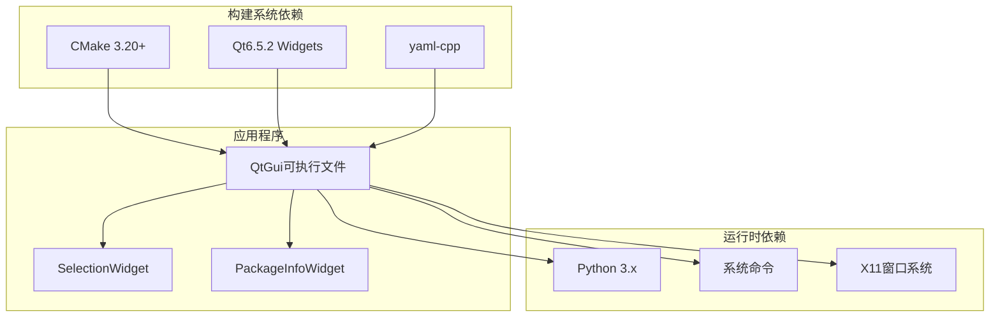
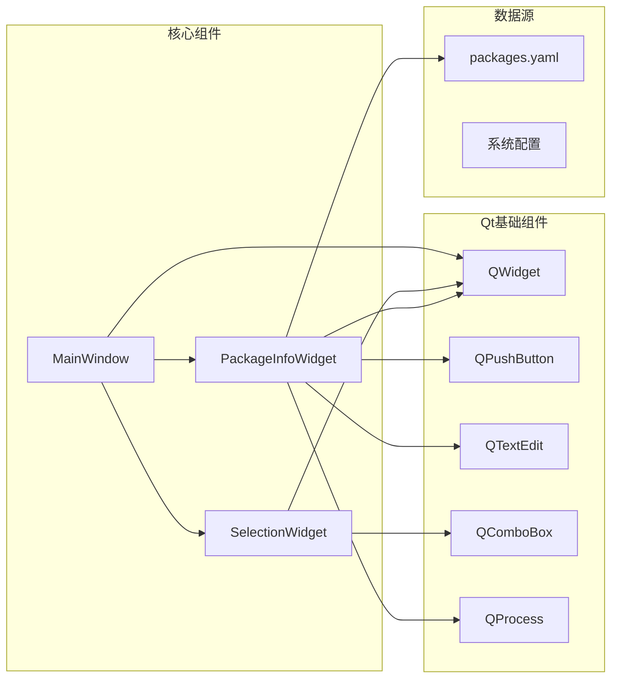

# Qt6组件API

<cite>
**本文档引用的文件**
- [gui/main.cpp](file://gui/main.cpp)
- [gui/SelectionWidget.h](file://gui/SelectionWidget.h)
- [gui/PackageInfoWidget.h](file://gui/PackageInfoWidget.h)
- [gui/CMakeLists.txt](file://gui/CMakeLists.txt)
- [install.py](file://install.py)
- [packages.yaml](file://packages.yaml)
- [swap.py](file://swap.py)
- [config.py](file://config.py)
</cite>

## 目录
1. [简介](#简介)
2. [项目结构](#项目结构)
3. [核心组件](#核心组件)
4. [架构概览](#架构概览)
5. [详细组件分析](#详细组件分析)
6. [依赖关系分析](#依赖关系分析)
7. [性能考虑](#性能考虑)
8. [故障排除指南](#故障排除指南)
9. [结论](#结论)
10. [附录](#附录)

## 简介

这是一个基于Qt6开发的GUI应用程序，提供了两个主要的自定义组件：SelectionWidget（选择组件）和PackageInfoWidget（包信息组件）。该应用程序旨在简化软件包安装和系统配置过程，通过图形界面提供直观的操作体验。

应用程序的核心功能包括：
- SLAM系统参数选择界面
- 软件包信息展示和安装功能
- 系统配置工具集成
- 交换空间管理功能

## 项目结构

该项目采用模块化设计，主要包含以下目录和文件：



**图表来源**
- [gui/main.cpp:1-73](file://gui/main.cpp#L1-L73)
- [gui/CMakeLists.txt:1-26](file://gui/CMakeLists.txt#L1-L26)

**章节来源**
- [gui/main.cpp:1-73](file://gui/main.cpp#L1-L73)
- [gui/CMakeLists.txt:1-26](file://gui/CMakeLists.txt#L1-L26)

## 核心组件

### SelectionWidget 组件

SelectionWidget是一个自定义的组合控件，封装了QComboBox并提供了简化的接口。

**主要特性：**
- 基于QComboBox的选择框
- 动态选项设置功能
- 自动化的信号槽连接
- 内置日志输出机制

**构造函数：**
- `SelectionWidget(QWidget *parent = nullptr)`
  - 参数：父级窗口指针
  - 返回：SelectionWidget实例
  - 功能：初始化内部布局和QComboBox控件

**公共方法：**
- `void setOptions(const QStringList &options)`
  - 参数：QStringList类型的选项列表
  - 返回：void
  - 功能：清空现有选项并添加新的选项列表
  
- `QString getSelectedOption() const`
  - 参数：无
  - 返回：QString类型的当前选中选项
  - 功能：获取当前选中的文本内容

**信号槽机制：**
- 内部连接QComboBox的currentIndexChanged信号到onOptionChanged槽函数
- 支持扩展的optionChanged信号（当前被注释）

**事件处理：**
- onOptionChanged(int index) - 处理选项变更事件
- 自动输出选中选项的日志信息

### PackageInfoWidget 组件

PackageInfoWidget是一个综合的信息展示和操作组件，集成了软件包信息显示、选择和安装功能。

**主要特性：**
- YAML配置文件解析
- 软件包信息动态加载
- 用户交互式包选择
- 进程执行和结果监控
- 实时输出显示

**构造函数：**
- `PackageInfoWidget(QWidget *parent = nullptr)`
  - 参数：父级窗口指针
  - 返回：PackageInfoWidget实例
  - 功能：初始化UI组件、连接信号槽并加载软件包信息

**公共方法：**
- `bool loadPackageInfo()`
  - 参数：无
  - 返回：bool类型（加载成功与否）
  - 功能：从YAML文件加载软件包配置信息
  
- `void updatePackageInfo(const QString &packageName)`
  - 参数：QString类型的包名
  - 返回：void
  - 功能：更新显示指定包的详细信息

**私有槽函数：**
- `void showPackageSelection()`
  - 功能：弹出对话框让用户选择软件包
  
- `void runCommand()`
  - 功能：执行系统命令并监控进程状态
  
- `void onReadyReadStandardOutput()`
  - 功能：处理标准输出数据
  
- `void onReadyReadStandardError()`
  - 功能：处理标准错误数据
  
- `void onFinished(int exitCode, QProcess::ExitStatus exitStatus)`
  - 功能：处理进程完成事件

**章节来源**
- [gui/SelectionWidget.h:1-40](file://gui/SelectionWidget.h#L1-L40)
- [gui/PackageInfoWidget.h:1-145](file://gui/PackageInfoWidget.h#L1-L145)

## 架构概览

应用程序采用MVC架构模式，结合Qt的信号槽机制实现松耦合的设计。



**图表来源**
- [gui/main.cpp:7-42](file://gui/main.cpp#L7-L42)
- [gui/SelectionWidget.h:8-19](file://gui/SelectionWidget.h#L8-L19)
- [gui/PackageInfoWidget.h:18-44](file://gui/PackageInfoWidget.h#L18-L44)

## 详细组件分析

### SelectionWidget 类结构分析



**图表来源**
- [gui/SelectionWidget.h:8-39](file://gui/SelectionWidget.h#L8-L39)

**组件特性：**
- 单一职责原则：专注于选项选择功能
- 封装性：内部QComboBox的使用对外透明
- 可扩展性：预留信号槽扩展点

**使用示例：**
```cpp
// 创建SelectionWidget实例
SelectionWidget* widget = new SelectionWidget();

// 设置选项
QStringList options = {"Option1", "Option2", "Option3"};
widget->setOptions(options);

// 获取选中值
QString selected = widget->getSelectedOption();
```

**章节来源**
- [gui/SelectionWidget.h:11-39](file://gui/SelectionWidget.h#L11-L39)

### PackageInfoWidget 类结构分析



**图表来源**
- [gui/PackageInfoWidget.h:18-51](file://gui/PackageInfoWidget.h#L18-L51)

**组件特性：**
- 复杂的数据处理：YAML解析和数据结构管理
- 异步操作：进程执行和实时输出监控
- 错误处理：完善的异常捕获和用户反馈

**使用示例：**
```cpp
// 创建PackageInfoWidget实例
PackageInfoWidget* widget = new PackageInfoWidget();

// 更新特定包的信息
widget->updatePackageInfo("DevSidecar");

// 执行安装命令
widget->runCommand();
```

**章节来源**
- [gui/PackageInfoWidget.h:20-145](file://gui/PackageInfoWidget.h#L20-L145)

### 主窗口类接口分析



**图表来源**
- [gui/main.cpp:9-42](file://gui/main.cpp#L9-L42)
- [gui/main.cpp:47-61](file://gui/main.cpp#L47-L61)

**主窗口特性：**
- 组件初始化：创建并配置四个SelectionWidget实例
- 布局管理：使用QHBoxLayout组织界面元素
- 事件处理：连接按钮点击事件到runCommand槽函数
- 进程管理：启动外部命令并监控执行状态

**章节来源**
- [gui/main.cpp:7-62](file://gui/main.cpp#L7-L62)

### 信号槽连接流程



**图表来源**
- [gui/SelectionWidget.h:17-37](file://gui/SelectionWidget.h#L17-L37)
- [gui/main.cpp:35-61](file://gui/main.cpp#L35-L61)

## 依赖关系分析

### 外部依赖关系



**图表来源**
- [gui/CMakeLists.txt:9-13](file://gui/CMakeLists.txt#L9-L13)

### 内部组件依赖



**图表来源**
- [gui/main.cpp:4-5](file://gui/main.cpp#L4-L5)
- [gui/SelectionWidget.h:3-6](file://gui/SelectionWidget.h#L3-L6)
- [gui/PackageInfoWidget.h:2-16](file://gui/PackageInfoWidget.h#L2-L16)

**章节来源**
- [gui/CMakeLists.txt:1-26](file://gui/CMakeLists.txt#L1-L26)

## 性能考虑

### 内存管理最佳实践

**自动内存管理：**
- Qt对象树机制确保子对象随父对象自动销毁
- 使用父子关系传递避免手动delete调用
- QProcess等资源密集型对象正确释放

**性能优化建议：**
- 避免频繁的字符串拼接操作
- 合理使用QVector替代QList进行索引访问
- 在大量数据更新时使用批量操作

### 线程安全注意事项

**主线程限制：**
- GUI操作必须在主线程执行
- 长时间运行的任务应使用异步方式
- QProcess提供异步信号槽机制

**并发处理：**
- 使用QThread或QtConcurrent处理耗时操作
- 避免在信号槽中执行阻塞操作
- 正确处理跨线程信号槽连接

## 故障排除指南

### 常见问题及解决方案

**组件初始化失败：**
- 检查CMake配置是否正确
- 确认Qt6 Widgets库已正确安装
- 验证yaml-cpp库依赖

**信号槽连接问题：**
- 确保使用正确的元对象语法
- 检查信号槽签名匹配
- 验证对象生命周期

**进程执行失败：**
- 检查命令路径和权限
- 验证环境变量设置
- 查看错误输出信息

**章节来源**
- [gui/PackageInfoWidget.h:53-88](file://gui/PackageInfoWidget.h#L53-L88)
- [gui/PackageInfoWidget.h:109-127](file://gui/PackageInfoWidget.h#L109-L127)

## 结论

本Qt6 GUI应用程序展示了现代C++和Qt框架的最佳实践，通过模块化设计实现了清晰的职责分离和良好的可维护性。SelectionWidget和PackageInfoWidget两个核心组件分别解决了不同的用户需求场景，配合主窗口实现了完整的用户交互流程。

**主要优势：**
- 清晰的组件架构和接口设计
- 完善的错误处理和用户反馈机制
- 良好的扩展性和可维护性
- 符合Qt6开发规范的代码结构

**改进建议：**
- 添加单元测试覆盖关键功能
- 实现更详细的日志记录机制
- 考虑添加国际化支持
- 优化内存使用和性能表现

## 附录

### 组件使用示例

**SelectionWidget集成示例：**
```cpp
// 在主窗口中集成SelectionWidget
QVector<SelectionWidget*> selectionWidgets{4};
for (auto &widget : selectionWidgets) {
    widget = new SelectionWidget();
}

// 设置不同类型的选项
selectionWidgets[0]->setOptions({"ORB_SLAM2", "ov2slam", "VINS_MONO", "ssvio"});
selectionWidgets[1]->setOptions({"kitti", "euroc", "uma"});
```

**PackageInfoWidget集成示例：**
```cpp
// 创建并配置PackageInfoWidget
PackageInfoWidget* packageWidget = new PackageInfoWidget();
packageWidget->updatePackageInfo("DevSidecar");
packageWidget->runCommand();
```

### UI组件集成指南

**布局管理：**
- 使用QHBoxLayout实现水平排列
- 合理设置组件间距和边距
- 考虑响应式布局适配

**样式定制：**
- 使用QSS样式表统一外观
- 实现主题切换支持
- 考虑高DPI显示适配

**章节来源**
- [gui/main.cpp:13-31](file://gui/main.cpp#L13-L31)
- [gui/PackageInfoWidget.h:20-44](file://gui/PackageInfoWidget.h#L20-L44)