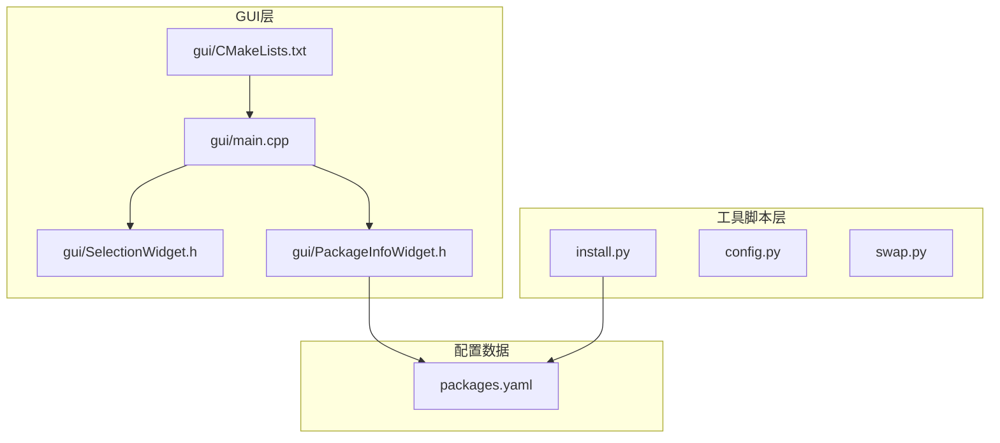
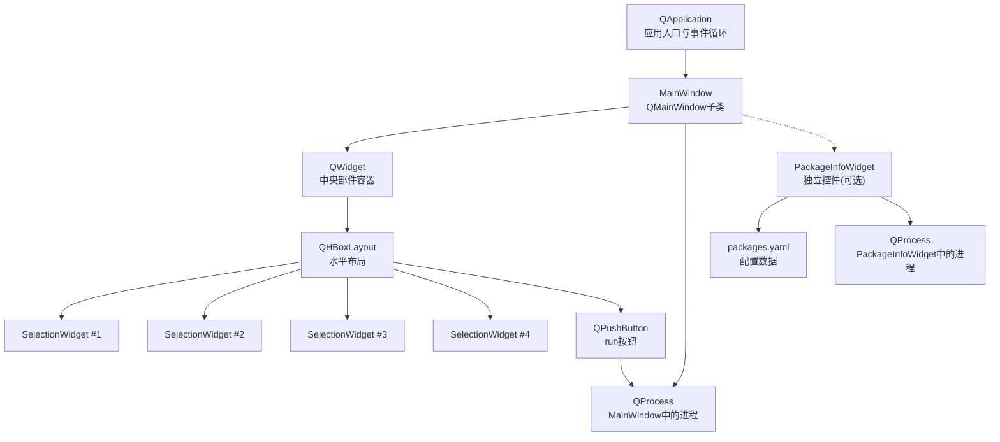
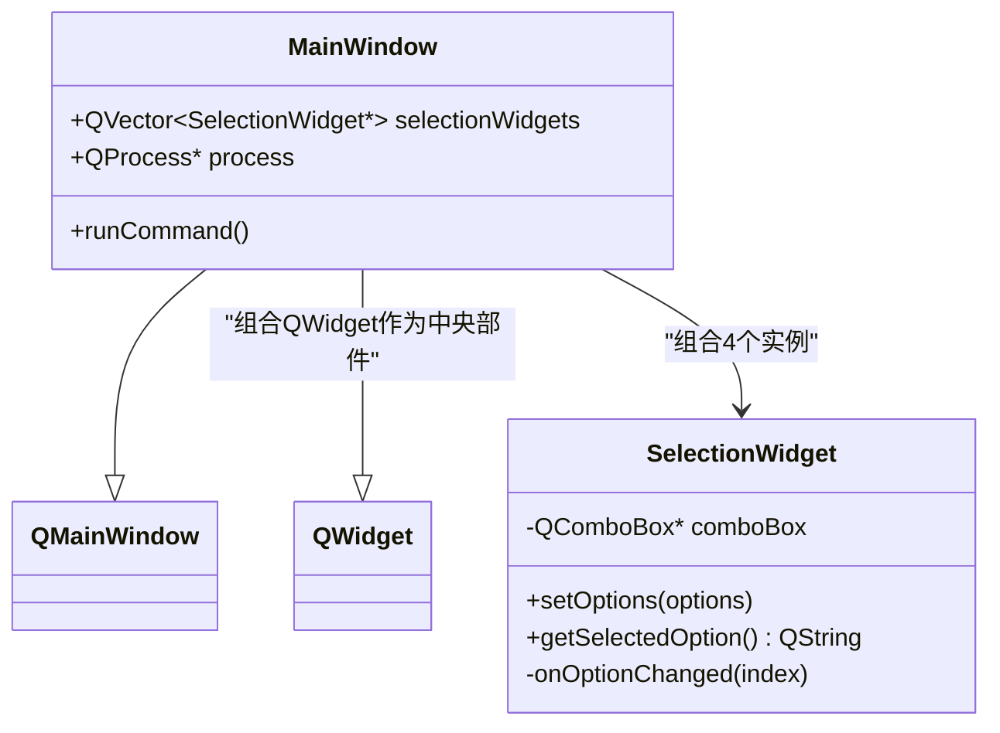
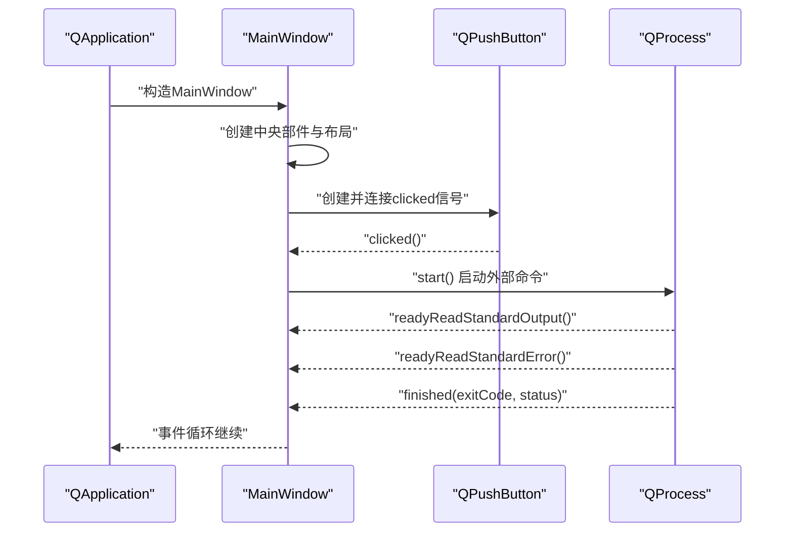
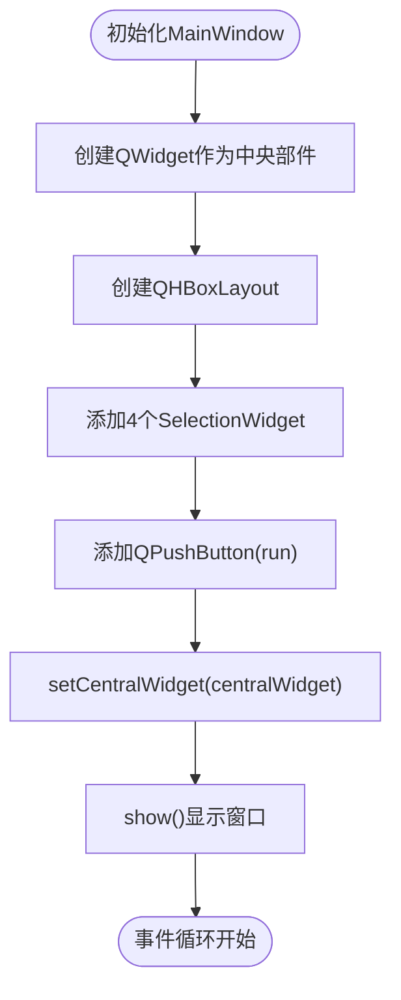
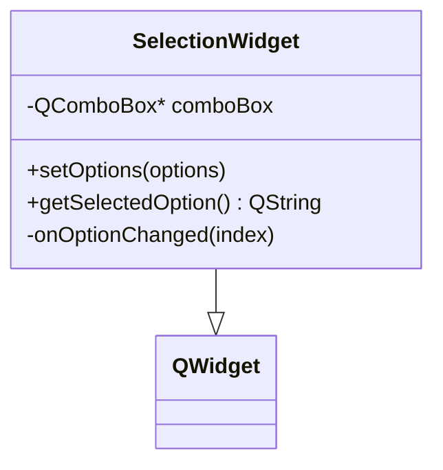
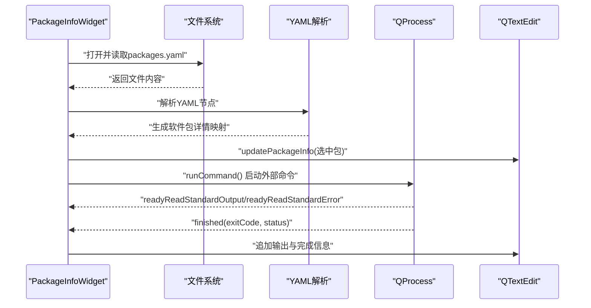
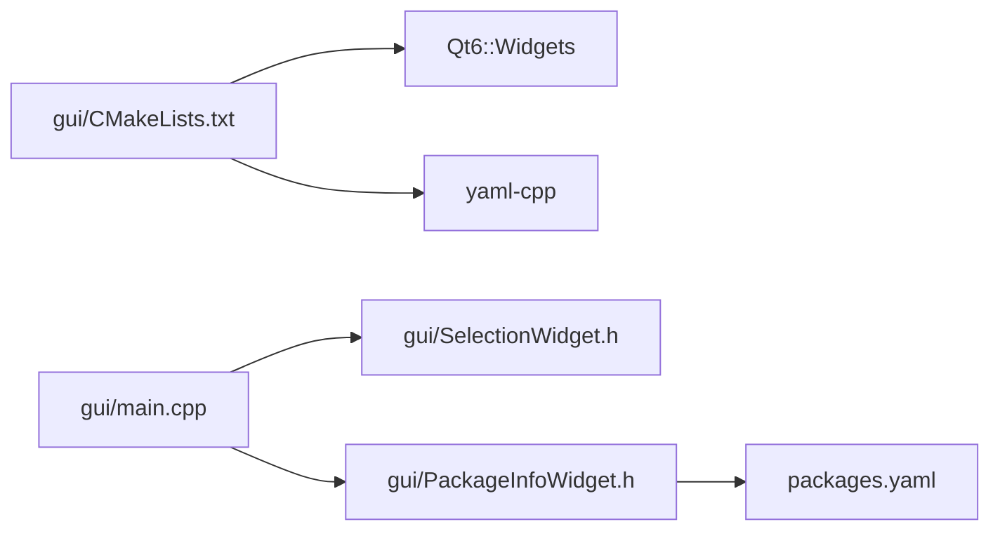

# Qt6应用程序架构

<cite>
**本文档引用的文件**
- [gui/main.cpp](file://gui/main.cpp)
- [gui/PackageInfoWidget.h](file://gui/PackageInfoWidget.h)
- [gui/SelectionWidget.h](file://gui/SelectionWidget.h)
- [gui/CMakeLists.txt](file://gui/CMakeLists.txt)
- [README.md](file://README.md)
- [config.py](file://config.py)
- [install.py](file://install.py)
- [swap.py](file://swap.py)
- [packages.yaml](file://packages.yaml)
</cite>

## 目录
1. [引言](#引言)
2. [项目结构](#项目结构)
3. [核心组件](#核心组件)
4. [架构总览](#架构总览)
5. [详细组件分析](#详细组件分析)
6. [依赖分析](#依赖分析)
7. [性能考虑](#性能考虑)
8. [故障排除指南](#故障排除指南)
9. [结论](#结论)
10. [附录](#附录)

## 引言
本文件面向希望深入理解Qt6图形界面应用核心架构的开发者，围绕MainWindow类的设计理念与继承关系展开，系统阐述Qt应用程序的生命周期管理、事件循环机制与内存管理策略；同时详解QMainWindow的布局管理、中央部件设计与窗口管理，结合Qt对象模型、父子关系与资源管理最佳实践，辅以架构图与代码示例路径，帮助读者建立对整体设计思路的清晰认知。

## 项目结构
该项目采用“功能模块化+工具脚本”的混合组织方式：
- GUI层：基于Qt6 Widgets模块，包含主窗口与两个自定义控件（选择器与包信息展示）。
- 工具脚本：Python脚本用于系统配置、软件包安装与交换空间管理。
- 配置数据：YAML文件描述可安装软件包清单。

**图表来源**
- [gui/main.cpp:1-73](file://gui/main.cpp#L1-L73)
- [gui/SelectionWidget.h:1-40](file://gui/SelectionWidget.h#L1-L40)
- [gui/PackageInfoWidget.h:1-145](file://gui/PackageInfoWidget.h#L1-L145)
- [gui/CMakeLists.txt:1-26](file://gui/CMakeLists.txt#L1-L26)
- [install.py:1-36](file://install.py#L1-L36)
- [packages.yaml:1-50](file://packages.yaml#L1-L50)

**章节来源**
- [gui/main.cpp:1-73](file://gui/main.cpp#L1-L73)
- [gui/CMakeLists.txt:1-26](file://gui/CMakeLists.txt#L1-L26)
- [README.md:1-7](file://README.md#L1-L7)

## 核心组件
本节聚焦于MainWindow类及其关键子组件，阐明其职责边界、交互关系与生命周期行为。

- MainWindow类
  - 继承自QMainWindow，作为顶层窗口承载UI布局与业务逻辑。
  - 负责创建并配置中央部件（QWidget），设置水平布局（QHBoxLayout），将四个SelectionWidget实例按顺序加入布局。
  - 提供运行按钮与runCommand槽函数，通过QProcess执行外部命令。
  - 通过QApplication::exec进入事件循环，实现消息驱动的交互。

- SelectionWidget类
  - 继承自QWidget，内部封装QComboBox，负责选项选择与变更通知。
  - 对外暴露setOptions与getSelectedOption接口，便于上层读取用户选择。

- PackageInfoWidget类
  - 继承自QWidget，负责从packages.yaml加载软件包信息并展示。
  - 内部维护QProcess监听标准输出与错误流，以及进程完成回调，实现异步命令执行与结果展示。

**章节来源**
- [gui/main.cpp:7-62](file://gui/main.cpp#L7-L62)
- [gui/SelectionWidget.h:8-40](file://gui/SelectionWidget.h#L8-L40)
- [gui/PackageInfoWidget.h:18-145](file://gui/PackageInfoWidget.h#L18-L145)

## 架构总览
下图展示了Qt6应用的典型架构：应用入口创建QApplication与顶层窗口，窗口内嵌入多个自定义控件，控件之间通过信号槽通信，底层通过QProcess执行系统命令或外部程序。

**图表来源**
- [gui/main.cpp:7-62](file://gui/main.cpp#L7-L62)
- [gui/SelectionWidget.h:8-40](file://gui/SelectionWidget.h#L8-L40)
- [gui/PackageInfoWidget.h:18-145](file://gui/PackageInfoWidget.h#L18-L145)
- [packages.yaml:1-50](file://packages.yaml#L1-L50)

## 详细组件分析

### MainWindow类设计与继承关系
- 设计理念
  - 单一职责：集中管理UI布局与顶层交互，避免在构造函数中执行耗时操作。
  - 组合优先：通过组合多个SelectionWidget实现参数选择，便于扩展与维护。
  - 事件驱动：通过按钮点击触发runCommand，使用QProcess异步执行命令，避免阻塞UI线程。
- 继承关系
  - MainWindow继承QMainWindow，复用其窗口框架能力（菜单栏、工具栏、状态栏等预留接口）。
  - 通过setCentralWidget将自定义中央部件接入窗口，遵循Qt的“中央部件模式”。

**图表来源**
- [gui/main.cpp:7-62](file://gui/main.cpp#L7-L62)
- [gui/SelectionWidget.h:8-40](file://gui/SelectionWidget.h#L8-L40)

**章节来源**
- [gui/main.cpp:7-62](file://gui/main.cpp#L7-L62)

### 事件循环与生命周期管理
- 应用生命周期
  - 入口：main函数创建QApplication实例，随后构造MainWindow。
  - 运行：调用QApplication::exec进入事件循环，等待并分发事件（鼠标、键盘、定时器、网络等）。
  - 结束：当所有顶层窗口关闭且应用退出条件满足时，exec返回，main函数返回给操作系统。
- 事件循环机制
  - Qt通过事件队列与事件循环实现非阻塞式交互。信号槽连接在事件到达时触发对应槽函数。
  - 在runCommand中，QProcess通过信号槽异步报告标准输出、标准错误与完成状态，避免UI冻结。
- 内存管理策略
  - 父子关系：所有控件均以this为父对象创建，Qt自动管理析构顺序，确保先销毁子对象再销毁父对象。
  - 智能指针替代：当前使用原生指针，建议在需要时引入QScopedPointer/QSharedPointer提升安全性。
  - 资源释放：QProcess在MainWindow作用域内创建，随窗口销毁自动清理；若需长期运行，应考虑在完成后显式释放。

**图表来源**
- [gui/main.cpp:47-61](file://gui/main.cpp#L47-L61)

**章节来源**
- [gui/main.cpp:64-73](file://gui/main.cpp#L64-L73)
- [gui/main.cpp:47-61](file://gui/main.cpp#L47-L61)

### 布局管理、中央部件与窗口管理
- 布局管理
  - MainWindow内部创建QWidget作为中央部件，使用QHBoxLayout进行水平排列。
  - 四个SelectionWidget依次加入布局，右侧附加QPushButton，形成简洁的参数选择+执行界面。
- 中央部件设计
  - setCentralWidget将自定义中央部件设置为主窗口内容区域，遵循Qt的“中央部件模式”，便于扩展更多控件。
- 窗口管理
  - show()显示主窗口；窗口关闭时由QApplication::exec负责退出流程。
  - 若需多窗口管理，可在MainWindow中创建其他窗口并以模态/非模态方式显示。

**图表来源**
- [gui/main.cpp:9-42](file://gui/main.cpp#L9-L42)

**章节来源**
- [gui/main.cpp:9-42](file://gui/main.cpp#L9-L42)

### SelectionWidget组件分析
- 功能职责
  - 封装QComboBox，提供setOptions与getSelectedOption接口。
  - 内部连接QComboBox的currentIndexChanged信号到私有槽onOptionChanged，便于日志记录或进一步处理。
- 设计要点
  - 使用垂直布局（QVBoxLayout）容纳QComboBox，保持控件紧凑。
  - 未启用Q_OBJECT宏，因此不支持信号槽跨线程或元对象特性；如需跨线程通信，应在类声明中添加Q_OBJECT并使用合适的连接方式。

**图表来源**
- [gui/SelectionWidget.h:8-40](file://gui/SelectionWidget.h#L8-L40)

**章节来源**
- [gui/SelectionWidget.h:8-40](file://gui/SelectionWidget.h#L8-L40)

### PackageInfoWidget组件分析
- 数据加载与展示
  - 从packages.yaml读取软件包信息，解析为名称、描述、URL、版本等键值对，并存储在QMap中。
  - 使用QTextEdit展示当前选中软件包的详情；提供“选择包”与“安装”按钮。
- 异步命令执行
  - 通过QProcess启动外部命令，连接readyReadStandardOutput、readyReadStandardError与finished信号，实时更新QTextEdit。
  - 支持命令启动失败检测与完成状态输出，便于调试与用户反馈。

**图表来源**
- [gui/PackageInfoWidget.h:53-145](file://gui/PackageInfoWidget.h#L53-L145)
- [packages.yaml:1-50](file://packages.yaml#L1-L50)

**章节来源**
- [gui/PackageInfoWidget.h:18-145](file://gui/PackageInfoWidget.h#L18-L145)
- [packages.yaml:1-50](file://packages.yaml#L1-L50)

## 依赖分析
- 外部依赖
  - Qt6 Widgets：提供窗口、控件与事件系统。
  - yaml-cpp：解析YAML配置文件。
- 内部依赖
  - gui/main.cpp依赖SelectionWidget与PackageInfoWidget头文件。
  - PackageInfoWidget依赖packages.yaml作为数据源。
- 构建配置
  - CMake启用AUTOMOC/AUTORCC/AUTOUIC，自动处理元对象编译、资源与界面文件。
  - 链接Qt6::Widgets与yaml-cpp库。

**图表来源**
- [gui/CMakeLists.txt:9-13](file://gui/CMakeLists.txt#L9-L13)
- [gui/main.cpp:4-5](file://gui/main.cpp#L4-L5)
- [gui/PackageInfoWidget.h:12](file://gui/PackageInfoWidget.h#L12)
- [packages.yaml:1-50](file://packages.yaml#L1-L50)

**章节来源**
- [gui/CMakeLists.txt:1-26](file://gui/CMakeLists.txt#L1-L26)
- [gui/main.cpp:1-6](file://gui/main.cpp#L1-L6)

## 性能考虑
- UI响应性
  - 所有外部命令通过QProcess异步执行，避免阻塞主线程；建议在长时间任务中增加进度提示或取消机制。
- 内存管理
  - 利用Qt父子关系自动释放，减少手动delete风险；对于长生命周期对象，考虑智能指针增强可维护性。
- 布局优化
  - 使用合理的布局策略（如QGridLayout/QStackedLayout）以适配不同屏幕尺寸；避免在事件回调中频繁重建控件。
- 文件I/O
  - YAML解析仅在初始化阶段执行；后续可通过缓存或增量更新减少重复解析成本。

## 故障排除指南
- 进程启动失败
  - 检查命令路径与权限；确认QProcess::waitForStarted返回值与错误日志。
  - 参考路径：[gui/main.cpp:56-60](file://gui/main.cpp#L56-L60)，[gui/PackageInfoWidget.h:122-126](file://gui/PackageInfoWidget.h#L122-L126)
- YAML文件读取异常
  - 确认packages.yaml存在且格式正确；捕获异常并弹出错误对话框。
  - 参考路径：[gui/PackageInfoWidget.h:53-88](file://gui/PackageInfoWidget.h#L53-L88)
- 信号槽连接问题
  - 确保使用正确的重载签名与连接方式；必要时启用Q_OBJECT宏并重新构建。
  - 参考路径：[gui/main.cpp:35](file://gui/main.cpp#L35)，[gui/SelectionWidget.h:18](file://gui/SelectionWidget.h#L18)，[gui/PackageInfoWidget.h:113-115](file://gui/PackageInfoWidget.h#L113-L115)
- 事件循环无响应
  - 检查是否存在阻塞操作；确保QApplication::exec在main函数中被调用。
  - 参考路径：[gui/main.cpp:64-73](file://gui/main.cpp#L64-L73)

**章节来源**
- [gui/main.cpp:35](file://gui/main.cpp#L35)
- [gui/main.cpp:56-60](file://gui/main.cpp#L56-L60)
- [gui/PackageInfoWidget.h:53-88](file://gui/PackageInfoWidget.h#L53-L88)
- [gui/PackageInfoWidget.h:113-115](file://gui/PackageInfoWidget.h#L113-L115)
- [gui/main.cpp:64-73](file://gui/main.cpp#L64-L73)

## 结论
本项目以MainWindow为核心，结合SelectionWidget与PackageInfoWidget实现了参数选择与软件包管理的图形界面。通过Qt的事件循环与信号槽机制，配合QProcess实现异步命令执行，既保证了UI的流畅性，又具备良好的扩展性。建议在后续迭代中完善错误处理、引入智能指针与更丰富的布局策略，并考虑将PackageInfoWidget集成到MainWindow中以统一界面风格。

## 附录
- 快速开始
  - 构建：使用CMake生成构建系统并编译目标。
    - 参考路径：[gui/CMakeLists.txt:1-26](file://gui/CMakeLists.txt#L1-L26)
  - 运行：执行生成的应用程序，点击run按钮触发命令执行。
    - 参考路径：[gui/main.cpp:64-73](file://gui/main.cpp#L64-L73)
- 相关脚本
  - Python脚本用于系统配置与软件包安装，可与Qt应用协同工作。
    - 参考路径：[install.py:1-36](file://install.py#L1-L36)，[config.py:1-8](file://config.py#L1-L8)，[swap.py:1-10](file://swap.py#L1-L10)