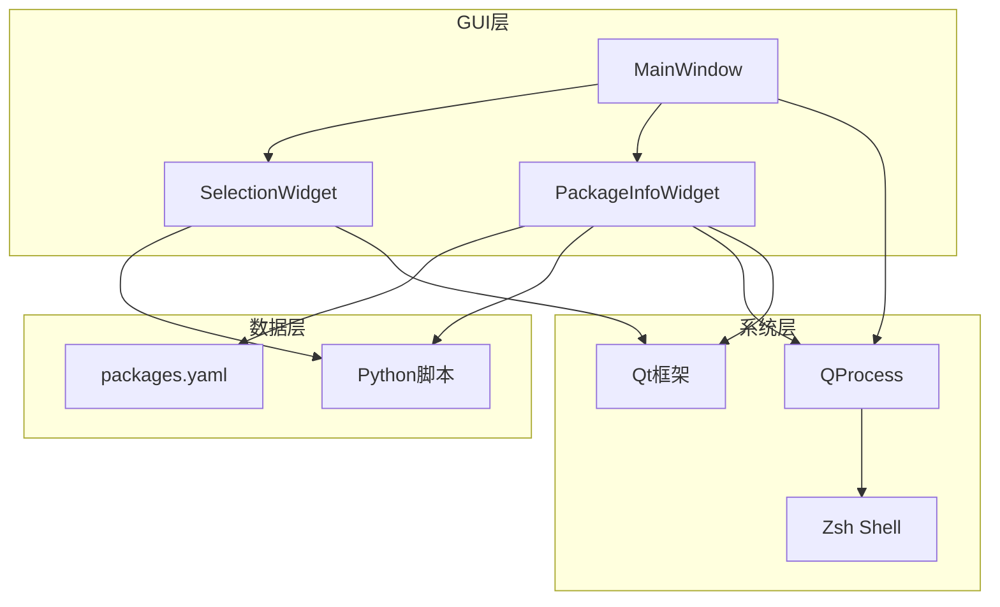
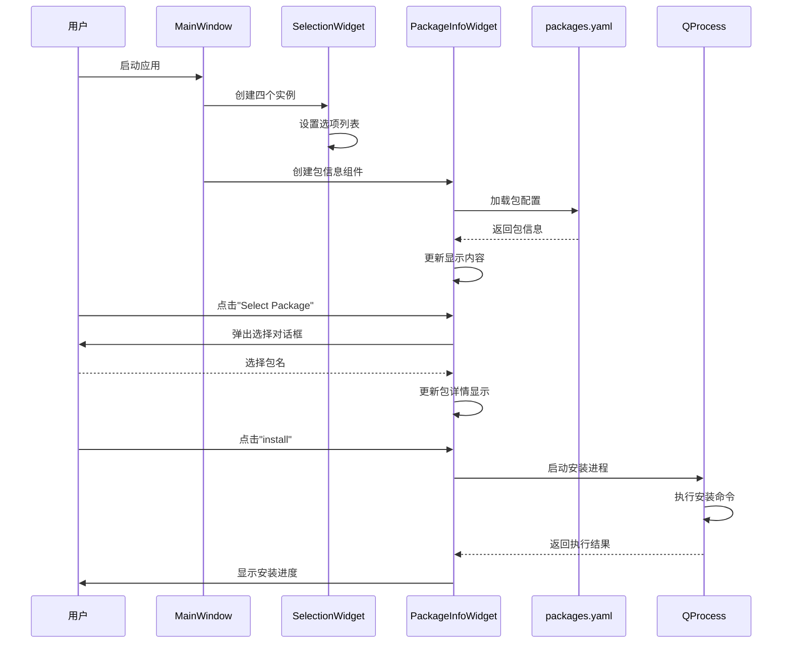
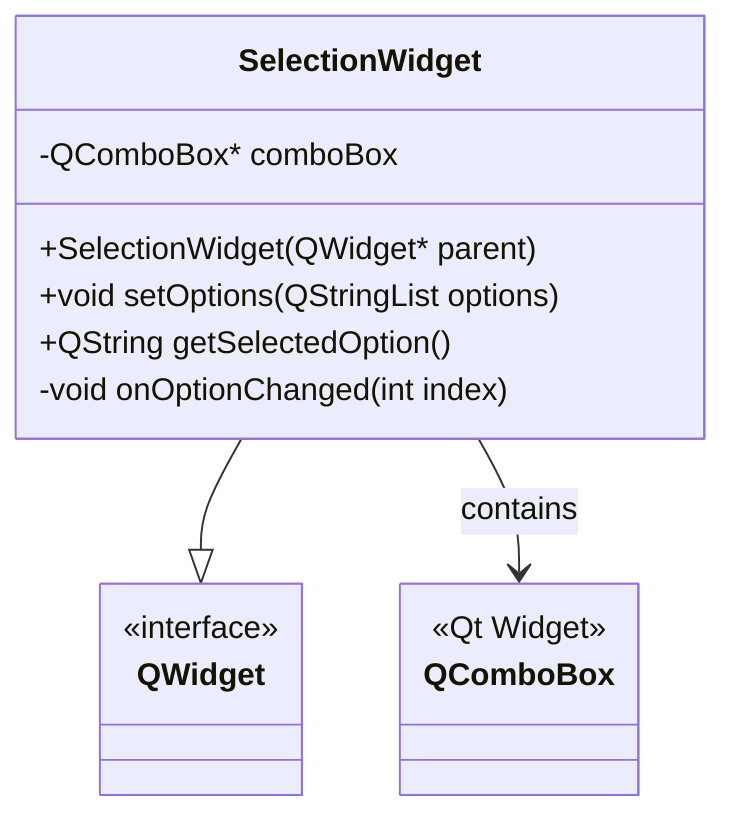
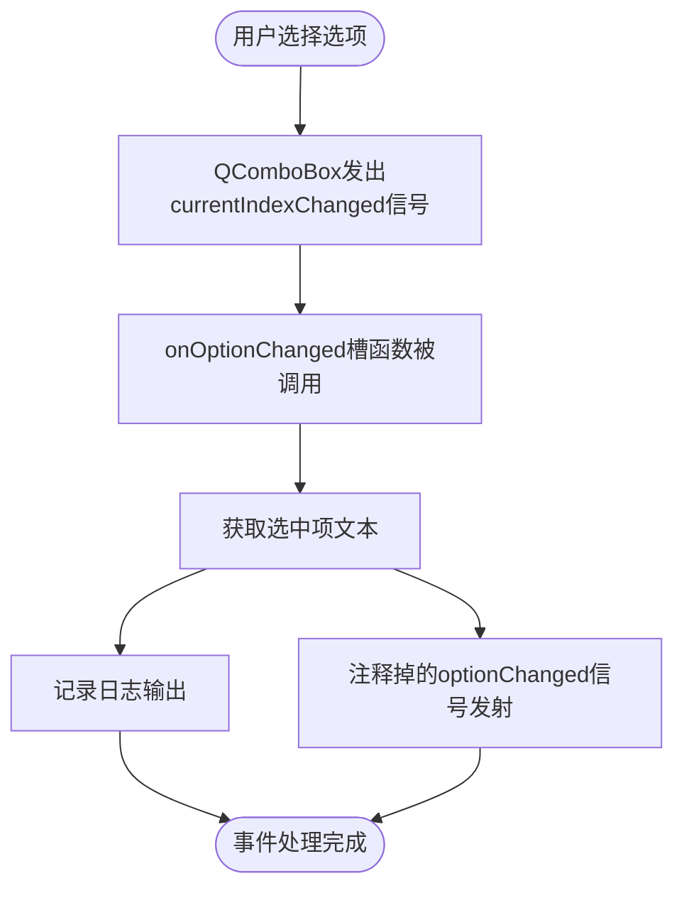
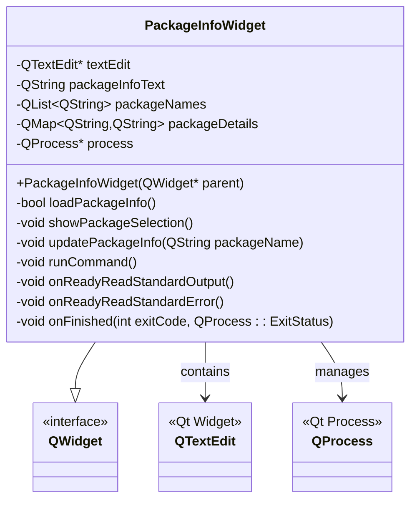
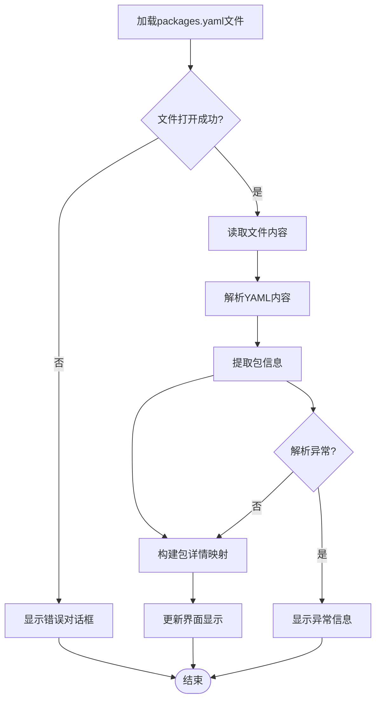
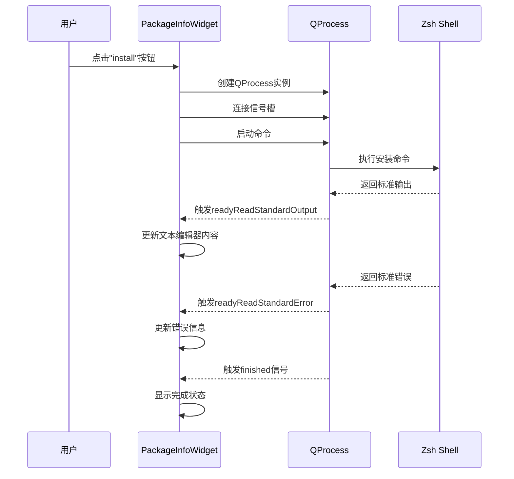
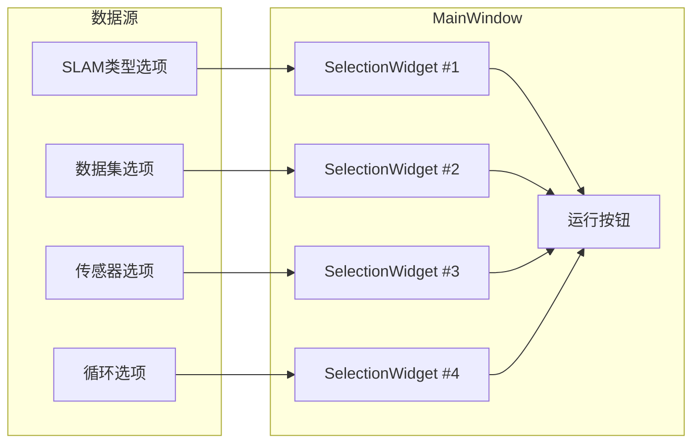
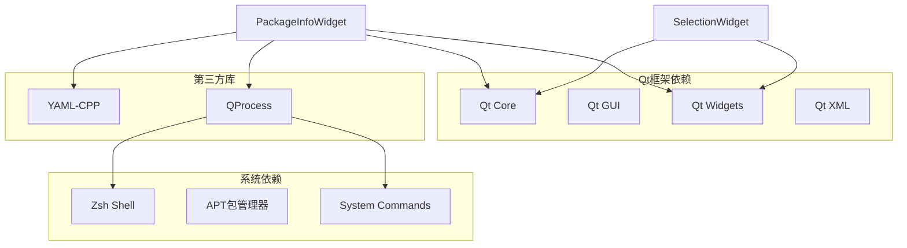

# UI组件设计

<cite>
**本文档引用的文件**
- [PackageInfoWidget.h](file://gui/PackageInfoWidget.h)
- [SelectionWidget.h](file://gui/SelectionWidget.h)
- [main.cpp](file://gui/main.cpp)
- [packages.yaml](file://packages.yaml)
- [install.py](file://install.py)
- [config.py](file://config.py)
- [swap.py](file://swap.py)
- [README.md](file://README.md)
</cite>

## 目录
1. [简介](#简介)
2. [项目结构](#项目结构)
3. [核心组件](#核心组件)
4. [架构概览](#架构概览)
5. [详细组件分析](#详细组件分析)
6. [依赖关系分析](#依赖关系分析)
7. [性能考虑](#性能考虑)
8. [故障排除指南](#故障排除指南)
9. [结论](#结论)

## 简介

Install项目是一个基于Qt框架开发的图形化安装工具，专注于简化软件包安装和系统配置过程。该项目提供了两个主要的UI组件：SelectionWidget（选择组件）和PackageInfoWidget（包信息组件），它们协同工作为用户提供直观的软件包管理和安装界面。

该项目的核心目标是通过图形化界面替代传统的命令行操作，使用户能够轻松地选择、查看和安装各种软件包，同时提供实时的安装进度反馈和错误处理机制。

## 项目结构

项目采用模块化的C++/Qt架构设计，主要分为以下几个部分：

**图表来源**
- [main.cpp:1-73](file://gui/main.cpp#L1-L73)
- [PackageInfoWidget.h:18-145](file://gui/PackageInfoWidget.h#L18-L145)
- [SelectionWidget.h:8-40](file://gui/SelectionWidget.h#L8-L40)

**章节来源**
- [main.cpp:1-73](file://gui/main.cpp#L1-L73)
- [README.md:1-7](file://README.md#L1-L7)

## 核心组件

### SelectionWidget组件

SelectionWidget是一个轻量级的选择组件，基于QComboBox实现，提供基本的选项选择功能。该组件具有以下特点：

- **简单易用**：仅包含一个下拉选择框
- **可配置性**：支持动态设置选项列表
- **事件处理**：内置选项变更监听机制
- **状态管理**：维护当前选中项的状态

### PackageInfoWidget组件

PackageInfoWidget是一个功能丰富的信息展示组件，集成了包信息显示、选择交互和命令执行功能：

- **信息展示**：使用QTextEdit显示详细的包信息
- **交互控制**：提供包选择和安装按钮
- **进程管理**：集成QProcess进行后台命令执行
- **数据绑定**：从YAML文件加载包配置信息
- **实时反馈**：显示命令执行的实时输出

**章节来源**
- [SelectionWidget.h:8-40](file://gui/SelectionWidget.h#L8-L40)
- [PackageInfoWidget.h:18-145](file://gui/PackageInfoWidget.h#L18-L145)

## 架构概览

系统采用分层架构设计，各组件间通过清晰的接口进行通信：

**图表来源**
- [main.cpp:13-42](file://gui/main.cpp#L13-L42)
- [PackageInfoWidget.h:90-145](file://gui/PackageInfoWidget.h#L90-L145)

## 详细组件分析

### SelectionWidget组件深度分析

#### 类结构设计

**图表来源**
- [SelectionWidget.h:8-40](file://gui/SelectionWidget.h#L8-L40)

#### 属性设置机制

SelectionWidget通过以下方式实现属性配置：

1. **构造函数初始化**：在构造时创建QComboBox实例
2. **布局管理**：使用QVBoxLayout自动管理组件布局
3. **选项设置**：通过setOptions方法动态更新下拉选项
4. **事件连接**：建立信号槽连接以响应用户交互

#### 事件处理机制

组件内部实现了完整的事件处理流程：

**图表来源**
- [SelectionWidget.h:32-37](file://gui/SelectionWidget.h#L32-L37)

**章节来源**
- [SelectionWidget.h:8-40](file://gui/SelectionWidget.h#L8-L40)

### PackageInfoWidget组件深度分析

#### 组件架构设计

**图表来源**
- [PackageInfoWidget.h:18-145](file://gui/PackageInfoWidget.h#L18-L145)

#### 数据加载与解析机制

组件通过以下流程处理YAML配置文件：

**图表来源**
- [PackageInfoWidget.h:53-88](file://gui/PackageInfoWidget.h#L53-L88)

#### 命令执行与进程管理

组件集成了完整的命令执行机制：

**图表来源**
- [PackageInfoWidget.h:109-145](file://gui/PackageInfoWidget.h#L109-L145)

**章节来源**
- [PackageInfoWidget.h:18-145](file://gui/PackageInfoWidget.h#L18-L145)

### 组件间通信机制

#### 主窗口协调机制

MainWindow作为协调者，负责管理多个SelectionWidget实例：

**图表来源**
- [main.cpp:13-42](file://gui/main.cpp#L13-L42)

#### 事件传播流程

组件间的事件传播遵循Qt的信号槽机制：

1. **用户交互**：用户在SelectionWidget中选择选项
2. **事件捕获**：SelectionWidget捕获currentIndexChanged信号
3. **状态更新**：组件内部更新当前选中状态
4. **外部通知**：可通过信号机制向父组件传递状态变化

**章节来源**
- [main.cpp:13-42](file://gui/main.cpp#L13-L42)

## 依赖关系分析

### 外部依赖关系

**图表来源**
- [PackageInfoWidget.h:12-16](file://gui/PackageInfoWidget.h#L12-L16)
- [SelectionWidget.h:3-6](file://gui/SelectionWidget.h#L3-L6)

### 内部组件依赖

组件间的依赖关系相对简单，主要体现在：

1. **继承关系**：两个组件都继承自QWidget基类
2. **组合关系**：MainWindow组合多个SelectionWidget实例
3. **信号槽依赖**：组件内部使用Qt的信号槽机制进行通信

**章节来源**
- [PackageInfoWidget.h:12-16](file://gui/PackageInfoWidget.h#L12-L16)
- [SelectionWidget.h:3-6](file://gui/SelectionWidget.h#L3-L6)

## 性能考虑

### 内存管理优化

1. **智能指针使用**：建议在未来的版本中使用Qt的智能指针来自动管理内存
2. **资源释放**：确保QProcess对象在使用后正确释放
3. **字符串处理**：避免不必要的字符串复制操作

### 用户体验优化

1. **异步处理**：将长时间运行的操作改为异步执行，避免界面冻结
2. **进度指示**：为长耗时操作提供进度条或状态指示器
3. **错误恢复**：实现自动重试机制和优雅的错误处理

### 系统资源管理

1. **进程池管理**：限制同时运行的进程数量
2. **内存使用监控**：监控大文件加载时的内存使用情况
3. **I/O优化**：批量处理文件读写操作

## 故障排除指南

### 常见问题及解决方案

#### YAML文件加载失败

**问题症状**：
- 包信息组件显示"Failed to load package information."
- 应用程序无法正常显示包详情

**可能原因**：
1. packages.yaml文件路径不正确
2. YAML文件格式不符合规范
3. 文件权限不足

**解决步骤**：
1. 验证packages.yaml文件存在且路径正确
2. 检查YAML文件语法格式
3. 确认应用程序有读取文件的权限

#### 命令执行失败

**问题症状**：
- 安装按钮点击后无响应
- 进程启动失败日志

**可能原因**：
1. 目标命令不存在或路径错误
2. 权限不足执行sudo命令
3. 系统环境变量配置问题

**解决步骤**：
1. 验证命令在系统中的可用性
2. 检查sudo权限配置
3. 确认shell环境正确

#### UI组件响应问题

**问题症状**：
- 下拉选择框无法正常切换
- 选项变更事件未触发

**可能原因**：
1. 信号槽连接失败
2. 事件处理逻辑错误
3. 组件状态不一致

**解决步骤**：
1. 检查信号槽连接代码
2. 验证事件处理函数实现
3. 确认组件状态同步机制

**章节来源**
- [PackageInfoWidget.h:53-88](file://gui/PackageInfoWidget.h#L53-L88)
- [PackageInfoWidget.h:109-145](file://gui/PackageInfoWidget.h#L109-L145)

## 结论

Install项目的UI组件设计体现了简洁而实用的原则。SelectionWidget和PackageInfoWidget各自承担明确的功能职责，通过合理的架构设计实现了良好的用户体验。

### 设计优势

1. **模块化设计**：组件职责清晰，易于维护和扩展
2. **事件驱动架构**：基于Qt的信号槽机制，响应式设计良好
3. **数据驱动界面**：通过YAML配置文件实现灵活的数据绑定
4. **进程管理集成**：有效整合了系统命令执行功能

### 改进建议

1. **增强错误处理**：添加更完善的异常处理和用户提示机制
2. **性能优化**：实现异步操作和进度反馈
3. **代码重构**：考虑使用现代C++特性和Qt最佳实践
4. **测试覆盖**：增加单元测试和集成测试

该项目为类似的系统管理工具提供了一个优秀的参考实现，其设计理念和架构模式值得在其他项目中借鉴和应用。