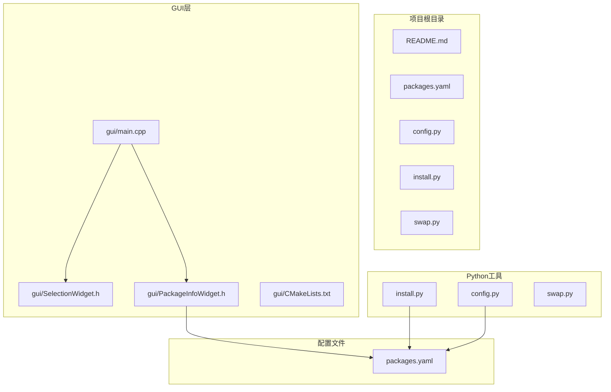
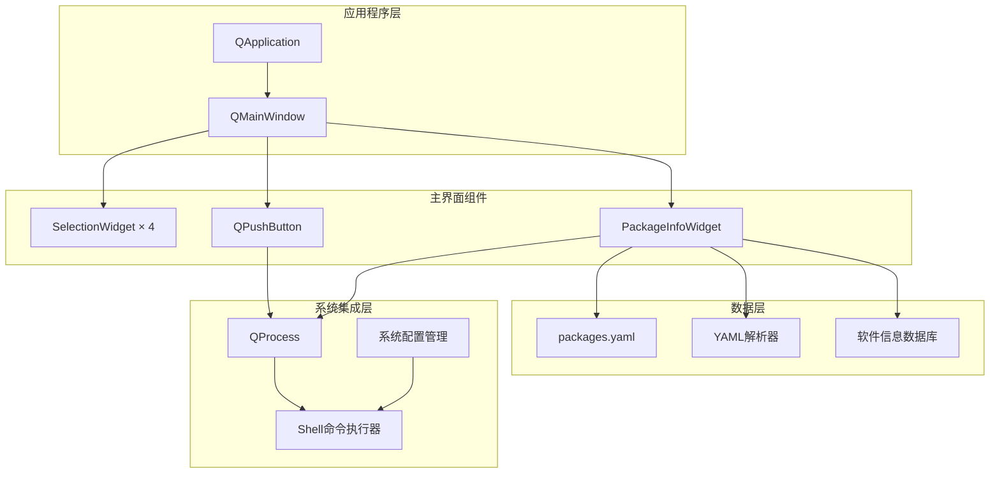
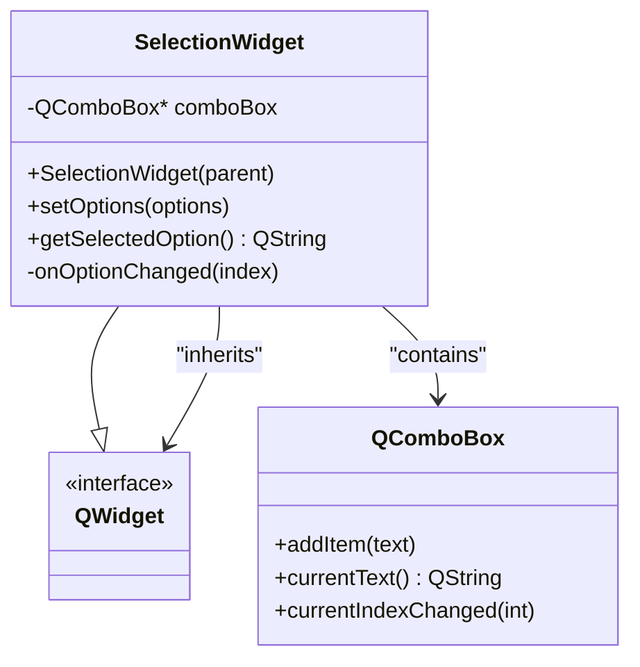
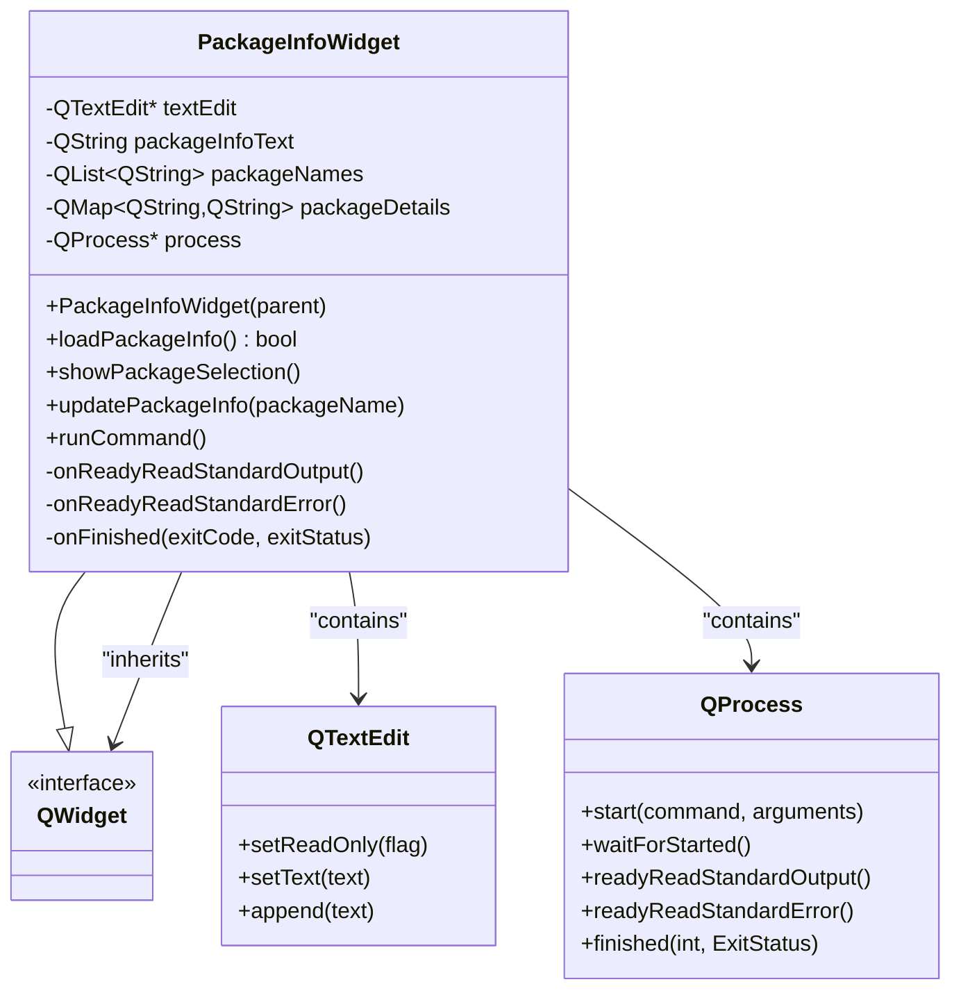
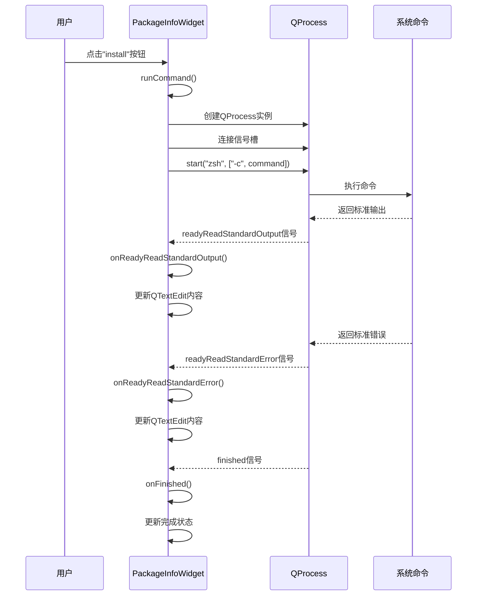
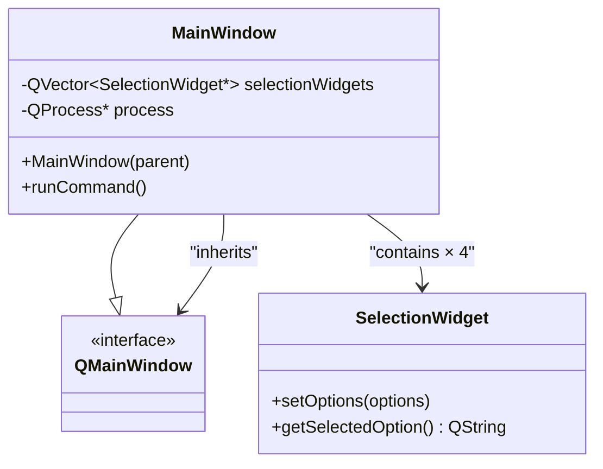
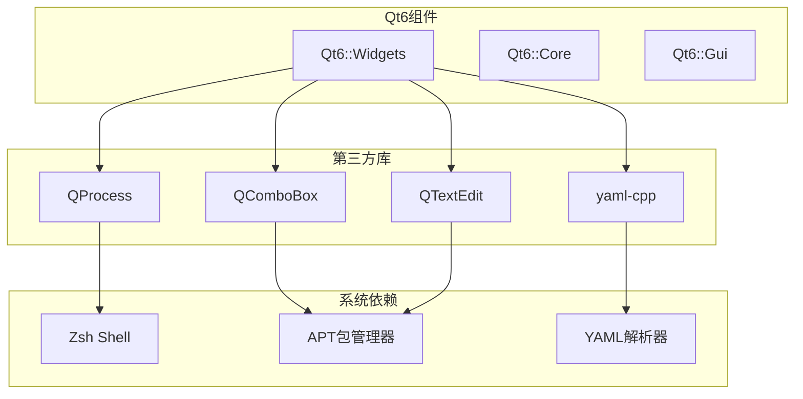
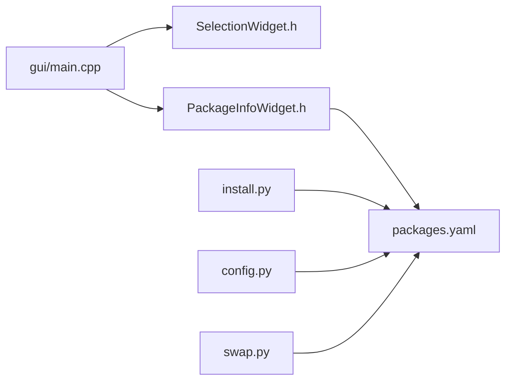

# 图形界面应用

<cite>
**本文档引用的文件**
- [gui/main.cpp](file://gui/main.cpp)
- [gui/SelectionWidget.h](file://gui/SelectionWidget.h)
- [gui/PackageInfoWidget.h](file://gui/PackageInfoWidget.h)
- [gui/CMakeLists.txt](file://gui/CMakeLists.txt)
- [packages.yaml](file://packages.yaml)
- [install.py](file://install.py)
- [config.py](file://config.py)
- [swap.py](file://swap.py)
- [README.md](file://README.md)
</cite>

## 目录
1. [简介](#简介)
2. [项目结构](#项目结构)
3. [核心组件](#核心组件)
4. [架构概览](#架构概览)
5. [详细组件分析](#详细组件分析)
6. [依赖关系分析](#依赖关系分析)
7. [性能考虑](#性能考虑)
8. [故障排除指南](#故障排除指南)
9. [构建与部署指南](#构建与部署指南)
10. [结论](#结论)

## 简介

Install项目是一个基于Qt6的图形界面应用程序，旨在为用户提供一个直观的软件安装和配置界面。该应用程序采用模块化设计，主要包含两个核心GUI组件：SelectionWidget用于软件选择和配置，PackageInfoWidget用于软件信息展示和安装操作。

该项目的设计理念是通过图形化界面简化复杂的命令行操作，让用户能够通过简单的点击和选择来完成软件安装、配置和系统管理任务。应用程序支持多种软件类型（Git下载、Wget下载、配置脚本），并通过YAML配置文件进行灵活的软件管理。

## 项目结构

项目采用清晰的分层架构，主要分为GUI层、业务逻辑层和配置管理层：



**图表来源**
- [gui/main.cpp:1-73](file://gui/main.cpp#L1-L73)
- [gui/CMakeLists.txt:1-26](file://gui/CMakeLists.txt#L1-L26)

**章节来源**
- [gui/main.cpp:1-73](file://gui/main.cpp#L1-L73)
- [gui/CMakeLists.txt:1-26](file://gui/CMakeLists.txt#L1-L26)

## 核心组件

### SelectionWidget组件

SelectionWidget是一个专门用于软件选择的GUI组件，基于QComboBox实现。它提供了以下核心功能：

- **选项管理**：支持动态设置下拉选项列表
- **事件处理**：监听选项变化并提供回调机制
- **数据获取**：提供方法获取当前选中的选项

该组件采用单向数据流设计，从父组件接收选项列表，然后通过信号槽机制通知父组件选项变化。

### PackageInfoWidget组件

PackageInfoWidget是一个综合性的软件信息展示和管理组件，集成了以下功能：

- **信息展示**：使用QTextEdit显示软件详细信息
- **交互式选择**：通过QInputDialog提供软件选择界面
- **安装执行**：集成QProcess进行后台安装操作
- **实时反馈**：监控进程输出并实时更新界面状态

该组件实现了完整的MVC模式，其中Widget负责视图展示，内部逻辑处理数据更新和用户交互。

**章节来源**
- [gui/SelectionWidget.h:1-40](file://gui/SelectionWidget.h#L1-L40)
- [gui/PackageInfoWidget.h:1-145](file://gui/PackageInfoWidget.h#L1-L145)

## 架构概览

应用程序采用经典的Qt应用程序架构，结合了MVC设计模式和事件驱动编程：



**图表来源**
- [gui/main.cpp:7-42](file://gui/main.cpp#L7-L42)
- [gui/PackageInfoWidget.h:18-44](file://gui/PackageInfoWidget.h#L18-L44)

### 控制流分析

应用程序的控制流遵循Qt的事件驱动模型：

1. **初始化阶段**：应用程序启动，创建主窗口和各个组件
2. **配置阶段**：为主窗口的SelectionWidget实例设置选项
3. **交互阶段**：用户通过按钮触发事件，调用相应的槽函数
4. **执行阶段**：通过QProcess执行系统命令，实时监控执行状态

**章节来源**
- [gui/main.cpp:47-61](file://gui/main.cpp#L47-L61)
- [gui/PackageInfoWidget.h:109-127](file://gui/PackageInfoWidget.h#L109-L127)

## 详细组件分析

### SelectionWidget类分析

SelectionWidget实现了简洁而高效的软件选择功能：



**图表来源**
- [gui/SelectionWidget.h:8-39](file://gui/SelectionWidget.h#L8-L39)

#### 组件特性

- **简单性**：仅包含一个QComboBox作为核心控件
- **可扩展性**：通过setOptions方法支持动态选项配置
- **事件响应**：自动连接QComboBox的信号槽机制
- **数据封装**：提供getSelectedOption方法获取当前值

#### 事件处理机制

SelectionWidget采用Qt的标准信号槽机制：
- 当用户改变下拉框选项时，触发currentIndexChanged信号
- 自动连接到onOptionChanged槽函数
- 在槽函数中获取当前选中的文本并进行日志输出

**章节来源**
- [gui/SelectionWidget.h:17-37](file://gui/SelectionWidget.h#L17-L37)

### PackageInfoWidget类分析

PackageInfoWidget是最复杂的组件，实现了完整的软件管理功能：



**图表来源**
- [gui/PackageInfoWidget.h:18-51](file://gui/PackageInfoWidget.h#L18-L51)

#### 数据管理机制

PackageInfoWidget采用内存缓存策略：
- **加载策略**：首次访问时从YAML文件加载所有软件信息
- **缓存机制**：将软件名称和详细信息存储在QMap中
- **查询优化**：通过名称快速查找对应的软件详情

#### 命令执行流程



**图表来源**
- [gui/PackageInfoWidget.h:109-144](file://gui/PackageInfoWidget.h#L109-L144)

**章节来源**
- [gui/PackageInfoWidget.h:53-88](file://gui/PackageInfoWidget.h#L53-L88)
- [gui/PackageInfoWidget.h:109-144](file://gui/PackageInfoWidget.h#L109-L144)

### 主窗口组件分析

主窗口采用了组合模式，将多个SelectionWidget实例组织在一个水平布局中：



**图表来源**
- [gui/main.cpp:7-45](file://gui/main.cpp#L7-L45)

#### 用户交互流程

主窗口的用户交互遵循以下流程：

1. **初始化**：创建四个SelectionWidget实例
2. **配置**：为每个Widget设置不同的选项列表
3. **布局**：将所有Widget和按钮添加到水平布局中
4. **事件绑定**：为运行按钮连接clicked信号到runCommand槽

**章节来源**
- [gui/main.cpp:13-35](file://gui/main.cpp#L13-L35)

## 依赖关系分析

### 外部依赖

应用程序依赖于以下外部库和框架：



**图表来源**
- [gui/CMakeLists.txt:9-13](file://gui/CMakeLists.txt#L9-L13)

### 内部依赖关系



**图表来源**
- [gui/main.cpp:4-5](file://gui/main.cpp#L4-L5)
- [gui/PackageInfoWidget.h:12](file://gui/PackageInfoWidget.h#L12)

**章节来源**
- [gui/CMakeLists.txt:9-13](file://gui/CMakeLists.txt#L9-L13)

## 性能考虑

### 内存管理

应用程序采用了智能指针和Qt的内存管理机制：
- **自动内存管理**：所有Qt对象都通过parent-child关系自动管理生命周期
- **避免内存泄漏**：通过QProcess的parent参数确保进程结束后自动清理
- **资源释放**：应用程序退出时自动释放所有分配的资源

### 界面响应性

为了保持界面的流畅响应：
- **异步处理**：所有长时间运行的操作都在独立线程中执行
- **进度反馈**：通过实时输出更新提供用户反馈
- **错误处理**：完善的错误处理机制避免界面冻结

### 数据访问优化

- **缓存策略**：软件信息在首次加载后缓存在内存中
- **延迟加载**：只有在需要时才解析YAML文件
- **批量操作**：减少不必要的文件I/O操作

## 故障排除指南

### 常见问题及解决方案

#### YAML文件加载失败

**症状**：应用程序启动时显示"Failed to load package information"错误

**可能原因**：
- packages.yaml文件不存在或路径错误
- YAML格式不正确
- 文件权限不足

**解决方法**：
1. 检查packages.yaml文件是否存在且位于正确路径
2. 验证YAML文件格式的正确性
3. 确保应用程序有读取文件的权限

#### QProcess启动失败

**症状**：点击安装按钮后无任何反应或显示"Failed to start process"

**可能原因**：
- Zsh shell不存在或不可执行
- 权限不足执行系统命令
- 命令参数错误

**解决方法**：
1. 确认系统已安装Zsh shell
2. 检查sudo权限配置
3. 验证命令字符串的正确性

#### GUI组件初始化问题

**症状**：界面显示异常或组件无法正常工作

**可能原因**：
- Qt库版本不兼容
- 头文件包含顺序错误
- 构建配置问题

**解决方法**：
1. 确认Qt6版本符合要求
2. 检查头文件包含的完整性
3. 重新配置CMake构建系统

**章节来源**
- [gui/PackageInfoWidget.h:53-88](file://gui/PackageInfoWidget.h#L53-L88)
- [gui/PackageInfoWidget.h:117-127](file://gui/PackageInfoWidget.h#L117-L127)

## 构建与部署指南

### 环境要求

- **操作系统**：Linux发行版（推荐Ubuntu 20.04+）
- **编译器**：GCC 9+ 或 Clang 10+
- **Qt6版本**：Qt 6.5.0+
- **CMake版本**：CMake 3.20+
- **其他依赖**：yaml-cpp库

### 编译步骤

1. **创建构建目录**：
   ```bash
   mkdir build && cd build
   ```

2. **配置项目**：
   ```bash
   cmake .. -DCMAKE_BUILD_TYPE=Release
   ```

3. **编译项目**：
   ```bash
   make -j$(nproc)
   ```

4. **安装应用程序**：
   ```bash
   sudo make install
   ```

### 依赖管理

应用程序使用CMake进行依赖管理：

```mermaid
flowchart TD
A[CMakeLists.txt] --> B[find_package(Qt6 REQUIRED)]
A --> C[find_package(yaml-cpp REQUIRED)]
B --> D[Qt6::Widgets]
C --> E[yaml-cpp]
D --> F[链接到目标]
E --> F
F --> G[可执行文件 QtGui]
```

**图表来源**
- [gui/CMakeLists.txt:9-13](file://gui/CMakeLists.txt#L9-L13)

### 部署配置

应用程序支持CPack打包系统：

- **包格式**：DEB (Debian/Ubuntu)
- **包名**：MyProject
- **版本**：1.0.0
- **描述**：My Project Description
- **供应商**：Your Company
- **安装位置**：/usr/bin

**章节来源**
- [gui/CMakeLists.txt:15-25](file://gui/CMakeLists.txt#L15-L25)

### Python工具集成

项目还包含相关的Python工具：

- **config.py**：配置证书和环境变量
- **install.py**：命令行软件安装工具
- **swap.py**：交换空间管理工具

这些工具可以与Qt应用程序配合使用，提供更完整的系统管理功能。

## 结论

Install项目的Qt6图形界面应用展现了现代C++ GUI开发的最佳实践。通过模块化设计、清晰的组件分离和完善的错误处理机制，该应用程序为用户提供了直观易用的软件管理界面。

### 主要优势

1. **架构清晰**：采用MVC模式和事件驱动设计
2. **扩展性强**：组件设计支持功能扩展和定制
3. **用户体验好**：提供实时反馈和状态更新
4. **维护性佳**：代码结构清晰，易于理解和修改

### 技术亮点

- **信号槽机制**：充分利用Qt的事件系统
- **异步处理**：通过QProcess实现非阻塞操作
- **内存安全**：利用Qt的RAII原则管理资源
- **跨平台兼容**：基于Qt6的跨平台特性

### 改进建议

1. **添加单元测试**：为关键组件添加自动化测试
2. **增强错误处理**：提供更详细的错误信息和恢复机制
3. **国际化支持**：添加多语言界面支持
4. **配置持久化**：保存用户偏好设置

该应用程序为类似的系统管理工具开发提供了良好的参考模板，展示了如何将复杂的系统操作简化为直观的图形界面。