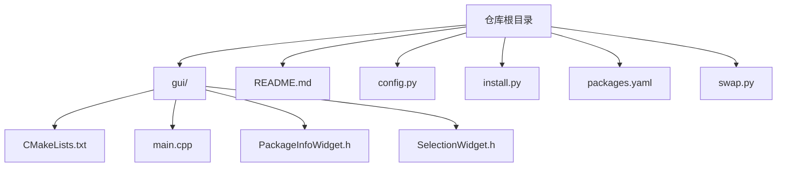
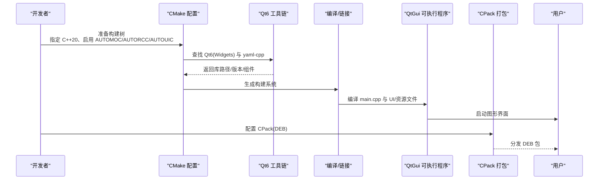
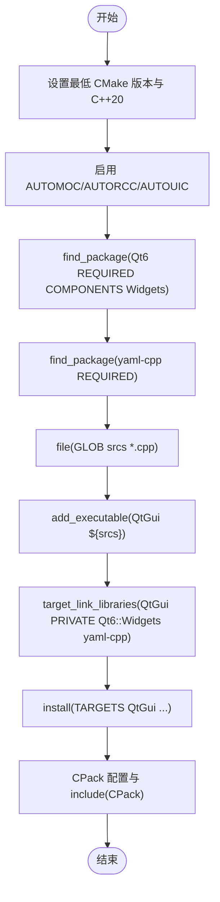
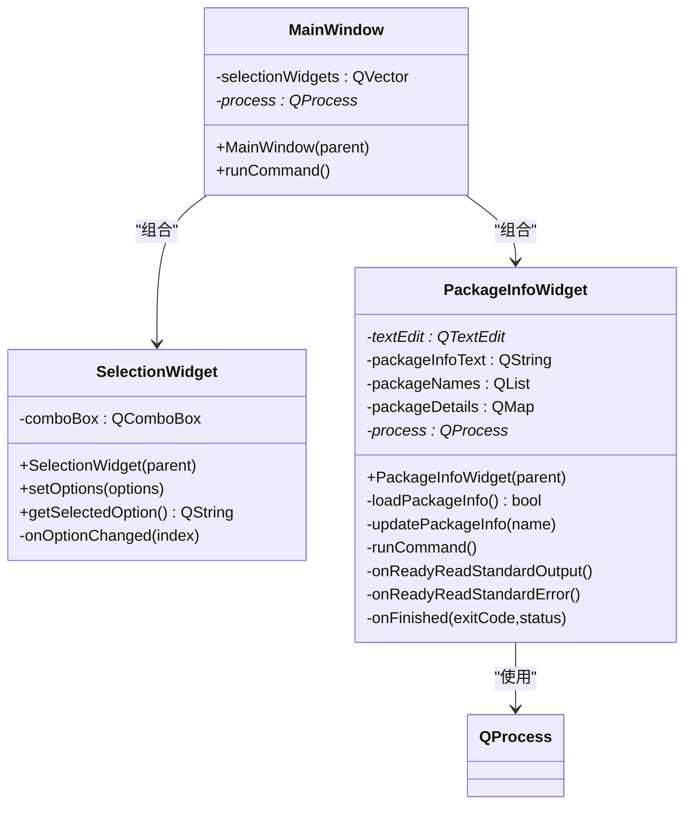
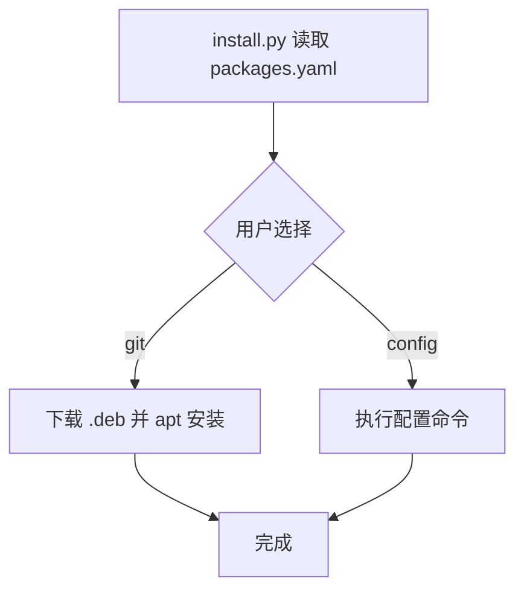
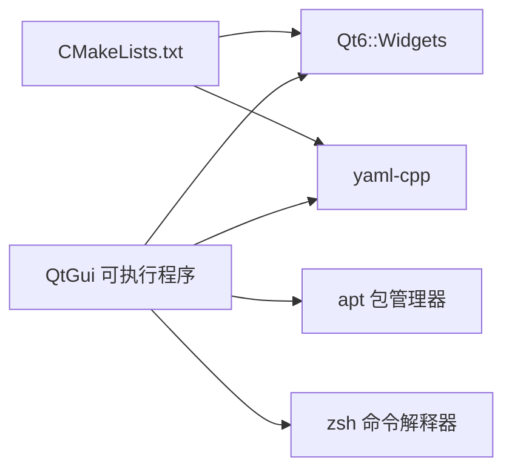

# 构建配置

<cite>
**本文引用的文件**
- [gui/CMakeLists.txt](file://gui/CMakeLists.txt)
- [gui/main.cpp](file://gui/main.cpp)
- [gui/PackageInfoWidget.h](file://gui/PackageInfoWidget.h)
- [gui/SelectionWidget.h](file://gui/SelectionWidget.h)
- [README.md](file://README.md)
- [config.py](file://config.py)
- [install.py](file://install.py)
- [packages.yaml](file://packages.yaml)
- [swap.py](file://swap.py)
</cite>

## 目录
1. [简介](#简介)
2. [项目结构](#项目结构)
3. [核心组件](#核心组件)
4. [架构总览](#架构总览)
5. [详细组件分析](#详细组件分析)
6. [依赖关系分析](#依赖关系分析)
7. [性能考虑](#性能考虑)
8. [故障排除指南](#故障排除指南)
9. [结论](#结论)
10. [附录](#附录)

## 简介
本文件面向使用 CMake 构建 Qt6 图形界面应用的开发者，系统性梳理构建配置、依赖查找与链接、版本管理、编译器与链接器选项、目标平台配置、构建环境准备、依赖安装与交叉编译思路、故障排除、性能优化与部署策略。本文以仓库中的 CMakeLists.txt 为核心入口，结合 GUI 源码与 Python 安装脚本，给出可操作的实践建议与可视化图示。

## 项目结构
该仓库采用“顶层脚本 + 子目录源码”的组织方式：
- 顶层提供安装与系统配置脚本（Python、YAML、README）
- 子目录 gui 下包含 Qt6 应用的 CMake 构建脚本与源代码
- 构建产物通过 CPack 打包为 DEB 包，便于 Linux 发行版分发

图表来源
- [gui/CMakeLists.txt:1-26](file://gui/CMakeLists.txt#L1-L26)
- [gui/main.cpp:1-73](file://gui/main.cpp#L1-L73)
- [gui/PackageInfoWidget.h:1-145](file://gui/PackageInfoWidget.h#L1-L145)
- [gui/SelectionWidget.h:1-40](file://gui/SelectionWidget.h#L1-L40)
- [README.md:1-7](file://README.md#L1-L7)
- [config.py:1-8](file://config.py#L1-L8)
- [install.py:1-36](file://install.py#L1-L36)
- [packages.yaml:1-50](file://packages.yaml#L1-L50)
- [swap.py:1-10](file://swap.py#L1-L10)

章节来源
- [gui/CMakeLists.txt:1-26](file://gui/CMakeLists.txt#L1-L26)
- [README.md:1-7](file://README.md#L1-L7)

## 核心组件
- 构建系统与目标
  - 使用 CMake 最低版本要求与 C++20 标准
  - 启用自动 MOC/AUTORCC/AUTOUIC，简化 Qt 元对象与资源/界面文件处理
  - 定义可执行目标并链接 Qt6 Widgets 与 yaml-cpp
  - 安装规则与 CPack 打包配置（DEB）

- GUI 源码要点
  - 主窗口类组合多个选择控件，提供运行命令触发
  - PackageInfoWidget 负责读取 YAML 并展示包信息，调用外部进程执行命令
  - SelectionWidget 提供下拉选择与事件回调

章节来源
- [gui/CMakeLists.txt:1-26](file://gui/CMakeLists.txt#L1-L26)
- [gui/main.cpp:1-73](file://gui/main.cpp#L1-L73)
- [gui/PackageInfoWidget.h:1-145](file://gui/PackageInfoWidget.h#L1-L145)
- [gui/SelectionWidget.h:1-40](file://gui/SelectionWidget.h#L1-L40)

## 架构总览
从构建到运行的端到端流程如下：

图表来源
- [gui/CMakeLists.txt:1-26](file://gui/CMakeLists.txt#L1-L26)
- [gui/main.cpp:1-73](file://gui/main.cpp#L1-L73)

## 详细组件分析

### CMakeLists.txt 构建配置详解
- 版本与标准
  - 最低 CMake 版本与 C++20 标准确保现代特性可用
- 自动化开关
  - AUTOMOC/AUTORCC/AUTOUIC 使 Qt 的 moc/rcc/uic 处理自动化，减少手工维护
- 项目与依赖
  - 查找 Qt6 Widgets 组件；同时查找 yaml-cpp
  - 收集当前目录下所有 .cpp 文件作为源码
  - 链接 Qt6::Widgets 与 yaml-cpp
- 安装与打包
  - 安装目标到系统二进制目录
  - CPack 配置包名、版本、描述、厂商、联系人、文件名与生成器（DEB）

图表来源
- [gui/CMakeLists.txt:1-26](file://gui/CMakeLists.txt#L1-L26)

章节来源
- [gui/CMakeLists.txt:1-26](file://gui/CMakeLists.txt#L1-L26)

### GUI 源码与 Qt6 集成
- 主窗口类
  - 组合四个 SelectionWidget，并提供“run”按钮触发外部命令
  - 使用 QProcess 启动 shell 命令并监听输出与完成状态
- 选择控件
  - SelectionWidget 封装 QComboBox，提供选项设置与变更回调
- 包信息展示
  - PackageInfoWidget 读取 packages.yaml，解析 YAML 内容并展示详情
  - 通过 QProcess 执行系统命令并将输出实时写入文本框

图表来源
- [gui/main.cpp:1-73](file://gui/main.cpp#L1-L73)
- [gui/SelectionWidget.h:1-40](file://gui/SelectionWidget.h#L1-L40)
- [gui/PackageInfoWidget.h:1-145](file://gui/PackageInfoWidget.h#L1-L145)

章节来源
- [gui/main.cpp:1-73](file://gui/main.cpp#L1-L73)
- [gui/SelectionWidget.h:1-40](file://gui/SelectionWidget.h#L1-L40)
- [gui/PackageInfoWidget.h:1-145](file://gui/PackageInfoWidget.h#L1-L145)

### 依赖安装与系统配置
- packages.yaml 描述了多款软件包的元数据（名称、描述、下载地址、版本），用于后续安装流程
- install.py 读取 YAML，提供交互式菜单，支持两类安装方式：
  - git 类型：从 GitHub Releases 下载 .deb 并安装
  - config 类型：执行一组系统配置命令（如 GRUB 默认启动项设置）
- swap.py 用于创建并启用交换分区，满足大体量安装或构建时内存需求
- config.py 用于复制证书并更新系统 CA 证书缓存，保障网络访问

图表来源
- [install.py:1-36](file://install.py#L1-L36)
- [packages.yaml:1-50](file://packages.yaml#L1-L50)

章节来源
- [install.py:1-36](file://install.py#L1-L36)
- [packages.yaml:1-50](file://packages.yaml#L1-L50)
- [swap.py:1-10](file://swap.py#L1-L10)
- [config.py:1-8](file://config.py#L1-L8)

## 依赖关系分析
- 构建期依赖
  - Qt6 Widgets：图形界面基础
  - yaml-cpp：解析 packages.yaml
- 运行期依赖
  - 系统包管理器（apt）用于安装 .deb
  - Zsh 用于执行命令（由 GUI 触发）
  - 系统网络访问需有效证书（config.py 更新 CA）

图表来源
- [gui/CMakeLists.txt:1-26](file://gui/CMakeLists.txt#L1-L26)
- [gui/PackageInfoWidget.h:1-145](file://gui/PackageInfoWidget.h#L1-L145)
- [gui/main.cpp:1-73](file://gui/main.cpp#L1-L73)

章节来源
- [gui/CMakeLists.txt:1-26](file://gui/CMakeLists.txt#L1-L26)
- [gui/PackageInfoWidget.h:1-145](file://gui/PackageInfoWidget.h#L1-L145)
- [gui/main.cpp:1-73](file://gui/main.cpp#L1-L73)

## 性能考虑
- 构建性能
  - 启用 AUTOMOC/AUTORCC/AUTOUIC 可减少手工维护成本，但会增加配置阶段开销；在大型工程中建议配合并行构建与增量编译
  - 使用 Ninja 或 VS/Unix Make 等高效生成器，避免不必要的全量重编
- 运行性能
  - GUI 控件数量有限，性能瓶颈通常不在 UI 层；注意外部命令执行的阻塞与异步输出处理
  - 对于频繁读取 YAML 的场景，可考虑缓存解析结果或使用更轻量的数据结构
- 内存与磁盘
  - 大体量安装可能需要交换分区；swap.py 提供快速创建与挂载方案
  - 避免在 UI 线程中进行耗时操作，使用 QProcess 异步执行外部命令

[本节为通用指导，无需特定文件来源]

## 故障排除指南
- CMake 找不到 Qt6
  - 确认已正确安装 Qt6 开发包与工具链，检查 Qt6 安装路径是否在 CMake 搜索路径中
  - 若使用自定义安装路径，可通过 CMake 变量指定 Qt 根目录
- yaml-cpp 未找到
  - 确保系统已安装 yaml-cpp 开发包；若使用自定义安装，设置 yaml-cpp 的查找路径
- 构建失败（AUTOUIC/AUTORCC/AUTOMOC）
  - 确认 UI 文件与资源文件命名规范；检查 CMake 版本与 Qt 版本兼容性
- 运行时报错找不到命令
  - 确认 zsh 已安装且在 PATH 中；检查 GUI 触发的命令是否存在或权限是否足够
- 安装过程卡顿或内存不足
  - 使用 swap.py 创建交换分区；必要时降低并发安装或分批执行
- 网络访问失败
  - 使用 config.py 更新系统 CA 证书缓存后再尝试网络操作

章节来源
- [gui/CMakeLists.txt:1-26](file://gui/CMakeLists.txt#L1-L26)
- [swap.py:1-10](file://swap.py#L1-L10)
- [config.py:1-8](file://config.py#L1-L8)
- [gui/PackageInfoWidget.h:1-145](file://gui/PackageInfoWidget.h#L1-L145)

## 结论
本项目以简洁的 CMakeLists.txt 实现了 Qt6 应用的自动化构建与打包，结合 Python 脚本实现依赖安装与系统配置。通过合理配置 AUTOMOC/AUTORCC/AUTOUIC、明确依赖查找与链接、以及利用 CPack 输出 DEB 包，可快速交付可用的图形界面应用。建议在实际工程中进一步完善版本管理、交叉编译支持与持续集成流水线，以提升可维护性与可移植性。

[本节为总结，无需特定文件来源]

## 附录

### 构建环境准备清单
- 必备工具
  - CMake（满足最低版本要求）
  - C++20 编译器（如 GCC/Clang）
  - Qt6 开发包（Widgets 组件）
  - yaml-cpp 开发包
  - zsh（用于执行命令）
  - 系统包管理器（apt）
- 可选工具
  - Ninja 生成器
  - CPack（用于 DEB 打包）
  - 交换分区（swap.py）

章节来源
- [gui/CMakeLists.txt:1-26](file://gui/CMakeLists.txt#L1-L26)
- [swap.py:1-10](file://swap.py#L1-L10)

### 依赖安装与系统配置
- 使用 packages.yaml 与 install.py 进行交互式安装
- 使用 swap.py 创建并启用交换分区
- 使用 config.py 更新系统 CA 证书缓存

章节来源
- [install.py:1-36](file://install.py#L1-L36)
- [packages.yaml:1-50](file://packages.yaml#L1-L50)
- [swap.py:1-10](file://swap.py#L1-L10)
- [config.py:1-8](file://config.py#L1-L8)

### 部署策略
- 使用 CPack 生成 DEB 包，便于在 Debian/Ubuntu 生态分发
- 在目标系统上安装依赖后直接运行可执行文件
- 如需跨平台部署，建议引入交叉编译链与目标平台 SDK

章节来源
- [gui/CMakeLists.txt:17-26](file://gui/CMakeLists.txt#L17-L26)