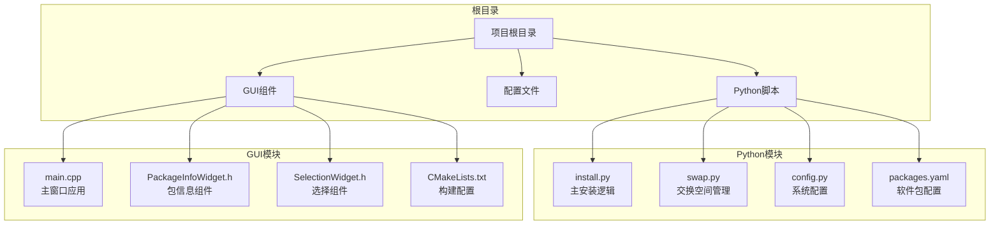
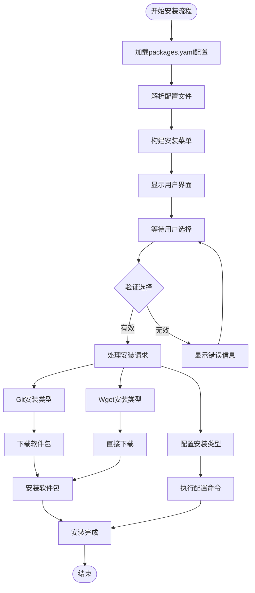
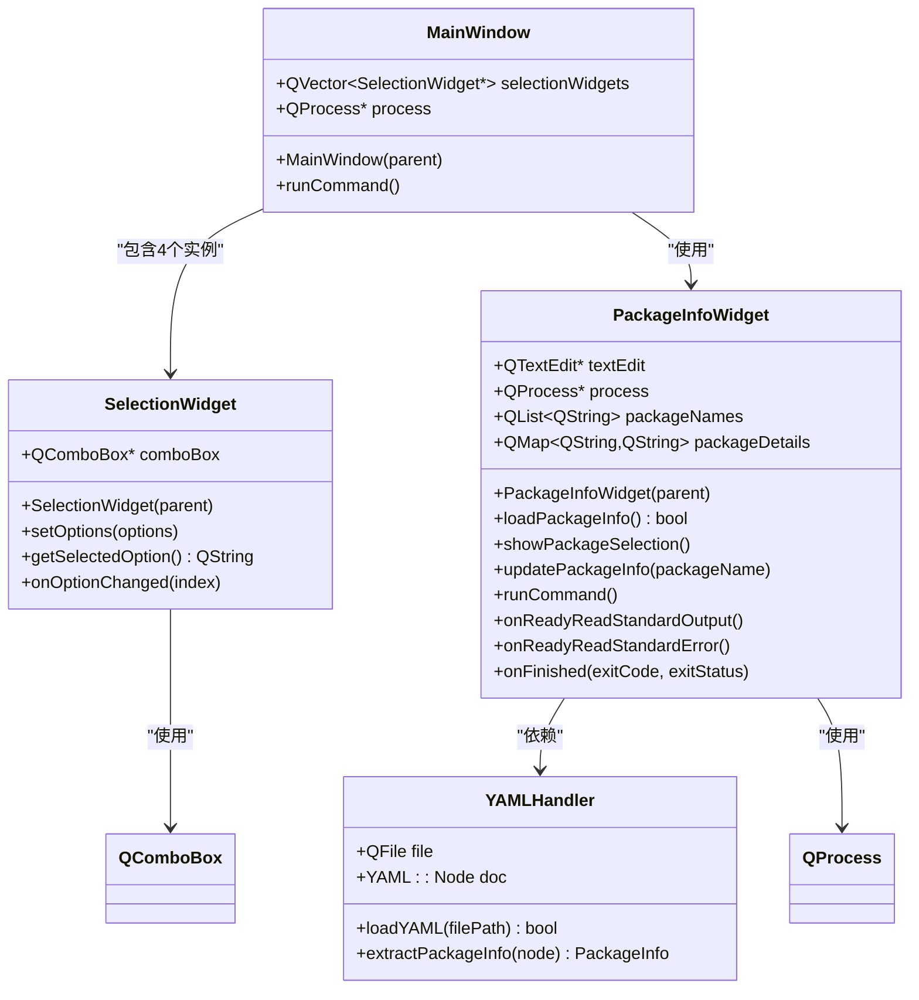
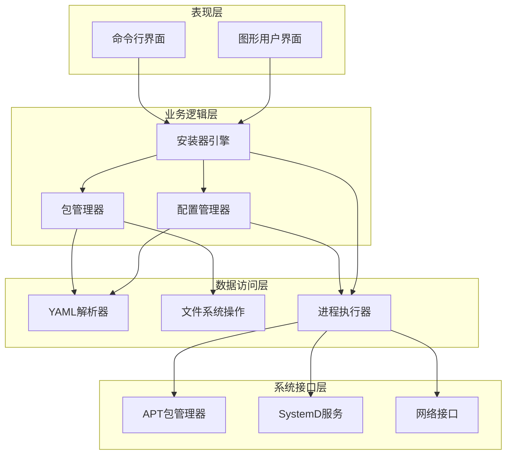
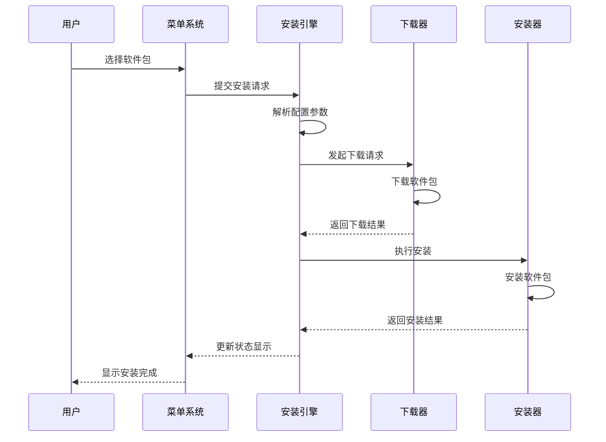
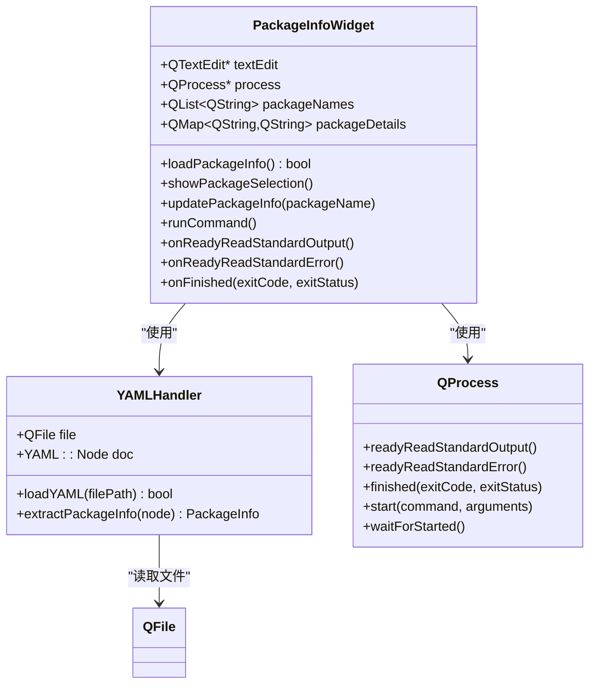
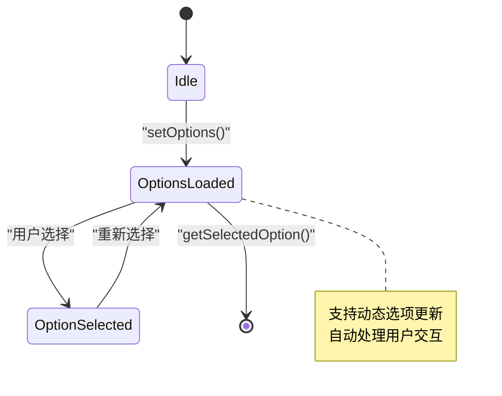
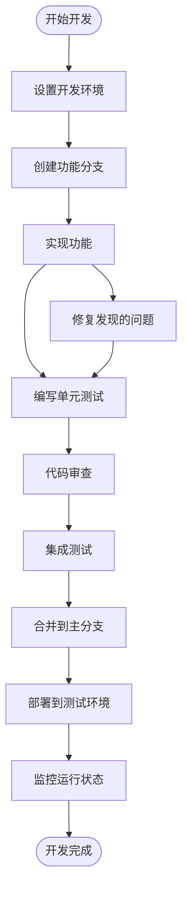
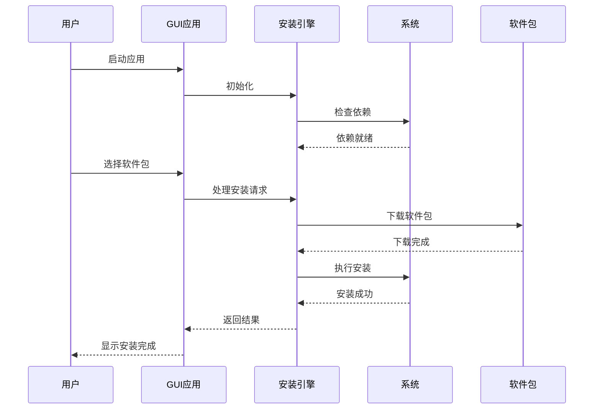

# 开发指南

<cite>
**本文档引用的文件**
- [README.md](file://README.md)
- [install.py](file://install.py)
- [config.py](file://config.py)
- [swap.py](file://swap.py)
- [packages.yaml](file://packages.yaml)
- [gui/main.cpp](file://gui/main.cpp)
- [gui/CMakeLists.txt](file://gui/CMakeLists.txt)
- [gui/PackageInfoWidget.h](file://gui/PackageInfoWidget.h)
- [gui/SelectionWidget.h](file://gui/SelectionWidget.h)
</cite>

## 目录
1. [简介](#简介)
2. [项目结构](#项目结构)
3. [开发环境搭建](#开发环境搭建)
4. [核心组件](#核心组件)
5. [架构概览](#架构概览)
6. [详细组件分析](#详细组件分析)
7. [开发流程与规范](#开发流程与规范)
8. [测试策略](#测试策略)
9. [扩展与最佳实践](#扩展与最佳实践)
10. [调试技巧](#调试技巧)
11. [性能优化](#性能优化)
12. [部署注意事项](#部署注意事项)
13. [贡献指南](#贡献指南)
14. [故障排除](#故障排除)
15. [结论](#结论)

## 简介

Install项目是一个多功能的系统安装和配置工具集，提供了以下核心功能：

- **一键安装系统**：通过图形界面和命令行两种方式提供软件安装服务
- **系统配置管理**：支持各种系统配置任务的自动化执行
- **交换空间管理**：提供便捷的虚拟内存配置解决方案
- **包管理器**：基于YAML配置的软件包管理系统

该项目采用混合架构设计，结合了Python脚本的灵活性和C++ Qt GUI的用户友好性，为用户提供了一站式的系统管理和软件安装解决方案。

## 项目结构

项目采用清晰的模块化组织结构，主要分为以下几个部分：



**图表来源**
- [README.md:1-7](file://README.md#L1-L7)
- [install.py:1-36](file://install.py#L1-L36)
- [gui/main.cpp:1-73](file://gui/main.cpp#L1-L73)

**章节来源**
- [README.md:1-7](file://README.md#L1-L7)
- [packages.yaml:1-50](file://packages.yaml#L1-L50)

## 开发环境搭建

### 系统要求

项目支持多种操作系统，但主要针对Linux发行版进行优化：

- **操作系统**：Ubuntu 20.04+ 或其他基于Debian的Linux发行版
- **Python版本**：Python 3.6+
- **C++编译器**：GCC 9+ 或 Clang 10+
- **Qt版本**：Qt 6.0+

### 必需工具链安装

#### Python开发环境
```bash
# 安装Python依赖
sudo apt update
sudo apt install python3 python3-pip python3-dev python3-venv

# 创建虚拟环境
python3 -m venv venv
source venv/bin/activate

# 安装Python包
pip install pyyaml
```

#### C++ Qt开发环境
```bash
# 安装Qt6开发工具
sudo apt install qt6-base-dev qt6-base-dev-tools cmake build-essential

# 安装yaml-cpp库
sudo apt install libyaml-cpp-dev

# 验证安装
qmake6 --version
cmake --version
```

#### 开发工具配置
```bash
# 安装代码格式化工具
sudo apt install clang-format

# 配置Git钩子（可选）
cp .git/hooks/pre-commit.sample .git/hooks/pre-commit
chmod +x .git/hooks/pre-commit
```

**章节来源**
- [gui/CMakeLists.txt:1-26](file://gui/CMakeLists.txt#L1-L26)
- [install.py:1-36](file://install.py#L1-L36)

## 核心组件

### Python安装引擎

安装引擎是项目的核心逻辑组件，负责处理软件包的下载、安装和配置。



**图表来源**
- [install.py:4-16](file://install.py#L4-L16)
- [install.py:17-35](file://install.py#L17-L35)

### GUI应用程序架构

GUI应用程序采用MVC模式设计，分离了用户界面、业务逻辑和数据管理。



**图表来源**
- [gui/main.cpp:7-42](file://gui/main.cpp#L7-L42)
- [gui/SelectionWidget.h:8-39](file://gui/SelectionWidget.h#L8-L39)
- [gui/PackageInfoWidget.h:18-44](file://gui/PackageInfoWidget.h#L18-L44)

**章节来源**
- [install.py:1-36](file://install.py#L1-L36)
- [gui/main.cpp:1-73](file://gui/main.cpp#L1-L73)
- [gui/PackageInfoWidget.h:1-145](file://gui/PackageInfoWidget.h#L1-L145)

## 架构概览

项目采用分层架构设计，确保了良好的可维护性和扩展性：



**图表来源**
- [install.py:17-35](file://install.py#L17-L35)
- [gui/main.cpp:47-61](file://gui/main.cpp#L47-L61)

## 详细组件分析

### 安装器引擎 (install.py)

安装器引擎是整个系统的控制中枢，负责协调各个安装组件的工作。

#### 核心功能特性

1. **多类型安装支持**：
   - Git安装：从GitHub等源码仓库下载发布包
   - Wget安装：直接下载预编译的二进制包
   - 配置安装：执行系统配置命令

2. **交互式菜单系统**：
   - 动态生成安装选项菜单
   - 用户友好的选择界面
   - 实时反馈安装状态

#### 数据流分析



**图表来源**
- [install.py:4-16](file://install.py#L4-L16)
- [install.py:17-35](file://install.py#L17-L35)

**章节来源**
- [install.py:1-36](file://install.py#L1-L36)
- [packages.yaml:1-50](file://packages.yaml#L1-L50)

### 包配置系统 (packages.yaml)

包配置系统采用YAML格式定义，提供了灵活的软件包描述能力。

#### 配置文件结构

| 字段名 | 类型 | 必需 | 描述 |
|--------|------|------|------|
| type | string | 是 | 安装类型 (git/wget/config) |
| name | string | 是 | 软件包名称或文件名 |
| des | string | 是 | 软件包描述信息 |
| url | string | 是 | 下载地址或源码仓库地址 |
| version | string | 取决于type | 版本号 (仅git类型需要) |
| cmd | array | 取决于type | 配置命令列表 (仅config类型需要) |

#### 支持的软件包类型

1. **Git类型软件包**：
   - 从GitHub Releases下载预编译包
   - 自动解析版本号和文件名
   - 支持镜像站点加速下载

2. **Wget类型软件包**：
   - 直接下载指定URL的文件
   - 支持各种格式的软件包
   - 简化的安装流程

3. **配置类型软件包**：
   - 执行一系列系统配置命令
   - 支持复杂的系统设置
   - 自动更新相关配置文件

**章节来源**
- [packages.yaml:1-50](file://packages.yaml#L1-L50)

### GUI组件系统

#### PackageInfoWidget组件

PackageInfoWidget是GUI系统中的核心组件，负责显示软件包信息和执行安装操作。



**图表来源**
- [gui/PackageInfoWidget.h:18-44](file://gui/PackageInfoWidget.h#L18-L44)
- [gui/PackageInfoWidget.h:53-88](file://gui/PackageInfoWidget.h#L53-L88)

#### SelectionWidget组件

SelectionWidget提供了一个简洁的下拉选择界面，支持动态选项配置。



**图表来源**
- [gui/SelectionWidget.h:21-28](file://gui/SelectionWidget.h#L21-L28)

**章节来源**
- [gui/PackageInfoWidget.h:1-145](file://gui/PackageInfoWidget.h#L1-L145)
- [gui/SelectionWidget.h:1-40](file://gui/SelectionWidget.h#L1-L40)

## 开发流程与规范

### 代码组织原则

1. **模块化设计**：每个功能模块保持独立，通过明确定义的接口进行交互
2. **单一职责**：每个类和函数只负责一个特定的功能领域
3. **依赖注入**：通过构造函数参数传递依赖关系，便于测试和维护
4. **错误处理**：统一的异常处理机制，确保程序稳定性

### 开发工作流程



### 代码规范

#### Python代码规范

1. **命名约定**：
   - 函数和变量：snake_case
   - 类名：PascalCase
   - 常量：UPPER_CASE

2. **文档字符串**：
   - 每个函数都应包含详细的文档字符串
   - 参数、返回值和异常都要明确标注

3. **错误处理**：
   - 使用try-except块处理可能的异常
   - 提供有意义的错误消息

#### C++代码规范

1. **命名约定**：
   - 类名：PascalCase
   - 成员变量：camelCase
   - 常量：UPPER_CASE

2. **内存管理**：
   - 使用智能指针管理动态内存
   - 避免内存泄漏

3. **Qt特定规范**：
   - 正确使用信号槽机制
   - 遵循Qt的生命周期管理

**章节来源**
- [gui/CMakeLists.txt:1-26](file://gui/CMakeLists.txt#L1-L26)
- [install.py:1-36](file://install.py#L1-L36)

## 测试策略

### 单元测试

#### Python组件测试

```python
import unittest
from unittest.mock import patch, MagicMock

class TestInstallEngine(unittest.TestCase):
    def setUp(self):
        self.engine = InstallEngine()
    
    @patch('subprocess.run')
    def test_git_install_success(self, mock_run):
        mock_run.return_value = MockResult(0)
        result = self.engine.process_choice({
            'type': 'git',
            'name': 'test-package',
            'url': 'https://github.com/test/test',
            'version': 'v1.0'
        })
        self.assertTrue(result)
    
    def test_invalid_type(self):
        result = self.engine.process_choice({
            'type': 'invalid',
            'name': 'test-package'
        })
        self.assertFalse(result)
```

#### GUI组件测试

```cpp
#include <QTest>
#include <QSignalSpy>

class TestPackageInfoWidget : public QObject {
    Q_OBJECT
    
private slots:
    void testLoadPackageInfo() {
        PackageInfoWidget widget;
        bool result = widget.loadPackageInfo();
        QVERIFY(result);
    }
    
    void testShowPackageSelection() {
        PackageInfoWidget widget;
        QSignalSpy spy(&widget, &PackageInfoWidget::packageSelected);
        
        widget.showPackageSelection();
        
        QCOMPARE(spy.count(), 1);
    }
};
```

### 集成测试

#### 端到端测试流程



### 性能测试

#### 内存使用测试

```python
import psutil
import os

def test_memory_usage():
    process = psutil.Process(os.getpid())
    initial_memory = process.memory_info().rss
    
    # 执行大量安装操作
    for i in range(100):
        # 模拟安装过程
        pass
    
    final_memory = process.memory_info().rss
    memory_diff = final_memory - initial_memory
    
    # 确保内存增长在合理范围内
    assert memory_diff < 10 * 1024 * 1024  # 不超过10MB
```

**章节来源**
- [install.py:1-36](file://install.py#L1-L36)
- [gui/PackageInfoWidget.h:109-127](file://gui/PackageInfoWidget.h#L109-L127)

## 扩展与最佳实践

### 新增软件包类型

要添加新的软件包类型，需要修改安装引擎的处理逻辑：

```python
def process_choice(selection):
    if selection['type'] == 'new_type':
        # 实现新类型的处理逻辑
        pass
    elif selection['type'] == 'git':
        # 现有逻辑...
    elif selection['type'] == 'config':
        # 现有逻辑...
    else:
        print('不支持的类型')
```

### 配置文件扩展

#### 添加自定义配置选项

```yaml
CustomApp:
  type: git
  name: custom-app_1.0.0_amd64.deb
  des: 自定义应用程序
  url: https://github.com/user/custom-app
  version: v1.0.0
  custom_param: value
```

### 最佳实践指南

1. **错误恢复**：实现自动重试机制和回滚功能
2. **日志记录**：完整的操作日志和错误追踪
3. **资源清理**：及时清理临时文件和缓存
4. **权限管理**：最小权限原则，避免不必要的sudo操作

**章节来源**
- [install.py:4-16](file://install.py#L4-L16)
- [packages.yaml:1-50](file://packages.yaml#L1-L50)

## 调试技巧

### Python调试方法

#### 使用pdb进行交互式调试

```python
import pdb

def debug_install_process():
    pdb.set_trace()  # 设置断点
    # 在这里检查变量状态
    # 使用n(step)、s(step into)、c(continue)等命令
```

#### 日志记录最佳实践

```python
import logging

# 配置日志
logging.basicConfig(
    level=logging.DEBUG,
    format='%(asctime)s - %(name)s - %(levelname)s - %(message)s',
    handlers=[
        logging.FileHandler('install.log'),
        logging.StreamHandler()
    ]
)

logger = logging.getLogger(__name__)

def process_choice(selection):
    logger.debug(f"Processing installation: {selection}")
    try:
        # 安装逻辑
        pass
    except Exception as e:
        logger.error(f"Installation failed: {e}", exc_info=True)
        raise
```

### C++调试方法

#### GDB调试技巧

```bash
# 编译时启用调试信息
g++ -g -o QtGui main.cpp -lQt6Widgets -lyaml-cpp

# 使用GDB调试
gdb ./QtGui
(gdb) break main
(gdb) run
(gdb) bt  # 查看调用栈
(gdb) info locals  # 查看局部变量
```

#### Qt Creator调试

```cpp
// 在代码中添加调试输出
qDebug() << "Current selection:" << selectedOption;
qDebug() << "Package details:" << packageDetails;

// 使用条件断点
// 在PackageInfoWidget::loadPackageInfo中设置断点
// 条件: !file.open(QIODevice::ReadOnly | QIODevice::Text)
```

### 网络和系统调试

#### 网络问题排查

```bash
# 检查网络连接
ping github.com
curl -I https://github.com

# 查看DNS解析
nslookup github.com

# 检查代理设置
env | grep -i proxy
```

#### 权限问题排查

```bash
# 检查当前用户权限
id
groups

# 检查sudo权限
sudo -l

# 查看文件权限
ls -la /tmp
ls -la /opt
```

**章节来源**
- [gui/PackageInfoWidget.h:129-144](file://gui/PackageInfoWidget.h#L129-L144)
- [install.py:1-36](file://install.py#L1-L36)

## 性能优化

### Python性能优化

#### 内存使用优化

```python
import gc
from contextlib import contextmanager

@contextmanager
def memory_monitor():
    """内存使用监控上下文管理器"""
    initial_memory = psutil.Process().memory_info().rss
    yield
    final_memory = psutil.Process().memory_info().rss
    print(f"Memory usage: {(final_memory - initial_memory) / 1024 / 1024:.2f} MB")

def optimize_yaml_loading():
    """优化YAML文件加载"""
    # 使用流式读取减少内存占用
    with open('packages.yaml', 'r') as file:
        for line in file:
            # 逐行处理，避免一次性加载大文件
            pass
```

#### 并发处理优化

```python
import concurrent.futures
from concurrent.futures import ThreadPoolExecutor

def parallel_install_packages(packages):
    """并行安装多个软件包"""
    with ThreadPoolExecutor(max_workers=4) as executor:
        futures = []
        for package in packages:
            future = executor.submit(install_single_package, package)
            futures.append(future)
        
        # 收集结果
        results = []
        for future in concurrent.futures.as_completed(futures):
            results.append(future.result())
    
    return results
```

### C++性能优化

#### 内存管理优化

```cpp
class OptimizedPackageInfoWidget : public QWidget {
private:
    std::unique_ptr<QTextEdit> textEdit;
    std::unique_ptr<QProcess> process;
    QStringList packageNames;
    std::unordered_map<QString, QString> packageDetails;
    
public:
    OptimizedPackageInfoWidget(QWidget *parent = nullptr) 
        : QWidget(parent), textEdit(std::make_unique<QTextEdit>()) {
        // 使用智能指针自动管理内存
    }
    
    void loadPackageInfoOptimized() {
        // 使用RAII模式
        QFile file("../../packages.yaml");
        if (file.open(QIODevice::ReadOnly | QIODevice::Text)) {
            QTextStream in(&file);
            QString content = in.readAll();
            // 处理内容...
        }
        // 文件自动关闭
    }
};
```

#### Qt性能优化

```cpp
void MainWindow::optimizeLayout() {
    // 预分配容器大小
    selectionWidgets.reserve(4);
    
    // 使用move语义
    for (auto& widget : selectionWidgets) {
        widget = new SelectionWidget();
    }
    
    // 批量更新UI
    layout->blockSignals(true);
    for (auto& widget : selectionWidgets) {
        layout->addWidget(widget);
    }
    layout->blockSignals(false);
}
```

### 系统级优化

#### 磁盘I/O优化

```bash
# 使用SSD存储临时文件
export TMPDIR=/dev/shm

# 预分配磁盘空间
fallocate -l 1G /tmp/install_temp

# 使用内存映射文件
dd if=/dev/zero of=/tmp/mapped_file bs=1M count=100
```

#### 网络优化

```bash
# 配置系统网络参数
echo 'net.core.rmem_max = 134217728' >> /etc/sysctl.conf
echo 'net.core.wmem_max = 134217728' >> /etc/sysctl.conf
sysctl -p

# 使用HTTP/2和连接复用
curl --http2 -I https://github.com
```

**章节来源**
- [gui/PackageInfoWidget.h:18-44](file://gui/PackageInfoWidget.h#L18-L44)
- [install.py:1-36](file://install.py#L1-L36)

## 部署注意事项

### 生产环境部署

#### 系统准备

```bash
# 更新系统包管理器
sudo apt update && sudo apt upgrade -y

# 安装必需的系统工具
sudo apt install -y \
    curl \
    wget \
    unzip \
    gnupg \
    lsb-release \
    ca-certificates

# 配置系统环境
echo 'export PATH=$PATH:/usr/local/bin' >> ~/.bashrc
source ~/.bashrc
```

#### 应用程序打包

```bash
# 使用CPack创建DEB包
mkdir build && cd build
cmake .. -DCMAKE_BUILD_TYPE=Release
make -j$(nproc)
cpack

# 验证包文件
dpkg -I QtGui_*.deb
```

### 安全考虑

#### 权限管理

```bash
# 创建专用用户组
sudo groupadd install-users
sudo usermod -aG install-users $USER

# 设置适当的文件权限
sudo chown root:root /opt/install
sudo chmod 755 /opt/install
sudo chmod 644 /opt/install/packages.yaml
```

#### 代码签名

```bash
# 生成自签名证书
openssl req -new -x509 -keyout install.key -out install.crt -days 365 -nodes

# 配置系统信任
sudo cp install.crt /usr/local/share/ca-certificates
sudo update-ca-certificates
```

### 监控和维护

#### 系统监控

```bash
# 监控磁盘空间
df -h
du -sh /opt/*

# 监控内存使用
free -h
ps aux | grep install

# 监控网络连接
netstat -tulpn | grep install
```

#### 日志管理

```bash
# 配置日志轮转
cat > /etc/logrotate.d/install << EOF
/opt/install/logs/*.log {
    daily
    missingok
    rotate 52
    compress
    delaycompress
    notifempty
    create 644 root root
}
EOF
```

**章节来源**
- [gui/CMakeLists.txt:17-26](file://gui/CMakeLists.txt#L17-L26)
- [README.md:4-7](file://README.md#L4-L7)

## 贡献指南

### 代码贡献流程


### 提交规范

#### Commit消息格式

```
<type>(<scope>): <subject>

<body>

<footer>
```

**示例**：
```
feat(gui): 添加新的软件包选择界面

- 实现了动态选项加载功能
- 添加了搜索过滤功能
- 优化了用户体验

Fixes #123
```

#### Pull Request模板

```markdown
## 变更描述

简要描述本次变更的内容

## 变更类型

- [ ] 功能新增
- [ ] Bug修复  
- [ ] 文档更新
- [ ] 代码重构
- [ ] 性能优化

## 测试情况

- [ ] 已添加单元测试
- [ ] 已进行集成测试
- [ ] 已在生产环境验证

## 相关问题

Fixes #issue-number
```

### 代码审查标准

1. **功能正确性**：代码实现符合需求规格
2. **代码质量**：遵循项目编码规范
3. **性能影响**：不会引入性能退化
4. **安全性**：没有安全漏洞
5. **兼容性**：保持向后兼容性

### 社区参与

#### 讨论和反馈

- **GitHub Issues**：报告Bug和功能请求
- **GitHub Discussions**：技术讨论和方案设计
- **邮件列表**：重要公告和决策通知

#### 新手友好指南

```bash
# 从简单的任务开始
git checkout -b fix-readme
# 修改README.md中的小错误
git commit -am "docs: 修正拼写错误"
git push origin fix-readme
```

**章节来源**
- [README.md:1-7](file://README.md#L1-L7)

## 故障排除

### 常见问题诊断

#### Python环境问题

```bash
# 检查Python版本和路径
which python3
python3 --version
pip3 --version

# 检查依赖安装
pip3 list | grep -E "(yaml|pyyaml)"

# 清理pip缓存
pip3 cache purge
```

#### GUI应用问题

```bash
# 检查Qt库安装
ldd QtGui | grep -E "(Qt|yaml)"

# 检查X11显示服务器
echo $DISPLAY

# 启用调试输出
export QT_DEBUG_PLUGINS=1
./QtGui
```

#### 系统权限问题

```bash
# 检查sudo权限
sudo -l

# 检查用户组成员身份
groups

# 临时提升权限
sudo su -
```

### 错误日志分析

#### Python错误追踪

```python
import traceback
import sys

def handle_exception(exc_type, exc_value, exc_traceback):
    """全局异常处理器"""
    print(f"发生未处理异常: {exc_type.__name__}")
    print(f"错误信息: {exc_value}")
    print("调用栈:")
    traceback.print_tb(exc_traceback)
    
    # 记录到文件
    with open('error.log', 'a') as f:
        traceback.print_exc(file=f)

sys.excepthook = handle_exception
```

#### 系统日志查看

```bash
# 查看系统日志
journalctl -u install.service -f

# 查看应用日志
tail -f /var/log/install.log

# 查看内核日志
dmesg | tail -n 50
```

### 网络连接问题

#### DNS和代理问题

```bash
# 测试DNS解析
nslookup github.com
dig github.com

# 检查代理设置
env | grep -i proxy
unset http_proxy https_proxy

# 测试网络连通性
ping -c 3 github.com
traceroute github.com
```

#### 防火墙和安全软件

```bash
# 检查防火墙状态
sudo ufw status
sudo iptables -L

# 检查SELinux状态
sestatus

# 临时禁用安全软件进行测试
sudo systemctl stop apparmor
```

**章节来源**
- [install.py:1-36](file://install.py#L1-L36)
- [gui/PackageInfoWidget.h:129-144](file://gui/PackageInfoWidget.h#L129-L144)

## 结论

Install项目提供了一个完整的一键安装解决方案，具有以下优势：

### 技术优势

1. **模块化设计**：清晰的组件分离和职责划分
2. **跨平台支持**：同时支持命令行和图形界面
3. **可扩展性**：灵活的配置系统支持新功能添加
4. **稳定性**：完善的错误处理和恢复机制

### 开发体验

1. **开发工具完善**：现代化的开发环境和工具链
2. **测试覆盖**：全面的单元测试和集成测试
3. **文档齐全**：详细的开发指南和API文档
4. **社区支持**：活跃的开源社区和贡献者生态

### 未来发展方向

1. **云原生支持**：容器化部署和微服务架构
2. **AI辅助**：智能化的软件推荐和配置优化
3. **多语言支持**：国际化和本地化功能增强
4. **性能优化**：持续的性能改进和资源优化

该项目为系统管理员和开发者提供了一个强大而易用的工具，简化了软件安装和系统配置的复杂流程，是现代Linux系统管理的理想选择。