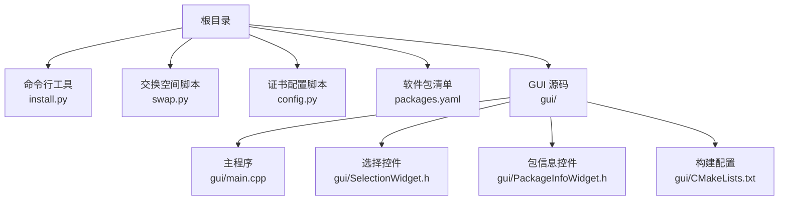
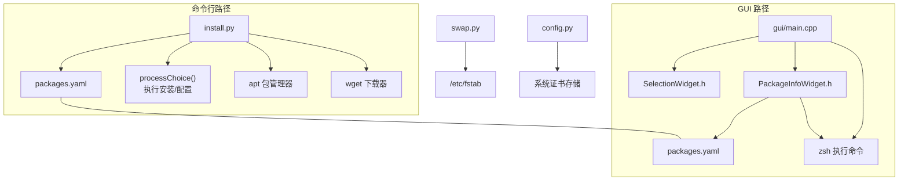
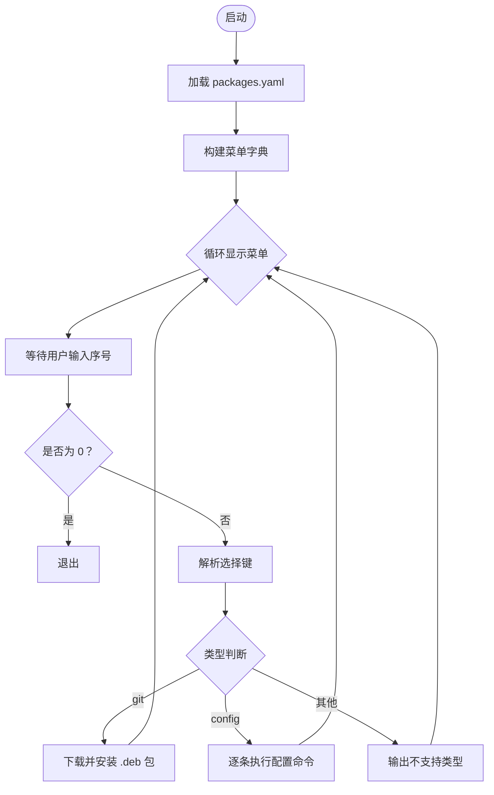
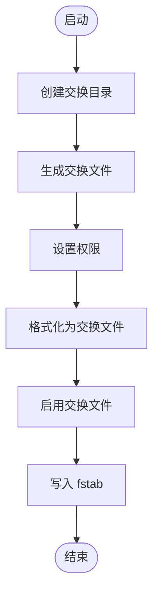
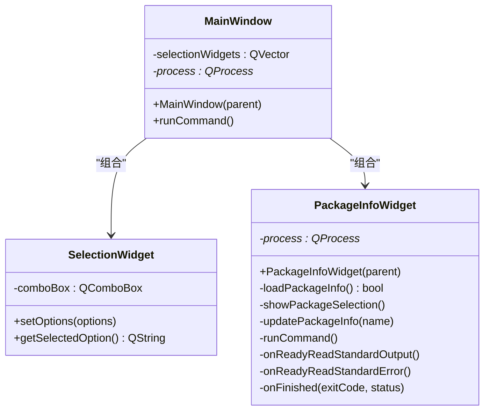
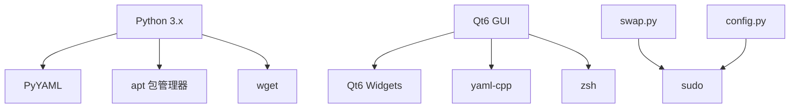

# 快速开始

<cite>
**本文引用的文件**
- [README.md](file://README.md)
- [install.py](file://install.py)
- [config.py](file://config.py)
- [swap.py](file://swap.py)
- [packages.yaml](file://packages.yaml)
- [gui/main.cpp](file://gui/main.cpp)
- [gui/PackageInfoWidget.h](file://gui/PackageInfoWidget.h)
- [gui/SelectionWidget.h](file://gui/SelectionWidget.h)
- [gui/CMakeLists.txt](file://gui/CMakeLists.txt)
- [.gitignore](file://.gitignore)
</cite>

## 目录
1. [简介](#简介)
2. [项目结构](#项目结构)
3. [核心组件](#核心组件)
4. [架构总览](#架构总览)
5. [详细组件分析](#详细组件分析)
6. [依赖分析](#依赖分析)
7. [性能考虑](#性能考虑)
8. [故障排除指南](#故障排除指南)
9. [结论](#结论)
10. [附录](#附录)

## 简介
本指南面向首次使用 Install 项目的用户，帮助您快速完成环境准备、依赖安装与基础使用。Install 提供两类使用方式：
- 命令行模式：通过交互式菜单选择软件包进行安装或执行配置命令。
- 图形界面模式：基于 Qt6 的 GUI 应用，可浏览软件包信息并执行安装任务。

此外，项目还提供了交换空间创建脚本，便于在资源受限的环境中提升系统稳定性。

## 项目结构
项目采用“功能模块化 + 配置驱动”的组织方式：
- 根目录包含核心脚本与配置文件：命令行安装器、交换空间脚本、证书配置脚本以及软件包清单。
- gui 子目录包含 Qt6 图形界面源码与构建配置，用于可视化管理软件包与执行安装任务。

图表来源
- [install.py:1-36](file://install.py#L1-L36)
- [swap.py:1-10](file://swap.py#L1-L10)
- [config.py:1-8](file://config.py#L1-L8)
- [packages.yaml:1-50](file://packages.yaml#L1-L50)
- [gui/main.cpp:1-73](file://gui/main.cpp#L1-L73)
- [gui/SelectionWidget.h:1-40](file://gui/SelectionWidget.h#L1-L40)
- [gui/PackageInfoWidget.h:1-145](file://gui/PackageInfoWidget.h#L1-L145)
- [gui/CMakeLists.txt:1-26](file://gui/CMakeLists.txt#L1-L26)

章节来源
- [README.md:1-7](file://README.md#L1-L7)
- [install.py:1-36](file://install.py#L1-L36)
- [swap.py:1-10](file://swap.py#L1-L10)
- [config.py:1-8](file://config.py#L1-L8)
- [packages.yaml:1-50](file://packages.yaml#L1-L50)
- [gui/main.cpp:1-73](file://gui/main.cpp#L1-L73)
- [gui/SelectionWidget.h:1-40](file://gui/SelectionWidget.h#L1-L40)
- [gui/PackageInfoWidget.h:1-145](file://gui/PackageInfoWidget.h#L1-L145)
- [gui/CMakeLists.txt:1-26](file://gui/CMakeLists.txt#L1-L26)

## 核心组件
- 命令行安装器（install.py）：读取软件包清单，提供交互式菜单，支持从 Git 发布页下载安装包或直接使用 wget 安装，亦可执行配置类命令。
- 交换空间脚本（swap.py）：自动化创建并启用交换分区，写入 fstab 以实现开机自动挂载。
- 证书配置脚本（config.py）：复制本地 CA 证书到系统信任目录并更新证书缓存。
- 软件包清单（packages.yaml）：集中定义可安装软件包的类型、名称、描述、下载地址与版本等元数据。
- GUI 应用（gui/）：基于 Qt6 的图形界面，展示软件包信息、选择安装目标并执行安装命令；同时提供可扩展的选择控件与包信息展示控件。

章节来源
- [install.py:1-36](file://install.py#L1-L36)
- [swap.py:1-10](file://swap.py#L1-L10)
- [config.py:1-8](file://config.py#L1-L8)
- [packages.yaml:1-50](file://packages.yaml#L1-L50)
- [gui/main.cpp:1-73](file://gui/main.cpp#L1-L73)
- [gui/PackageInfoWidget.h:1-145](file://gui/PackageInfoWidget.h#L1-L145)
- [gui/SelectionWidget.h:1-40](file://gui/SelectionWidget.h#L1-L40)

## 架构总览
下图展示了命令行与 GUI 两种使用路径的总体架构及数据流。

图表来源
- [install.py:1-36](file://install.py#L1-L36)
- [packages.yaml:1-50](file://packages.yaml#L1-L50)
- [gui/main.cpp:1-73](file://gui/main.cpp#L1-L73)
- [gui/SelectionWidget.h:1-40](file://gui/SelectionWidget.h#L1-L40)
- [gui/PackageInfoWidget.h:1-145](file://gui/PackageInfoWidget.h#L1-L145)
- [swap.py:1-10](file://swap.py#L1-L10)
- [config.py:1-8](file://config.py#L1-L8)

## 详细组件分析

### 命令行安装器（install.py）
- 功能概述
  - 读取软件包清单，生成编号菜单，用户输入序号后执行对应安装或配置动作。
  - 支持两类安装类型：
    - git：从指定发布页下载二进制包并调用 apt 安装。
    - config：逐条执行配置命令（如修改 GRUB 默认启动项）。
  - 其他类型将被识别为不支持。
- 数据流与处理逻辑
  - 加载 YAML 清单，构建菜单字典。
  - 循环显示菜单，等待用户输入。
  - 根据选择调用 processChoice，解析类型并执行相应流程。
- 复杂度与性能
  - 菜单构建与查询为 O(n)；I/O 主要集中在 YAML 解析与子进程调用。
- 错误处理
  - 对未知类型输出提示信息；对子进程执行失败可结合系统日志排查。
- 使用建议
  - 在执行前确保网络可达与权限充足；必要时先手动测试下载链接与命令。

图表来源
- [install.py:1-36](file://install.py#L1-L36)
- [packages.yaml:1-50](file://packages.yaml#L1-L50)

章节来源
- [install.py:1-36](file://install.py#L1-L36)
- [packages.yaml:1-50](file://packages.yaml#L1-L50)

### 交换空间脚本（swap.py）
- 功能概述
  - 创建专用目录与交换文件，设置权限，格式化为交换分区，立即启用并写入 fstab。
- 关键步骤
  - 创建目录与交换文件。
  - 修改权限以符合安全策略。
  - 格式化为交换文件并启用。
  - 追加 fstab 条目以开机自动挂载。
- 注意事项
  - 需要管理员权限；确保磁盘空间充足；建议在虚拟机或备份后执行。

图表来源
- [swap.py:1-10](file://swap.py#L1-L10)

章节来源
- [swap.py:1-10](file://swap.py#L1-L10)

### 证书配置脚本（config.py）
- 功能概述
  - 将本地 CA 证书复制到系统信任目录并更新证书缓存，便于 HTTPS 访问与代理场景。
- 使用场景
  - 企业内网或自签证书环境；配合代理工具使用。
- 注意事项
  - 需要管理员权限；确保证书文件存在且路径正确。

章节来源
- [config.py:1-8](file://config.py#L1-L8)

### 软件包清单（packages.yaml）
- 结构说明
  - 顶层为软件包键名（如 DevSidecar、ClashVergeRev 等），每个包包含：
    - type：安装类型（git/wget/config）。
    - name/des/url/version：安装包名称、描述、下载地址与版本。
    - cmd：当 type 为 config 时，包含需要执行的一系列命令。
- 使用方式
  - 命令行安装器读取该文件生成菜单；GUI 控件也从同一文件加载包信息。
- 维护建议
  - 更新版本号与下载地址时保持一致性；避免硬编码敏感信息。

章节来源
- [packages.yaml:1-50](file://packages.yaml#L1-L50)

### GUI 应用（gui/）
- 主程序（main.cpp）
  - 创建主窗口，组合多个选择控件，提供“运行”按钮触发命令执行。
  - 示例命令演示了如何通过 zsh 启动外部程序。
- 选择控件（SelectionWidget.h）
  - 封装下拉选择框，提供选项设置与当前选值获取。
- 包信息控件（PackageInfoWidget.h）
  - 从 YAML 文件加载包信息，展示名称、描述、URL、版本等。
  - 提供“选择包”与“安装”按钮，执行安装命令并通过文本框实时显示输出与错误。
- 构建配置（CMakeLists.txt）
  - 使用 Qt6 Widgets 与 yaml-cpp；支持打包为 DEB 并安装到系统路径。

图表来源
- [gui/main.cpp:1-73](file://gui/main.cpp#L1-L73)
- [gui/SelectionWidget.h:1-40](file://gui/SelectionWidget.h#L1-L40)
- [gui/PackageInfoWidget.h:1-145](file://gui/PackageInfoWidget.h#L1-L145)

章节来源
- [gui/main.cpp:1-73](file://gui/main.cpp#L1-L73)
- [gui/SelectionWidget.h:1-40](file://gui/SelectionWidget.h#L1-L40)
- [gui/PackageInfoWidget.h:1-145](file://gui/PackageInfoWidget.h#L1-L145)
- [gui/CMakeLists.txt:1-26](file://gui/CMakeLists.txt#L1-L26)

## 依赖分析
- Python 运行时与库
  - Python 3.x（推荐 3.8+）。
  - PyYAML：用于解析 packages.yaml。
- 系统与包管理
  - apt：用于安装 .deb 包。
  - wget：用于从 URL 直接下载安装包。
  - zsh：GUI 中用于执行命令（可替换为 bash）。
- Qt6 开发环境
  - Qt6 Widgets：GUI 界面框架。
  - yaml-cpp：解析 YAML 文件。
  - CMake：构建系统。
- 其他
  - sudo 权限：执行系统级操作（创建交换空间、安装软件包、更新证书等）。
  - 内核支持：启用交换分区需内核支持 swap。

图表来源
- [install.py:1-3](file://install.py#L1-L3)
- [gui/CMakeLists.txt:9-13](file://gui/CMakeLists.txt#L9-L13)
- [swap.py:1-10](file://swap.py#L1-L10)
- [config.py:1-8](file://config.py#L1-L8)

章节来源
- [install.py:1-3](file://install.py#L1-L3)
- [gui/CMakeLists.txt:1-26](file://gui/CMakeLists.txt#L1-L26)
- [swap.py:1-10](file://swap.py#L1-L10)
- [config.py:1-8](file://config.py#L1-L8)

## 性能考虑
- 命令行安装器
  - 菜单构建与 YAML 解析为轻量级操作；主要耗时在于网络下载与 apt 安装。
  - 可通过缓存下载包或离线安装减少重复下载时间。
- GUI 应用
  - YAML 解析与 UI 刷新应避免在主线程阻塞；当前实现已通过信号槽异步处理输出与错误。
  - 建议在大型清单文件下分页或按类别筛选以优化交互体验。
- 交换空间
  - 交换文件创建与格式化为磁盘 I/O 密集型操作；建议使用 SSD 或高速存储介质。

[本节为通用指导，无需特定文件来源]

## 故障排除指南
- 权限不足
  - 症状：无法创建交换文件、无法安装软件包、无法更新证书。
  - 处理：确认以管理员身份运行；必要时使用 sudo。
- 网络问题
  - 症状：下载超时或失败。
  - 处理：检查网络连通性；尝试更换镜像源或代理；验证 URL 正确性。
- YAML 解析错误
  - 症状：GUI 或命令行无法加载软件包信息。
  - 处理：检查 packages.yaml 格式与缩进；确保字段完整。
- GUI 命令未执行
  - 症状：点击“安装”无响应或报错。
  - 处理：确认 zsh 可用；检查命令是否存在；查看标准输出与错误日志。
- 交换空间未生效
  - 症状：重启后交换未启用。
  - 处理：检查 fstab 条目；确认路径与权限；重新挂载。

章节来源
- [install.py:1-36](file://install.py#L1-L36)
- [gui/PackageInfoWidget.h:109-144](file://gui/PackageInfoWidget.h#L109-L144)
- [swap.py:1-10](file://swap.py#L1-L10)
- [config.py:1-8](file://config.py#L1-L8)

## 结论
Install 项目提供了简洁高效的软件安装与系统配置能力，既适合命令行用户快速批量安装，也适合桌面用户通过 GUI 进行可视化管理。通过统一的软件包清单与灵活的安装类型，用户可以轻松扩展支持更多软件与配置场景。

[本节为总结性内容，无需特定文件来源]

## 附录

### 环境要求与依赖安装
- Python 运行时
  - 安装 Python 3.x（推荐 3.8+）。
- Python 库
  - 安装 PyYAML：用于解析 YAML 清单。
- 系统工具
  - 安装 apt、wget、zsh（GUI 使用）。
- Qt6 开发环境
  - 安装 Qt6 Widgets 与 yaml-cpp。
  - 安装 CMake 以构建 GUI。
- 权限
  - 确保具备 sudo 权限以执行系统级操作。

章节来源
- [install.py:1-3](file://install.py#L1-L3)
- [gui/CMakeLists.txt:9-13](file://gui/CMakeLists.txt#L9-L13)

### 安装步骤
- 克隆仓库
  - 使用 git 将项目克隆到本地。
- 安装依赖
  - 安装 Python 库与系统工具。
  - 安装 Qt6 开发库与 CMake。
- 配置软件包列表
  - 编辑 packages.yaml，补充或修改软件包元数据。
- 构建 GUI（可选）
  - 使用 CMake 生成构建系统并编译 GUI 应用。

章节来源
- [README.md:1-7](file://README.md#L1-L7)
- [packages.yaml:1-50](file://packages.yaml#L1-L50)
- [gui/CMakeLists.txt:1-26](file://gui/CMakeLists.txt#L1-L26)

### 基本使用示例

- 命令行方式
  - 添加交换空间
    - 运行脚本以创建并启用交换分区。
  - 安装软件包
    - 运行安装器，根据菜单选择软件包并确认安装。
  - 配置系统
    - 选择配置类条目，执行相关命令（如设置 GRUB 默认启动项）。
- 图形界面方式
  - 启动 GUI 应用，浏览软件包信息，选择目标并执行安装命令。
  - 查看实时输出与错误日志，便于调试与记录。

章节来源
- [README.md:4-7](file://README.md#L4-L7)
- [install.py:17-35](file://install.py#L17-L35)
- [swap.py:3-10](file://swap.py#L3-L10)
- [gui/main.cpp:47-61](file://gui/main.cpp#L47-L61)
- [gui/PackageInfoWidget.h:109-144](file://gui/PackageInfoWidget.h#L109-L144)

### 常见使用场景与操作流程
- 场景一：为新系统添加交换空间
  - 步骤：运行交换空间脚本 → 验证启用状态 → 检查 fstab。
- 场景二：批量安装常用软件包
  - 步骤：编辑软件包清单 → 运行安装器 → 选择软件包 → 确认安装。
- 场景三：配置系统启动项
  - 步骤：在软件包清单中添加配置项 → 运行安装器 → 执行配置命令。
- 场景四：在 GUI 中安装软件包
  - 步骤：启动 GUI → 选择包 → 点击安装 → 查看输出。

章节来源
- [swap.py:3-10](file://swap.py#L3-L10)
- [install.py:17-35](file://install.py#L17-L35)
- [packages.yaml:38-46](file://packages.yaml#L38-L46)
- [gui/PackageInfoWidget.h:109-144](file://gui/PackageInfoWidget.h#L109-L144)

### 预期输出与结果
- 命令行安装器
  - 显示菜单与选择项；执行安装后返回状态码与提示信息。
- 交换空间脚本
  - 成功创建并启用交换分区；fstab 中出现相应条目。
- 证书配置脚本
  - 成功复制证书并更新系统信任。
- GUI 应用
  - 包信息控件显示软件包详情；安装按钮触发命令并实时输出结果。

章节来源
- [install.py:17-35](file://install.py#L17-L35)
- [swap.py:3-10](file://swap.py#L3-L10)
- [config.py:3-7](file://config.py#L3-L7)
- [gui/PackageInfoWidget.h:109-144](file://gui/PackageInfoWidget.h#L109-L144)