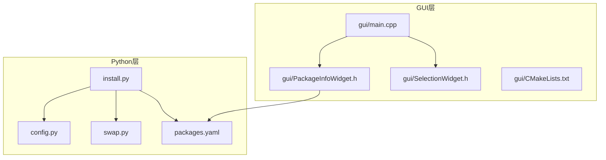
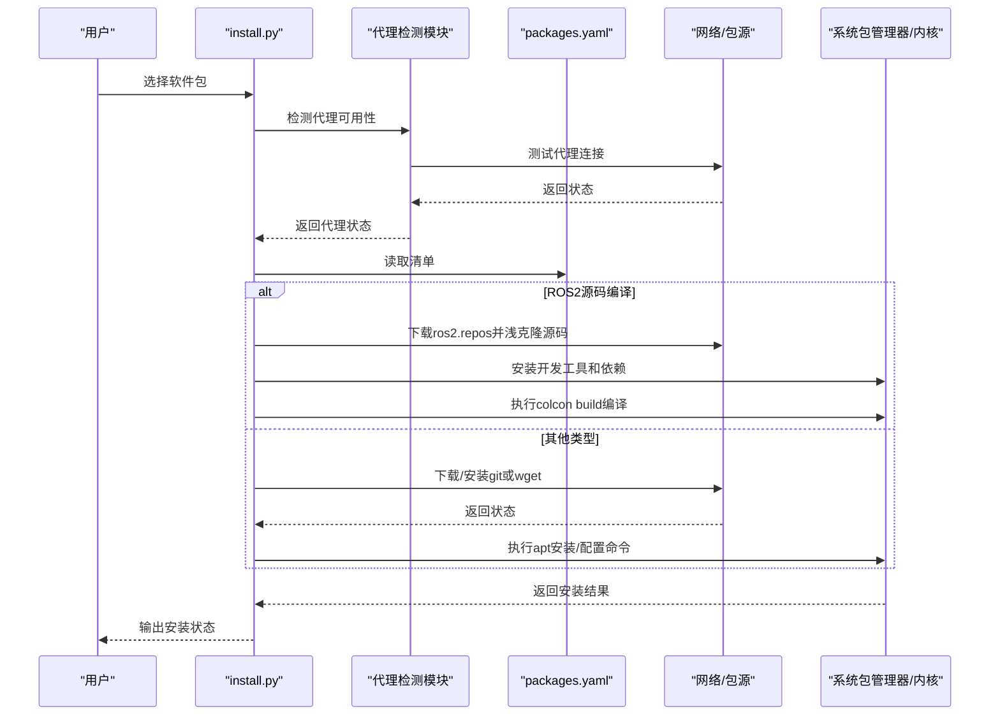
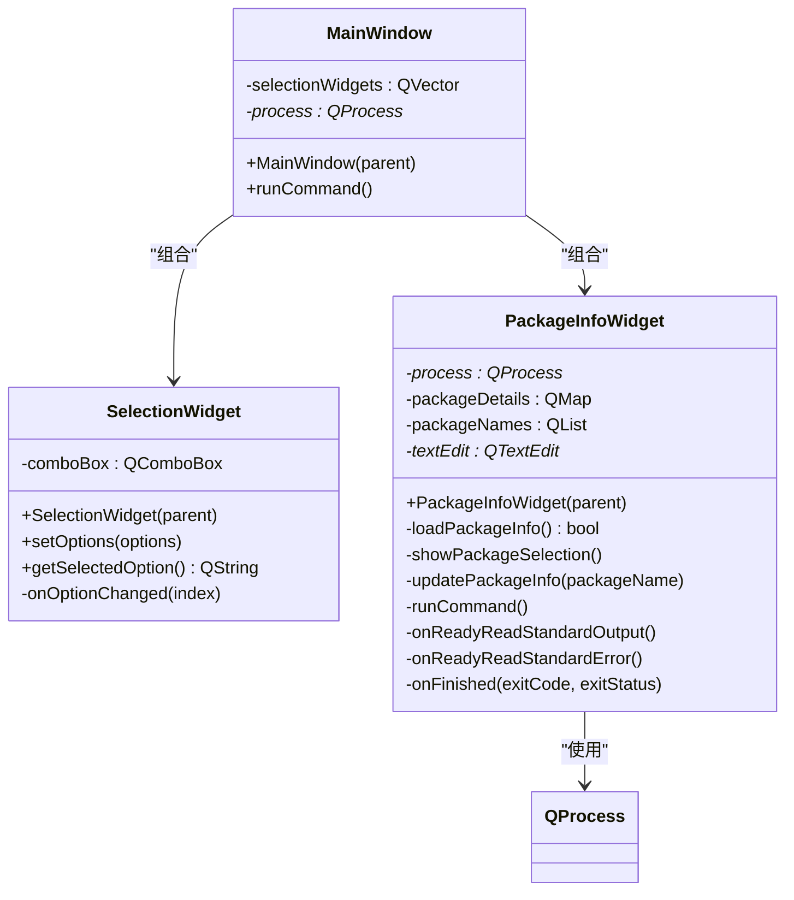
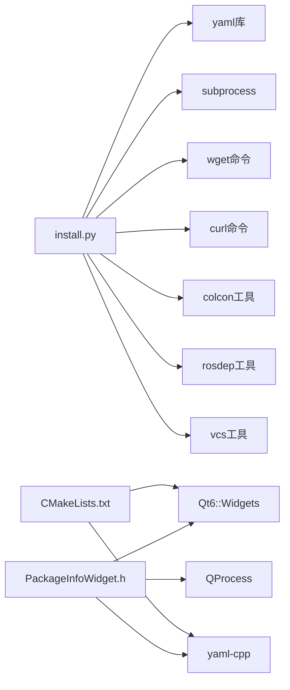

# 故障排除

<cite>
**本文引用的文件**
- [README.md](file://README.md)
- [install.py](file://install.py)
- [config.py](file://config.py)
- [swap.py](file://swap.py)
- [packages.yaml](file://packages.yaml)
- [gui/main.cpp](file://gui/main.cpp)
- [gui/PackageInfoWidget.h](file://gui/PackageInfoWidget.h)
- [gui/SelectionWidget.h](file://gui/SelectionWidget.h)
- [gui/CMakeLists.txt](file://gui/CMakeLists.txt)
</cite>

## 目录
1. [简介](#简介)
2. [项目结构](#项目结构)
3. [核心组件](#核心组件)
4. [架构总览](#架构总览)
5. [详细组件分析](#详细组件分析)
6. [依赖分析](#依赖分析)
7. [性能考虑](#性能考虑)
8. [故障排除指南](#故障排除指南)
9. [结论](#结论)
10. [附录](#附录)

## 简介
本指南面向Install项目的使用者与维护者，聚焦于安装失败、权限问题、网络连接问题、GUI界面问题、系统配置问题以及性能问题的系统化排查与解决方法。内容基于仓库中的脚本与GUI源码，提供可操作的调试步骤、日志分析技巧与问题报告模板，并给出社区支持渠道建议。

**更新** 新增ROS2源码编译安装流程的故障排除指南，改进代理检测相关问题的诊断方法。

## 项目结构
该项目由Python安装器、交换分区脚本、证书配置脚本、包清单与Qt GUI组成，采用分层设计：
- Python层：安装器负责解析包清单、执行下载与安装、执行配置类任务，**新增ROS2源码编译安装流程**
- Shell层：交换分区脚本负责系统级内存扩展配置
- GUI层（Qt）：提供可视化选择与命令执行界面
- 配置层：YAML清单描述软件包元数据与安装方式，**包含代理配置结构和ROS2相关配置**

**图表来源**
- [install.py:1-330](file://install.py#L1-L330)
- [swap.py:1-10](file://swap.py#L1-L10)
- [config.py:1-8](file://config.py#L1-L8)
- [packages.yaml:1-72](file://packages.yaml#L1-L72)
- [gui/main.cpp:1-73](file://gui/main.cpp#L1-L73)
- [gui/PackageInfoWidget.h:1-145](file://gui/PackageInfoWidget.h#L1-L145)
- [gui/SelectionWidget.h:1-40](file://gui/SelectionWidget.h#L1-L40)
- [gui/CMakeLists.txt:1-26](file://gui/CMakeLists.txt#L1-L26)

**章节来源**
- [README.md:1-7](file://README.md#L1-L7)
- [install.py:1-330](file://install.py#L1-L330)
- [swap.py:1-10](file://swap.py#L1-L10)
- [config.py:1-8](file://config.py#L1-L8)
- [packages.yaml:1-72](file://packages.yaml#L1-L72)
- [gui/main.cpp:1-73](file://gui/main.cpp#L1-L73)
- [gui/PackageInfoWidget.h:1-145](file://gui/PackageInfoWidget.h#L1-L145)
- [gui/SelectionWidget.h:1-40](file://gui/SelectionWidget.h#L1-L40)
- [gui/CMakeLists.txt:1-26](file://gui/CMakeLists.txt#L1-L26)

## 核心组件
- 安装器（install.py）
  - 解析YAML清单，生成菜单供用户选择
  - 支持两类安装路径：git下载+apt安装、直接执行配置命令
  - 使用子进程调用系统命令，涉及权限与网络
  - **新增ROS2源码编译安装流程：完整的6步编译安装过程**
  - **新增代理检测与自动切换功能**
- 交换分区脚本（swap.py）
  - 创建交换文件、设置权限、启用交换并写入fstab
- 证书配置脚本（config.py）
  - 复制CA证书并更新系统信任
- 包清单（packages.yaml）
  - 定义软件包类型、名称、描述、下载地址与版本
  - **包含代理配置结构：enabled、current_index、urls数组**
  - **新增ROS2相关配置：ROS2Rolling（二进制包）和ROS2RollingSource（源码编译）**
- GUI（Qt）
  - 主窗口组合多个选择组件，触发命令执行并展示输出
  - 通过QProcess异步读取标准输出与错误流

**章节来源**
- [install.py:4-16](file://install.py#L4-L16)
- [install.py:17-36](file://install.py#L17-L36)
- [install.py:55-88](file://install.py#L55-L88)
- [install.py:107-231](file://install.py#L107-L231)
- [install.py:166-231](file://install.py#L166-L231)
- [swap.py:3-10](file://swap.py#L3-L10)
- [config.py:3-8](file://config.py#L3-L8)
- [packages.yaml:1-18](file://packages.yaml#L1-L18)
- [packages.yaml:58-72](file://packages.yaml#L58-L72)
- [gui/main.cpp:47-62](file://gui/main.cpp#L47-L62)
- [gui/PackageInfoWidget.h:109-127](file://gui/PackageInfoWidget.h#L109-L127)

## 架构总览
下图展示了从用户交互到系统命令执行的关键流程，涵盖Python安装器与Qt GUI两种入口，**新增ROS2源码编译安装流程和代理检测与自动切换流程**。

**图表来源**
- [install.py:107-231](file://install.py#L107-L231)
- [install.py:25-53](file://install.py#L25-L53)
- [install.py:55-88](file://install.py#L55-L88)
- [install.py:4-16](file://install.py#L4-L16)
- [packages.yaml:58-72](file://packages.yaml#L58-L72)

**图表来源**
- [gui/PackageInfoWidget.h:109-127](file://gui/PackageInfoWidget.h#L109-L127)
- [gui/PackageInfoWidget.h:129-144](file://gui/PackageInfoWidget.h#L129-L144)
- [gui/main.cpp:47-62](file://gui/main.cpp#L47-L62)

## 详细组件分析

### Python安装器（install.py）
- 功能要点
  - 读取YAML清单，构建菜单并循环处理用户选择
  - 支持git类型：通过下载二进制包后使用apt安装
  - 支持config类型：逐条执行配置命令
  - **新增archive类型：支持压缩包安装（如ROS2二进制包）**
  - **新增source类型：完整的ROS2源码编译安装流程**
  - **新增代理检测功能：test_proxy函数支持wget/curl测试**
  - **新增自动代理切换：find_working_proxy函数自动测试并切换代理**
  - **新增代理状态管理：toggle_proxy、switch_proxy、show_proxy_status函数**
- 关键风险点
  - 子进程调用使用shell模式，存在注入风险
  - 权限不足时apt安装会失败
  - 网络代理/镜像源不稳定导致下载失败
  - **ROS2编译过程耗时较长，可能因资源不足而失败**
  - **代理检测失败可能导致自动切换机制失效**
- 建议改进
  - 对外部命令进行白名单校验与参数转义
  - 增加重试与超时控制
  - 提供更详细的错误码与日志输出
  - **增强代理检测的容错性和回退机制**
  - **为ROS2编译过程添加进度显示和资源监控**

**章节来源**
- [install.py:4-16](file://install.py#L4-L16)
- [install.py:17-36](file://install.py#L17-L36)
- [install.py:25-53](file://install.py#L25-L53)
- [install.py:55-88](file://install.py#L55-L88)
- [install.py:107-231](file://install.py#L107-L231)
- [install.py:166-231](file://install.py#L166-L231)
- [install.py:233-292](file://install.py#L233-L292)
- [packages.yaml:1-18](file://packages.yaml#L1-L18)

### 交换分区脚本（swap.py）
- 功能要点
  - 创建目录与交换文件、设置权限、格式化、启用交换并写入fstab
- 关键风险点
  - 文件系统空间不足
  - 权限不足导致无法写入fstab或修改系统配置
  - 交换文件损坏或命名冲突
- 建议改进
  - 检查磁盘空间与权限
  - 添加回滚逻辑（禁用并删除交换文件）

**章节来源**
- [swap.py:3-10](file://swap.py#L3-L10)

### 证书配置脚本（config.py）
- 功能要点
  - 复制CA证书到系统信任目录并更新证书数据库
- 关键风险点
  - 证书路径不存在或权限不足
  - 更新命令失败导致系统信任链异常
- 建议改进
  - 增加源文件存在性检查
  - 记录更新前后的证书列表以便回滚

**章节来源**
- [config.py:3-8](file://config.py#L3-L8)

### 包清单（packages.yaml）
- 功能要点
  - 定义软件包类型（git/wget/config/archive/source）、名称、描述、URL、版本
  - **包含代理配置：enabled开关、current_index当前索引、urls代理列表**
  - **新增ROS2相关配置：ROS2Rolling（二进制包）和ROS2RollingSource（源码编译）**
- 关键风险点
  - URL不可达或版本号不匹配
  - 描述字段过长影响UI渲染
  - **代理配置错误导致安装失败**
  - **ROS2源码编译依赖过多，可能因网络问题而失败**
- 建议改进
  - 增加URL可达性校验
  - 分离UI展示与安装逻辑
  - **增加代理配置的有效性检查**
  - **为ROS2配置添加更详细的错误处理**

**章节来源**
- [packages.yaml:1-18](file://packages.yaml#L1-L18)
- [packages.yaml:58-72](file://packages.yaml#L58-L72)

### GUI组件（Qt）
- 主窗口（main.cpp）
  - 组合四个选择组件，提供"run"按钮触发命令执行
  - 使用QProcess启动shell命令并记录日志
- PackageInfoWidget（PackageInfoWidget.h）
  - 加载YAML并展示软件包信息
  - 提供"Select Package"与"install"按钮
  - 通过QProcess异步读取标准输出与错误流
- SelectionWidget（SelectionWidget.h）
  - 封装下拉选择框，记录当前选项变化

**图表来源**
- [gui/main.cpp:7-44](file://gui/main.cpp#L7-L44)
- [gui/SelectionWidget.h:8-40](file://gui/SelectionWidget.h#L8-L40)
- [gui/PackageInfoWidget.h:18-51](file://gui/PackageInfoWidget.h#L18-L51)

**章节来源**
- [gui/main.cpp:1-73](file://gui/main.cpp#L1-L73)
- [gui/PackageInfoWidget.h:1-145](file://gui/PackageInfoWidget.h#L1-L145)
- [gui/SelectionWidget.h:1-40](file://gui/SelectionWidget.h#L1-L40)

## 依赖分析
- Python安装器依赖
  - YAML解析：用于读取packages.yaml
  - 子进程：用于执行系统命令
  - **新增代理检测依赖：wget、curl命令**
  - **新增ROS2编译依赖：colcon、rosdep、vcs等工具**
- GUI依赖
  - Qt6 Widgets：图形界面框架
  - yaml-cpp：解析YAML
  - CMake：构建与打包
- 运行时依赖
  - 系统包管理器（apt）、shell（zsh/bash）、网络访问能力

**图表来源**
- [install.py:1-2](file://install.py#L1-L2)
- [install.py:25-53](file://install.py#L25-L53)
- [gui/CMakeLists.txt:9-13](file://gui/CMakeLists.txt#L9-L13)
- [gui/PackageInfoWidget.h:16-16](file://gui/PackageInfoWidget.h#L16-L16)

**章节来源**
- [install.py:1-2](file://install.py#L1-L2)
- [install.py:25-53](file://install.py#L25-L53)
- [install.py:166-231](file://install.py#L166-L231)
- [gui/CMakeLists.txt:1-26](file://gui/CMakeLists.txt#L1-L26)
- [gui/PackageInfoWidget.h:16-16](file://gui/PackageInfoWidget.h#L16-L16)

## 性能考虑
- 安装器
  - 下载与安装串行执行，可考虑并发策略（需谨慎处理资源竞争）
  - 增加重试与超时控制，避免长时间阻塞
  - **ROS2源码编译过程耗时较长，建议预留充足时间**
  - **代理检测增加网络开销，建议合理设置超时时间**
- GUI
  - 异步读取输出与错误流，避免UI卡顿
  - 合理设置缓冲区大小，防止内存占用过高
- 系统级
  - 交换分区大小与IO性能相关，建议根据实际内存需求调整
  - 证书更新可能影响首次网络请求速度，建议在空闲时段执行

## 故障排除指南

### 通用排查步骤
- 确认环境
  - Python版本与依赖是否满足要求
  - GUI构建工具链（Qt6、yaml-cpp、CMake）是否就绪
  - **代理相关命令（wget、curl）是否可用**
  - **ROS2编译相关工具（colcon、rosdep、vcs）是否安装**
- 日志与输出
  - Python安装器：观察标准输出与错误
  - GUI：查看QTextEdit中的输出与QDebug日志
  - 系统日志：使用journalctl或dmesg查看内核与服务日志
- 权限与安全
  - 确保以具备sudo权限的用户运行
  - 检查SELinux/AppArmor策略是否阻止命令执行
- 网络与镜像
  - 测试URL连通性与可用性
  - 如使用代理/镜像，验证代理配置正确

### 安装失败
- 现象
  - apt安装阶段报错或中断
  - 下载阶段超时或返回非200
  - **ROS2源码编译过程中断或失败**
- 排查要点
  - 检查packages.yaml中的URL与版本是否有效
  - 在终端手动执行相同命令，定位具体失败点
  - 查看系统包管理器缓存与锁状态
  - **检查ROS2编译依赖是否完整安装**
  - **检查代理状态：代理是否可用、是否需要手动切换**
- 解决方案
  - 替换为可用镜像源或直连源
  - 清理包缓存并重试
  - 降低并发或增加重试次数
  - **使用代理切换功能：p切换代理开关，s手动选择代理**
  - **对于ROS2编译失败，检查磁盘空间和内存使用情况**

**章节来源**
- [install.py:4-16](file://install.py#L4-L16)
- [install.py:107-231](file://install.py#L107-L231)
- [install.py:166-231](file://install.py#L166-L231)
- [packages.yaml:1-18](file://packages.yaml#L1-L18)

### 权限问题
- 现象
  - 执行sudo命令失败或被拒绝
  - 写入系统目录（如fstab、证书目录）失败
- 排查要点
  - 确认当前用户是否在sudoers组
  - 检查sudoers规则与密码认证
- 解决方案
  - 临时提升权限或配置NOPASSWD规则（仅限可信环境）
  - 使用专用账户执行受限操作

**章节来源**
- [swap.py:3-10](file://swap.py#L3-L10)
- [config.py:3-8](file://config.py#L3-L8)

### 网络连接问题
- 现象
  - 下载超时、断线重连、返回404/403
  - **代理检测失败、自动切换机制失效**
  - **ROS2源码下载失败或编译超时**
- 排查要点
  - 使用curl或wget测试URL连通性
  - 检查代理设置与防火墙规则
  - **验证代理检测功能：test_proxy函数是否正常工作**
  - **检查代理配置：packages.yaml中的代理列表是否正确**
  - **检查ROS2源码仓库的可达性**
- 解决方案
  - 切换镜像源或使用本地缓存
  - 配置系统代理或容器内代理
  - **使用代理切换功能：p切换代理开关，s手动选择代理**
  - **检查代理URL有效性，必要时修改packages.yaml中的代理列表**
  - **对于ROS2编译，考虑使用国内镜像源或预编译包**

**章节来源**
- [install.py:9-10](file://install.py#L9-L10)
- [install.py:25-53](file://install.py#L25-L53)
- [install.py:55-88](file://install.py#L55-L88)
- [install.py:107-231](file://install.py#L107-L231)
- [install.py:166-231](file://install.py#L166-L231)
- [packages.yaml:6-18](file://packages.yaml#L6-L18)

### 代理相关故障排除

#### 代理检测失败
- 现象
  - 自动代理检测功能无法识别可用代理
  - test_proxy函数返回失败
- 排查要点
  - 检查wget和curl命令是否可用
  - 验证代理URL格式是否正确
  - 检查网络连通性和防火墙设置
- 解决方案
  - 安装缺失的网络工具：`sudo apt install wget curl`
  - 手动测试代理：`wget --timeout=5 --tries=1 --spider "https://gh-proxy.com/"`
  - 修改代理URL：编辑packages.yaml中的代理列表

#### 自动切换机制问题
- 现象
  - 当前代理失败但未自动切换到其他代理
  - current_index未更新
- 排查要点
  - 检查find_working_proxy函数的执行流程
  - 验证代理状态存储机制
  - 确认packages.yaml文件写入权限
- 解决方案
  - 手动切换代理：使用`s`选项选择新的代理
  - 重置代理状态：禁用后重新启用代理
  - 检查文件权限：确保对packages.yaml有写权限

#### 手动代理选择问题
- 现象
  - 代理列表显示异常
  - 选择代理后未生效
- 排查要点
  - 检查switch_proxy函数的输入验证
  - 验证代理索引范围检查
  - 确认代理配置更新逻辑
- 解决方案
  - 重新启动程序以刷新代理状态
  - 检查代理列表格式：确保每个代理URL正确
  - 手动编辑packages.yaml中的current_index值

**章节来源**
- [install.py:25-53](file://install.py#L25-L53)
- [install.py:55-88](file://install.py#L55-L88)
- [install.py:233-292](file://install.py#L233-L292)
- [packages.yaml:1-18](file://packages.yaml#L1-L18)

### ROS2源码编译安装故障排除

#### 编译环境准备问题
- 现象
  - 系统设置阶段失败
  - 开发工具安装失败
- 排查要点
  - 检查系统版本是否满足ROS2要求
  - 验证网络连接是否稳定
  - 确认有足够的磁盘空间
- 解决方案
  - 升级系统到支持的版本
  - 使用代理或镜像源加速下载
  - 清理磁盘空间或使用外部存储

#### 源码下载问题
- 现象
  - ros2.repos下载失败
  - vcs import浅克隆失败
- 排查要点
  - 检查repos_url的可达性
  - 验证代理设置
  - 确认网络防火墙允许相关端口
- 解决方案
  - 手动下载ros2.repos并放置到/tmp目录
  - 使用不同的代理或直连
  - 检查DNS解析和网络路由

#### 依赖安装问题
- 现象
  - rosdep初始化失败
  - rosdep install过程中断
- 排查要点
  - 检查rosdep数据库是否需要更新
  - 验证网络连接和代理设置
  - 确认系统包管理器正常工作
- 解决方案
  - 手动执行rosdep update
  - 使用国内镜像源或代理
  - 清理apt缓存并重试

#### 编译过程问题
- 现象
  - colcon build编译失败
  - 编译过程中内存不足
- 排查要点
  - 检查系统内存和磁盘空间
  - 验证编译器和构建工具版本
  - 确认Python环境兼容性
- 解决方案
  - 增加交换分区或使用SSD
  - 分批编译或跳过特定包
  - 使用更现代的编译器版本

**章节来源**
- [install.py:166-231](file://install.py#L166-L231)
- [packages.yaml:66-72](file://packages.yaml#L66-L72)

### GUI界面问题
- 现象
  - 界面无法启动、崩溃、无响应
- 排查要点
  - 检查Qt库与yaml-cpp是否正确链接
  - 查看QProcess启动状态与信号槽连接
- 解决方案
  - 重新构建并安装GUI
  - 使用最小化配置运行，逐步排查依赖缺失

**章节来源**
- [gui/main.cpp:47-62](file://gui/main.cpp#L47-L62)
- [gui/PackageInfoWidget.h:109-127](file://gui/PackageInfoWidget.h#L109-L127)
- [gui/CMakeLists.txt:9-13](file://gui/CMakeLists.txt#L9-L13)

### 系统配置问题
- 交换分区
  - 现象：系统内存不足、虚拟内存频繁触发
  - 排查：确认交换文件存在、权限正确、已启用且持久化
  - 解决：重建交换文件或调整大小
- 证书信任
  - 现象：HTTPS访问失败或证书不受信
  - 排查：确认证书文件存在、系统信任数据库已更新
  - 解决：重新复制并更新证书

**章节来源**
- [swap.py:3-10](file://swap.py#L3-L10)
- [config.py:3-8](file://config.py#L3-L8)

### 性能问题
- 现象
  - 安装过程缓慢、CPU/IO占用高
  - **代理检测过程耗时过长**
  - **ROS2源码编译过程耗时过长**
- 排查要点
  - 监控系统资源使用情况
  - 检查网络带宽与磁盘IO
  - **监控代理检测的超时设置**
  - **监控ROS2编译过程的资源使用**
- 优化建议
  - 合理设置并发度与重试策略
  - 使用SSD与稳定网络
  - 预热缓存与镜像
  - **优化代理检测超时时间，避免不必要的等待**
  - **为ROS2编译预留充足时间和资源**

### 日志分析技巧
- Python安装器
  - 在关键步骤前后打印上下文信息
  - 捕获子进程返回码与stderr
  - **关注代理检测的日志输出：test_proxy函数的测试结果**
  - **关注ROS2编译过程的详细输出**
- GUI
  - 使用QProcess的信号槽捕获输出与错误
  - 将输出实时追加到界面文本框
- 系统日志
  - 使用journalctl查看服务日志
  - 结合dmesg排查内核相关问题

**章节来源**
- [install.py:17-36](file://install.py#L17-L36)
- [install.py:25-53](file://install.py#L25-L53)
- [install.py:166-231](file://install.py#L166-L231)
- [gui/PackageInfoWidget.h:129-144](file://gui/PackageInfoWidget.h#L129-L144)

### 问题报告模板
- 基本信息
  - 系统版本与内核版本
  - Python版本与依赖版本
  - GUI构建与运行环境
  - **代理配置详情：enabled状态、current_index、代理列表**
  - **ROS2编译环境：系统版本、磁盘空间、内存大小**
- 复现步骤
  - 详细列出每一步操作
  - 提供命令与参数
- 日志与截图
  - 截取关键错误信息
  - 提供系统日志片段
  - **包含代理检测过程的日志**
  - **包含ROS2编译过程的日志**
- 期望行为与实际行为
  - 明确预期结果
  - 描述实际结果
- 附加信息
  - 网络环境与代理配置
  - 磁盘空间与内存使用情况
  - **代理服务器状态与可用性**
  - **ROS2编译依赖的安装状态**

### 社区支持渠道
- 问题反馈
  - 通过项目Issue提交问题报告
  - 提供上述模板与必要日志
- 技术交流
  - 参考项目README中的使用说明
  - 在社区论坛讨论相关经验

**章节来源**
- [README.md:1-7](file://README.md#L1-L7)

## 结论
本指南围绕Install项目的安装器、GUI与系统配置组件，提供了从环境准备、日志分析到问题定位与解决的完整流程。**新增的ROS2源码编译安装流程显著扩展了项目的功能范围**，同时**改进的代理检测与自动切换功能提升了网络连接的可靠性**。建议在生产环境中结合重试、超时与回滚机制，确保安装过程的稳定性与可恢复性；同时通过GUI与Python双入口，满足不同用户的使用习惯。

## 附录
- 快速检查清单
  - 确认网络连通性与镜像可用性
  - 检查sudo权限与系统信任配置
  - 验证交换分区与磁盘空间
  - 查看GUI依赖与构建产物
  - **确认代理相关命令（wget、curl）可用性**
  - **确认ROS2编译相关工具（colcon、rosdep、vcs）安装**
- 常见命令参考
  - 查看系统日志：journalctl -u <服务名>
  - 清理包缓存：apt clean && apt autoclean
  - 重建证书信任：update-ca-certificates
  - **代理检测命令：wget --timeout=5 --tries=1 --spider <URL>**
  - **代理切换操作：p切换代理开关，s手动选择代理**
  - **ROS2编译命令：colcon build --symlink-install**
  - **ROS2依赖管理：rosdep install --from-paths src --ignore-src -y**