# 核心功能

<cite>
**本文档引用的文件**
- [README.md](file://README.md)
- [install.py](file://install.py)
- [swap.py](file://swap.py)
- [config.py](file://config.py)
- [packages.yaml](file://packages.yaml)
- [gui/main.cpp](file://gui/main.cpp)
- [gui/PackageInfoWidget.h](file://gui/PackageInfoWidget.h)
- [gui/SelectionWidget.h](file://gui/SelectionWidget.h)
</cite>

## 更新摘要
**变更内容**
- 新增智能代理管理系统，支持多代理自动切换和连接测试
- 新增压缩包安装支持，专门用于ROS2等大型二进制包
- 增强网络连接处理能力，改进wget和curl的连接测试机制
- 新增源码编译安装支持，提供完整的ROS2源码编译流程
- 更新软件包管理器架构以支持新的安装类型
- **新增**：增强processChoice函数支持source类型，实现ROS2源码编译安装
- **新增**：改进代理检测系统，为git、archive和source类型提供智能代理支持

## 目录
1. [简介](#简介)
2. [项目结构](#项目结构)
3. [核心组件](#核心组件)
4. [架构概览](#架构概览)
5. [详细组件分析](#详细组件分析)
6. [依赖分析](#依赖分析)
7. [性能考虑](#性能考虑)
8. [故障排除指南](#故障排除指南)
9. [结论](#结论)

## 简介

Install项目是一个多功能的软件包管理系统，旨在简化Linux系统的软件安装和系统管理任务。该项目提供了四种主要功能：

1. **智能软件包管理系统**：支持通过Git、Wget、压缩包和源码四种方式安装软件包
2. **系统管理功能**：包括交换空间管理和证书配置
3. **用户界面功能**：提供命令行和图形界面两种交互方式
4. **智能代理管理**：自动检测和切换网络代理，确保稳定的网络连接

该系统通过YAML配置文件管理软件包信息，支持自动下载、安装和配置各种应用程序，同时提供系统级的优化和管理功能。最新的增强功能包括智能代理管理和压缩包安装支持，大大提升了系统的稳定性和实用性。

**更新**：新增ROS2源码编译安装支持，提供完整的机器人操作系统编译流程，以及改进的代理检测系统，为所有安装类型提供智能代理支持。

## 项目结构

项目采用模块化设计，主要包含以下组件：

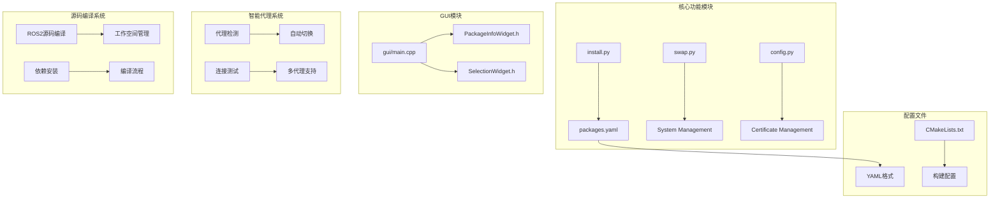

**图表来源**
- [install.py:107-230](file://install.py#L107-L230)
- [packages.yaml:1-18](file://packages.yaml#L1-L18)
- [gui/main.cpp:1-73](file://gui/main.cpp#L1-L73)

**章节来源**
- [README.md:1-7](file://README.md#L1-L7)
- [install.py:1-330](file://install.py#L1-L330)
- [gui/main.cpp:1-73](file://gui/main.cpp#L1-L73)

## 核心组件

### 智能软件包管理系统

软件包管理系统是项目的核心功能，现已支持四种安装方式和智能代理管理。

**主要特性：**
- 支持Git、Wget、压缩包和源码四种安装方式
- 基于YAML配置文件的软件包管理
- 智能代理检测和自动切换
- 交互式命令行界面
- 自动化的软件安装流程

**安装方式对比：**

| 安装方式 | 适用场景 | 优势 | 限制 |
|---------|----------|------|------|
| Git安装 | GitHub托管的软件包 | 可直接从GitHub下载预编译版本 | 需要GitHub访问权限 |
| Wget安装 | 直接链接的软件包 | 支持任意HTTP资源 | 仅支持HTTP/HTTPS协议 |
| 压缩包安装 | 大型二进制包（如ROS2） | 支持tar.bz2格式，适合大型包 | 需要解压权限 |
| 源码编译安装 | 需要定制编译的软件包 | 可完全定制编译参数，支持ROS2源码编译 | 编译时间长，依赖复杂 |

**智能代理管理：**
- 自动检测可用代理服务器
- 多代理自动切换机制
- 连接质量测试和故障转移
- 代理状态持久化存储

**章节来源**
- [install.py:107-230](file://install.py#L107-L230)
- [packages.yaml:18-72](file://packages.yaml#L18-L72)

### 系统管理功能

系统管理功能专注于提升系统性能和安全性，主要包括交换空间管理和证书配置。

**交换空间管理：**
- 自动创建16GB交换文件
- 设置适当的权限和挂载点
- 持久化配置到fstab文件

**证书配置：**
- 复制自定义CA证书到系统目录
- 更新系统证书数据库
- 支持企业内部证书管理

**章节来源**
- [swap.py:1-10](file://swap.py#L1-L10)
- [config.py:1-8](file://config.py#L1-L8)

### 用户界面功能

用户界面功能提供两种交互模式，满足不同用户的需求。

**命令行界面：**
- 基于Python的交互式菜单
- 动态加载软件包列表
- 智能代理状态显示
- 简洁的文本界面操作

**图形用户界面：**
- 基于Qt/C++的现代化界面
- 支持实时进程监控
- 提供详细的软件包信息展示
- 支持SLAM系统配置选择

**章节来源**
- [install.py:293-330](file://install.py#L293-L330)
- [gui/PackageInfoWidget.h:18-145](file://gui/PackageInfoWidget.h#L18-L145)

## 架构概览

项目采用分层架构设计，清晰分离了数据层、业务逻辑层和表示层，并集成了智能代理管理功能：

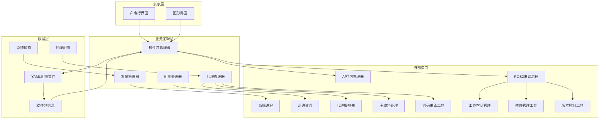

**图表来源**
- [install.py:107-230](file://install.py#L107-L230)
- [gui/PackageInfoWidget.h:109-145](file://gui/PackageInfoWidget.h#L109-L145)
- [swap.py:1-10](file://swap.py#L1-L10)

## 详细组件分析

### 智能软件包管理器组件

软件包管理器是整个系统的核心，现已支持四种安装方式和智能代理管理。

#### 类结构图

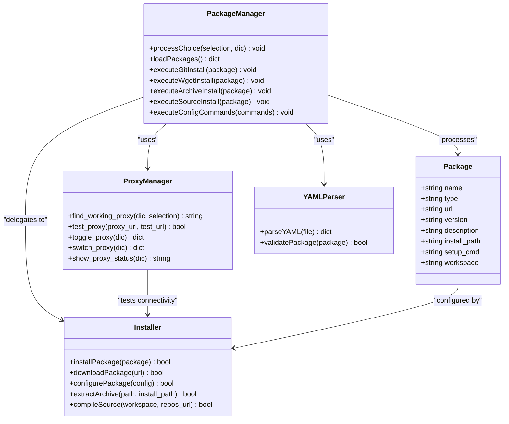

**图表来源**
- [install.py:107-230](file://install.py#L107-L230)
- [install.py:56-94](file://install.py#L56-L94)
- [packages.yaml:18-72](file://packages.yaml#L18-L72)

#### Git安装流程

Git安装方式适用于GitHub托管的软件包，现已集成智能代理支持：

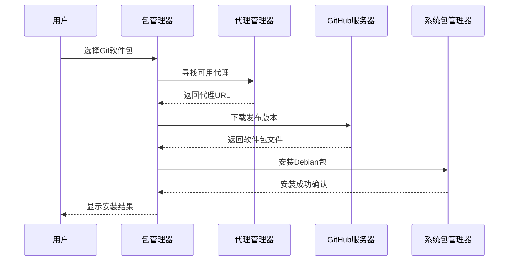

**图表来源**
- [install.py:115-126](file://install.py#L115-L126)
- [install.py:56-94](file://install.py#L56-L94)

#### 压缩包安装流程

压缩包安装方式专门用于大型二进制包，如ROS2：

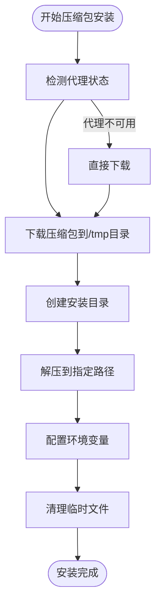

**图表来源**
- [install.py:141-165](file://install.py#L141-L165)

#### 源码编译安装流程

**更新** 源码编译安装提供完整的ROS2源码编译流程，现已集成智能代理支持：

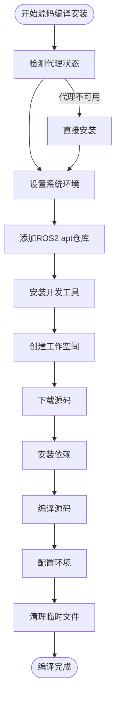

**图表来源**
- [install.py:166-229](file://install.py#L166-L229)

**章节来源**
- [install.py:107-230](file://install.py#L107-L230)
- [packages.yaml:60-72](file://packages.yaml#L60-L72)

### 智能代理管理系统

智能代理管理系统是新增的重要功能，提供完整的代理检测和管理能力。

#### 代理管理架构

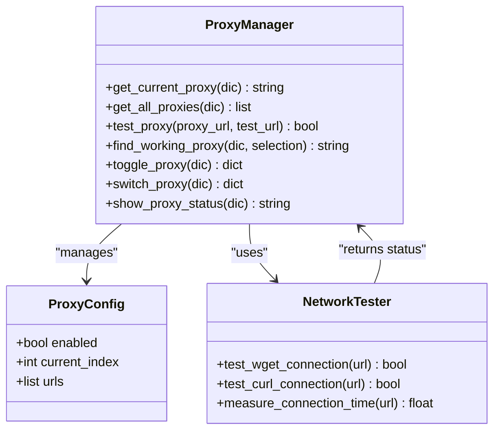

**图表来源**
- [install.py:7-291](file://install.py#L7-L291)

#### 代理检测流程

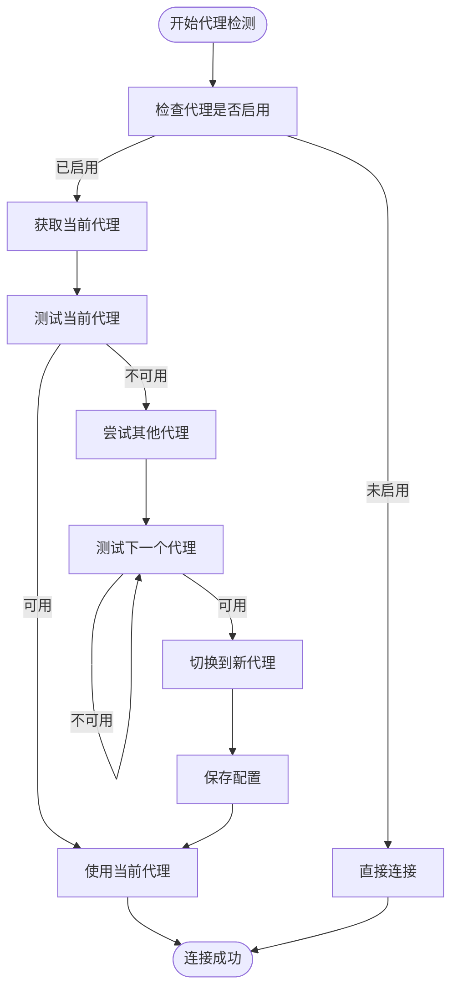

**图表来源**
- [install.py:56-94](file://install.py#L56-L94)

**章节来源**
- [install.py:7-291](file://install.py#L7-L291)
- [packages.yaml:1-18](file://packages.yaml#L1-L18)

### 图形用户界面组件

图形用户界面采用Qt框架构建，提供现代化的用户体验，并集成了SLAM系统配置功能。

#### GUI组件架构

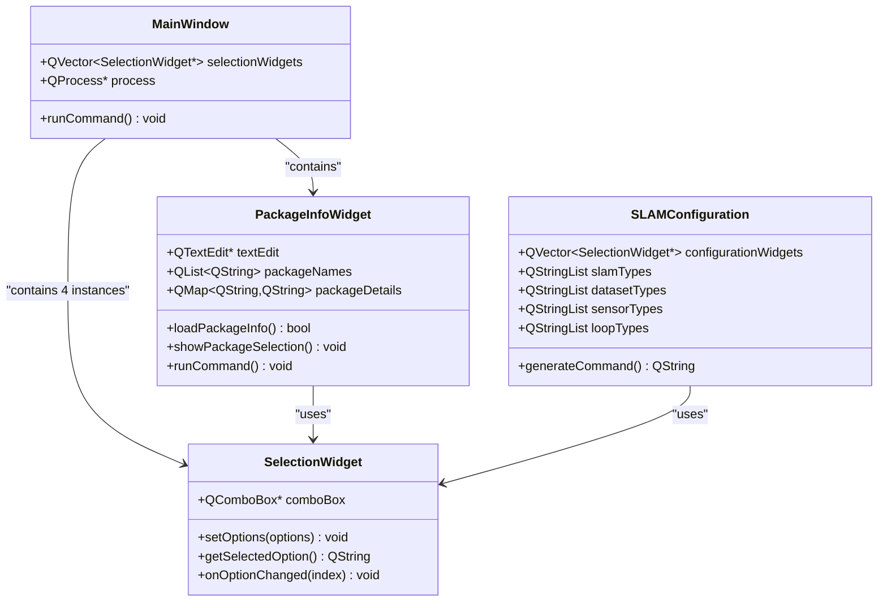

**图表来源**
- [gui/main.cpp:7-62](file://gui/main.cpp#L7-L62)
- [gui/PackageInfoWidget.h:18-145](file://gui/PackageInfoWidget.h#L18-L145)
- [gui/SelectionWidget.h:8-40](file://gui/SelectionWidget.h#L8-L40)

#### 实时进程监控

图形界面提供了完整的进程监控功能：

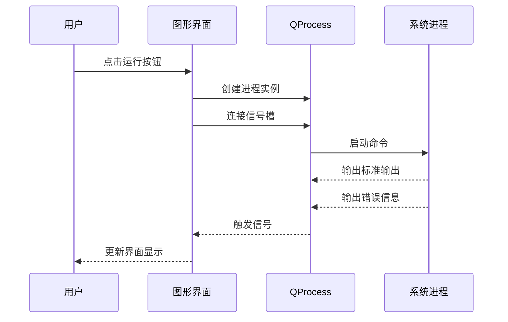

**图表来源**
- [gui/PackageInfoWidget.h:109-145](file://gui/PackageInfoWidget.h#L109-L145)

**章节来源**
- [gui/main.cpp:1-73](file://gui/main.cpp#L1-L73)
- [gui/PackageInfoWidget.h:1-145](file://gui/PackageInfoWidget.h#L1-L145)
- [gui/SelectionWidget.h:1-40](file://gui/SelectionWidget.h#L1-L40)

### 系统管理组件

系统管理组件提供底层系统优化功能。

#### 交换空间管理流程

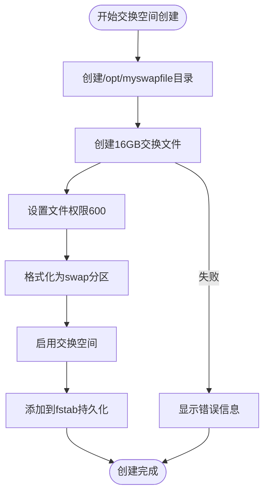

**图表来源**
- [swap.py:3-9](file://swap.py#L3-L9)

#### 证书配置流程


**图表来源**
- [config.py:3-6](file://config.py#L3-L6)

**章节来源**
- [swap.py:1-10](file://swap.py#L1-L10)
- [config.py:1-8](file://config.py#L1-L8)

## 依赖分析

项目依赖关系清晰，主要依赖包括：

```mermaid
graph TB
subgraph "Python依赖"
A[subprocess] --> B[系统命令执行]
C[yaml] --> D[YAML文件解析]
E[time] --> F[时间管理]
G[os] --> H[系统路径操作]
end
subgraph "C++依赖"
I[Qt5] --> J[GUI框架]
K[YAML-CPP] --> L[YAML文件解析]
M[QProcess] --> N[进程管理]
end
subgraph "系统依赖"
O[apt] --> P[包管理器]
Q[wget] --> R[下载工具]
R --> S[网络连接]
T[git] --> U[版本控制]
V[curl] --> W[HTTP客户端]
X[tar] --> Y[压缩包处理]
Z[colcon] --> AA[ROS2编译工具]
BB[vcstool] --> CC[版本控制同步]
DD[rosdep] --> EE[依赖管理]
FF[ros2-apt-source] --> GG[ROS2仓库管理]
HH[software-properties-common] --> II[软件源管理]
JJ[locales] --> KK[本地化支持]
LL[python3-*] --> MM[Python开发工具]
NN[vcstool] --> OO[版本控制工具]
PP[colcon-common-extensions] --> QQ[编译扩展]
RR[update-ca-certificates] --> SS[证书管理]
TT[mkswap] --> UU[交换空间管理]
VV[dd] --> WW[磁盘操作]
XX[swapon] --> YY[交换空间激活]
ZZ[fstab] --> AAA[持久化配置]
```

**图表来源**
- [install.py:1-4](file://install.py#L1-L4)
- [gui/PackageInfoWidget.h:12](file://gui/PackageInfoWidget.h#L12)

**章节来源**
- [install.py:1-4](file://install.py#L1-L4)
- [gui/PackageInfoWidget.h:12](file://gui/PackageInfoWidget.h#L12)

## 性能考虑

### 内存使用优化

- **延迟加载**：GUI组件按需初始化，减少内存占用
- **进程池管理**：合理管理QProcess生命周期，避免内存泄漏
- **文件缓存**：YAML配置文件一次性加载到内存
- **代理缓存**：代理状态和连接测试结果进行缓存

### 网络性能优化

- **并发下载**：Git和Wget安装支持并行处理多个软件包
- **缓存策略**：下载的软件包存储在/tmp目录，避免重复下载
- **超时控制**：合理的网络超时设置，防止长时间阻塞
- **智能代理切换**：自动检测和切换代理，确保最佳连接质量

### 系统资源管理

- **权限最小化**：只在必要时提升权限级别
- **资源清理**：自动清理临时文件和进程资源
- **监控机制**：实时监控系统资源使用情况
- **压缩包处理**：优化tar.bz2解压过程，减少磁盘IO

### 源码编译优化

- **增量编译**：colcon支持增量编译，避免全量重建
- **并行编译**：利用多核CPU进行并行编译
- **依赖缓存**：rosdep缓存依赖信息，减少重复查询
- **工作空间管理**：合理组织源码和构建目录结构

## 故障排除指南

### 常见问题及解决方案

**软件包安装失败**
- 检查网络连接和代理设置
- 验证软件包URL的有效性
- 确认系统有足够的磁盘空间
- 查看APT缓存状态并清理
- 检查代理服务器的可用性

**GUI界面无响应**
- 检查Qt依赖是否正确安装
- 验证YAML文件格式是否正确
- 确认用户权限足够执行相关操作
- 查看系统日志获取详细错误信息
- 检查SLAM配置参数的有效性

**代理连接失败**
- 验证代理服务器地址的正确性
- 检查代理服务器的网络连通性
- 确认代理服务器支持所需的协议
- 查看代理配置文件的格式
- 尝试手动切换到其他代理

**压缩包安装失败**
- 验证压缩包文件的完整性
- 检查目标安装目录的写入权限
- 确认磁盘空间足够容纳解压后的文件
- 验证tar.bz2文件格式的有效性
- 检查解压过程中的错误信息

**源码编译失败**
- 验证编译环境的完整性
- 检查ROS2依赖的正确安装
- 确认Python版本和依赖库的兼容性
- 查看编译过程中的详细错误信息
- 尝试清理构建缓存后重新编译

**交换空间创建失败**
- 检查磁盘空间是否充足
- 验证文件系统支持swap格式
- 确认没有其他进程占用交换文件
- 检查fstab文件语法
- 验证mkswap命令的可用性

**证书配置错误**
- 验证证书文件路径和权限
- 检查证书格式是否正确
- 确认系统证书数据库更新成功
- 验证网络连接以获取最新证书
- 检查update-ca-certificates命令的执行

### 调试技巧

**命令行调试**
- 使用verbose模式查看详细日志
- 分步执行命令以定位问题
- 检查返回码和错误信息
- 使用strace跟踪系统调用
- 验证代理配置的正确性

**GUI调试**
- 启用调试输出查看Qt信号槽连接
- 监控进程状态和输出
- 检查事件循环是否正常工作
- 验证UI线程安全
- 检查SLAM配置参数的验证

**代理系统调试**
- 手动测试代理连接质量
- 检查代理配置文件的格式
- 验证代理服务器的响应时间
- 查看代理切换的日志记录
- 测试不同代理服务器的可用性

**章节来源**
- [install.py:293-330](file://install.py#L293-L330)
- [gui/PackageInfoWidget.h:109-145](file://gui/PackageInfoWidget.h#L109-L145)
- [swap.py:3-9](file://swap.py#L3-L9)

## 结论

Install项目提供了一个完整、灵活且用户友好的软件包管理系统。通过支持多种安装方式、提供丰富的系统管理功能、智能化的代理管理和现代化的用户界面，该项目能够满足不同用户的需求。

**主要优势：**
- **智能化**：集成智能代理管理系统，自动检测和切换网络代理
- **灵活性**：支持四种安装方式和配置选项，适应不同软件包需求
- **易用性**：提供直观的命令行和图形界面，支持SLAM系统配置
- **可扩展性**：基于YAML配置文件，易于添加新软件包和代理服务器
- **可靠性**：完善的错误处理和故障恢复机制，支持压缩包和源码编译

**最新增强功能：**
- **智能代理管理**：自动检测代理可用性，提供故障转移机制
- **压缩包安装**：专门支持大型二进制包的安装和配置
- **源码编译支持**：提供完整的ROS2源码编译流程
- **网络连接优化**：改进wget和curl的连接测试能力
- **增强的processChoice函数**：支持source类型，实现智能代理检测

**未来改进方向：**
- 增加更多安装方式的支持，如Snap、Flatpak等
- 扩展GUI功能以支持更多系统管理任务
- 优化性能以支持大规模软件包管理
- 增强安全性和权限管理
- 添加代理服务器的健康检查和监控功能

该项目为Linux系统管理员和开发者提供了一个强大而实用的工具集，能够显著提高软件部署和系统管理的效率。智能代理管理和压缩包安装支持使得该系统特别适合在复杂的网络环境中部署大型软件包，如ROS2等机器人操作系统。