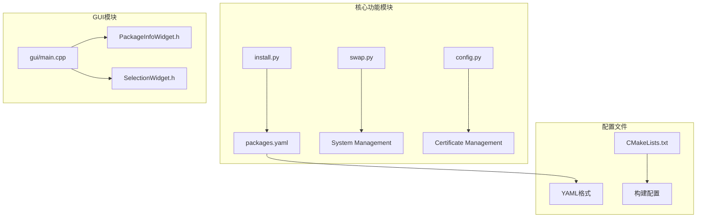
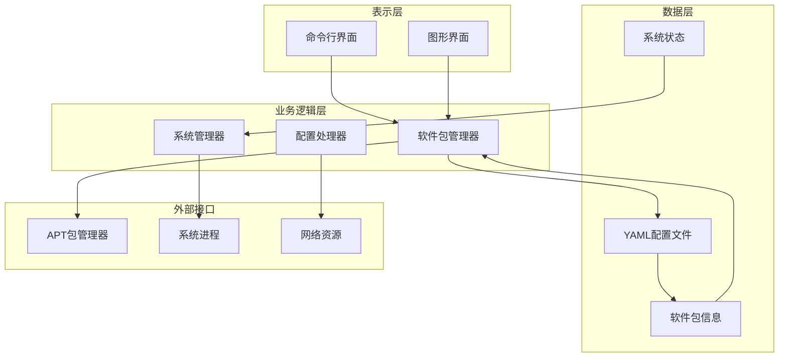
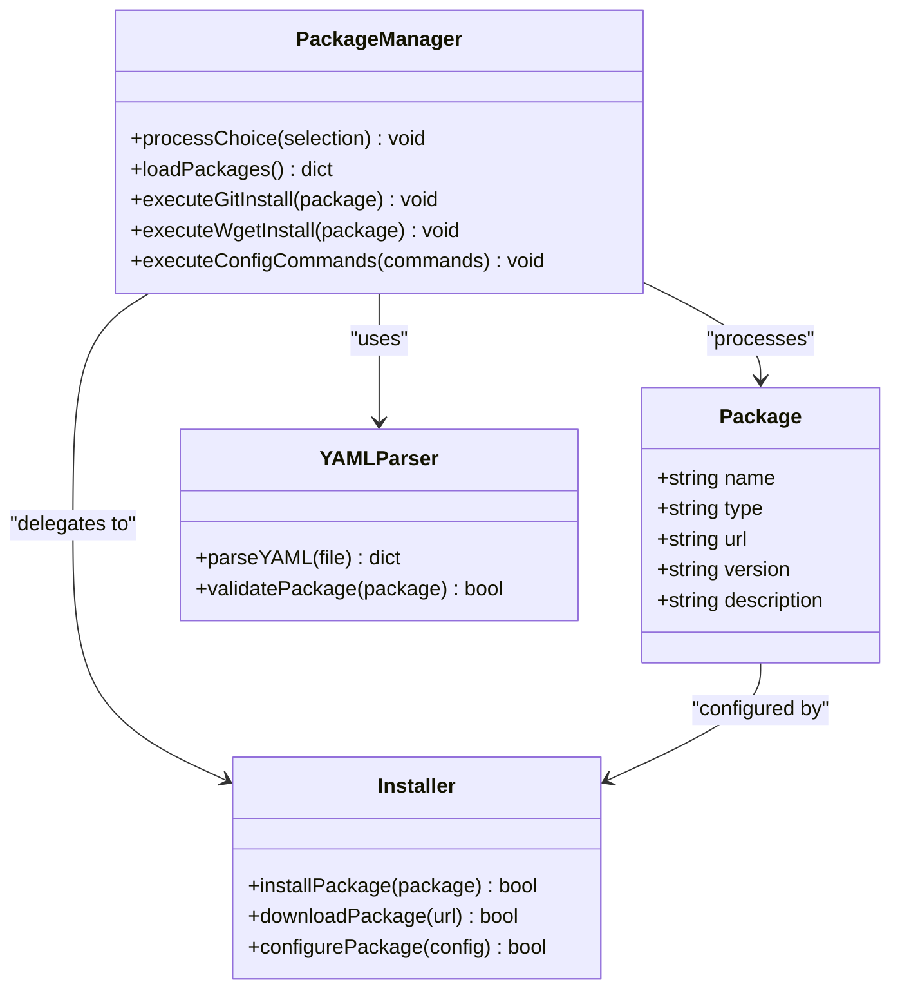
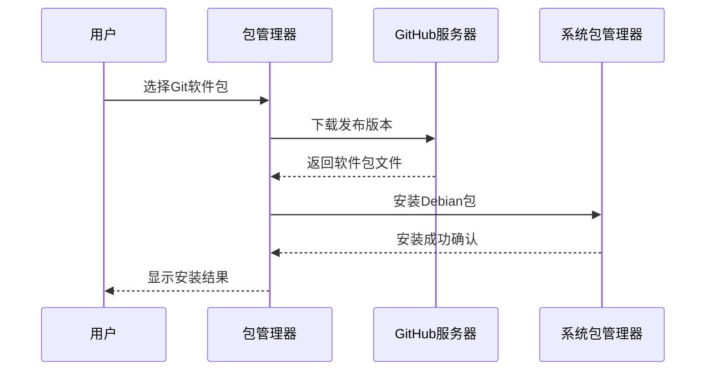
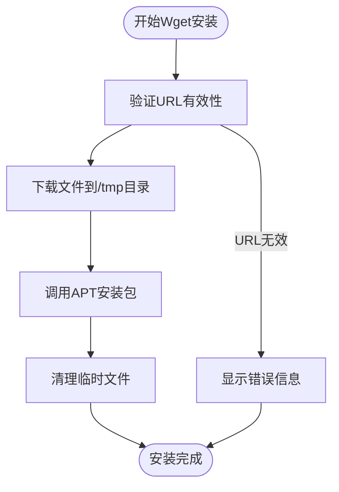
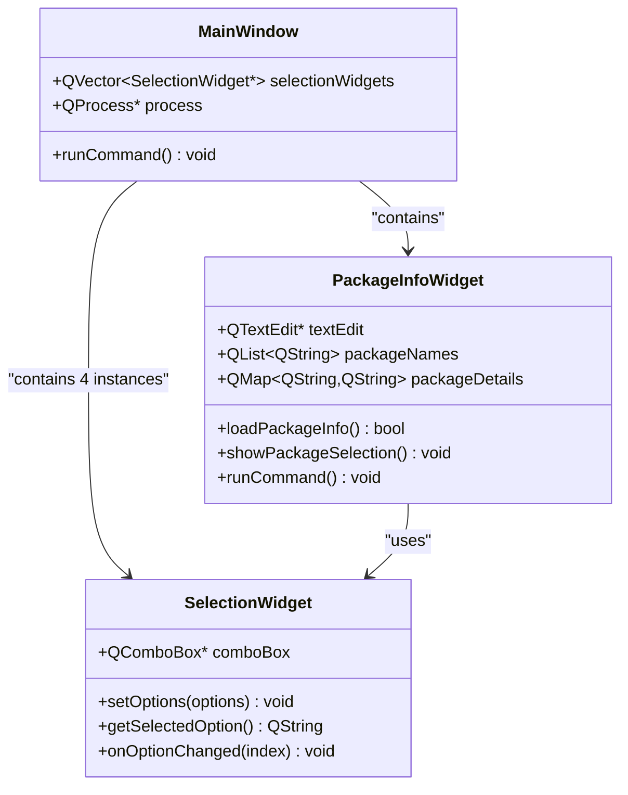
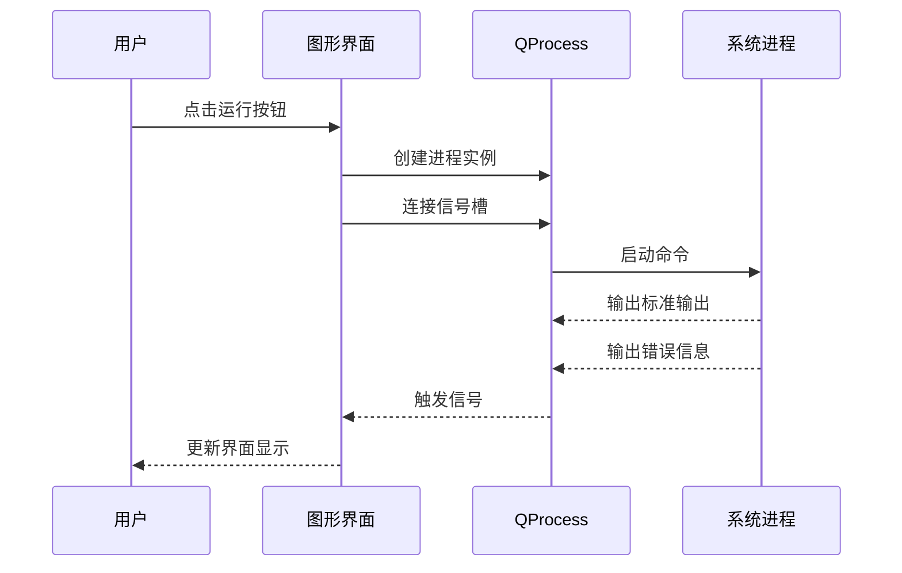
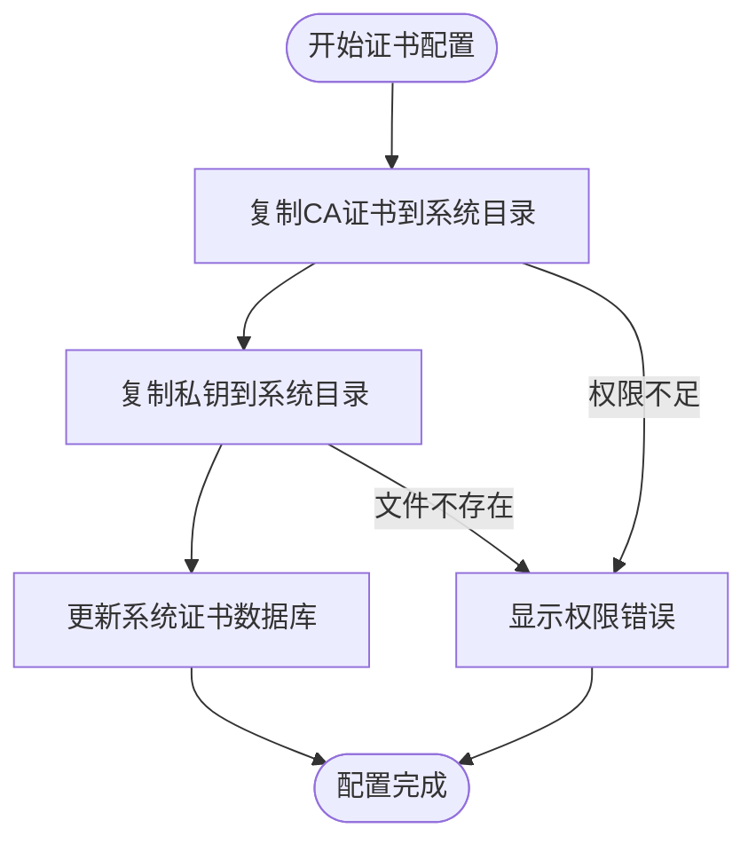
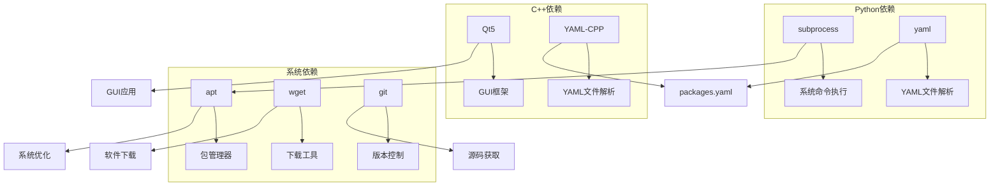

# 核心功能

<cite>
**本文档引用的文件**
- [README.md](file://README.md)
- [install.py](file://install.py)
- [swap.py](file://swap.py)
- [config.py](file://config.py)
- [packages.yaml](file://packages.yaml)
- [gui/main.cpp](file://gui/main.cpp)
- [gui/PackageInfoWidget.h](file://gui/PackageInfoWidget.h)
- [gui/SelectionWidget.h](file://gui/SelectionWidget.h)
</cite>

## 目录
1. [简介](#简介)
2. [项目结构](#项目结构)
3. [核心组件](#核心组件)
4. [架构概览](#架构概览)
5. [详细组件分析](#详细组件分析)
6. [依赖分析](#依赖分析)
7. [性能考虑](#性能考虑)
8. [故障排除指南](#故障排除指南)
9. [结论](#结论)

## 简介

Install项目是一个多功能的软件包管理系统，旨在简化Linux系统的软件安装和系统管理任务。该项目提供了三种主要功能：

1. **软件包管理系统**：支持通过Git和Wget两种方式安装软件包
2. **系统管理功能**：包括交换空间管理和证书配置
3. **用户界面功能**：提供命令行和图形界面两种交互方式

该系统通过YAML配置文件管理软件包信息，支持自动下载、安装和配置各种应用程序，同时提供系统级的优化和管理功能。

## 项目结构

项目采用模块化设计，主要包含以下组件：

**图表来源**
- [install.py:1-36](file://install.py#L1-L36)
- [swap.py:1-10](file://swap.py#L1-L10)
- [config.py:1-8](file://config.py#L1-L8)
- [gui/main.cpp:1-73](file://gui/main.cpp#L1-L73)

**章节来源**
- [README.md:1-7](file://README.md#L1-L7)
- [install.py:1-36](file://install.py#L1-L36)
- [gui/main.cpp:1-73](file://gui/main.cpp#L1-L73)

## 核心组件

### 软件包管理系统

软件包管理系统是项目的核心功能，支持多种安装方式和灵活的配置选项。

**主要特性：**
- 支持Git和Wget两种安装方式
- 基于YAML配置文件的软件包管理
- 交互式命令行界面
- 自动化的软件安装流程

**安装方式对比：**

| 安装方式 | 适用场景 | 优势 | 限制 |
|---------|----------|------|------|
| Git安装 | GitHub托管的软件包 | 可直接从GitHub下载预编译版本 | 需要GitHub访问权限 |
| Wget安装 | 直接链接的软件包 | 支持任意HTTP资源 | 仅支持HTTP/HTTPS协议 |
| 配置安装 | 系统配置脚本 | 可执行任意命令序列 | 需要root权限 |

**章节来源**
- [install.py:4-16](file://install.py#L4-L16)
- [packages.yaml:1-50](file://packages.yaml#L1-L50)

### 系统管理功能

系统管理功能专注于提升系统性能和安全性，主要包括交换空间管理和证书配置。

**交换空间管理：**
- 自动创建16GB交换文件
- 设置适当的权限和挂载点
- 持久化配置到fstab文件

**证书配置：**
- 复制自定义CA证书到系统目录
- 更新系统证书数据库
- 支持企业内部证书管理

**章节来源**
- [swap.py:1-10](file://swap.py#L1-L10)
- [config.py:1-8](file://config.py#L1-L8)

### 用户界面功能

用户界面功能提供两种交互模式，满足不同用户的需求。

**命令行界面：**
- 基于Python的交互式菜单
- 动态加载软件包列表
- 简洁的文本界面操作

**图形用户界面：**
- 基于Qt/C++的现代化界面
- 支持实时进程监控
- 提供详细的软件包信息展示

**章节来源**
- [install.py:17-36](file://install.py#L17-L36)
- [gui/PackageInfoWidget.h:18-44](file://gui/PackageInfoWidget.h#L18-L44)

## 架构概览

项目采用分层架构设计，清晰分离了数据层、业务逻辑层和表示层：

**图表来源**
- [install.py:17-36](file://install.py#L17-L36)
- [gui/PackageInfoWidget.h:109-127](file://gui/PackageInfoWidget.h#L109-L127)
- [swap.py:1-10](file://swap.py#L1-L10)

## 详细组件分析

### 软件包管理器组件

软件包管理器是整个系统的核心，负责处理各种类型的软件包安装请求。

#### 类结构图

**图表来源**
- [install.py:4-16](file://install.py#L4-L16)
- [packages.yaml:1-50](file://packages.yaml#L1-L50)

#### Git安装流程

Git安装方式适用于GitHub托管的软件包，具有以下特点：

**图表来源**
- [install.py:5-10](file://install.py#L5-L10)

#### Wget安装流程

Wget安装方式支持任意HTTP资源的直接下载安装：

**图表来源**
- [install.py:9-10](file://install.py#L9-L10)

**章节来源**
- [install.py:4-16](file://install.py#L4-L16)
- [packages.yaml:26-37](file://packages.yaml#L26-L37)

### 图形用户界面组件

图形用户界面采用Qt框架构建，提供现代化的用户体验。

#### GUI组件架构

**图表来源**
- [gui/main.cpp:7-42](file://gui/main.cpp#L7-L42)
- [gui/PackageInfoWidget.h:18-44](file://gui/PackageInfoWidget.h#L18-L44)
- [gui/SelectionWidget.h:8-39](file://gui/SelectionWidget.h#L8-L39)

#### 实时进程监控

图形界面提供了完整的进程监控功能：

**图表来源**
- [gui/PackageInfoWidget.h:109-144](file://gui/PackageInfoWidget.h#L109-L144)

**章节来源**
- [gui/main.cpp:1-73](file://gui/main.cpp#L1-L73)
- [gui/PackageInfoWidget.h:1-145](file://gui/PackageInfoWidget.h#L1-L145)
- [gui/SelectionWidget.h:1-40](file://gui/SelectionWidget.h#L1-L40)

### 系统管理组件

系统管理组件提供底层系统优化功能。

#### 交换空间管理流程

**图表来源**
- [swap.py:3-9](file://swap.py#L3-L9)

#### 证书配置流程

**图表来源**
- [config.py:3-6](file://config.py#L3-L6)

**章节来源**
- [swap.py:1-10](file://swap.py#L1-L10)
- [config.py:1-8](file://config.py#L1-L8)

## 依赖分析

项目依赖关系清晰，主要依赖包括：

**图表来源**
- [install.py:1-2](file://install.py#L1-L2)
- [gui/PackageInfoWidget.h:12](file://gui/PackageInfoWidget.h#L12)

**章节来源**
- [install.py:1-2](file://install.py#L1-L2)
- [gui/PackageInfoWidget.h:12](file://gui/PackageInfoWidget.h#L12)

## 性能考虑

### 内存使用优化

- **延迟加载**：GUI组件按需初始化，减少内存占用
- **进程池管理**：合理管理QProcess生命周期，避免内存泄漏
- **文件缓存**：YAML配置文件一次性加载到内存

### 网络性能优化

- **并发下载**：Git和Wget安装支持并行处理多个软件包
- **缓存策略**：下载的软件包存储在/tmp目录，避免重复下载
- **超时控制**：合理的网络超时设置，防止长时间阻塞

### 系统资源管理

- **权限最小化**：只在必要时提升权限级别
- **资源清理**：自动清理临时文件和进程资源
- **监控机制**：实时监控系统资源使用情况

## 故障排除指南

### 常见问题及解决方案

**软件包安装失败**
- 检查网络连接和代理设置
- 验证软件包URL的有效性
- 确认系统有足够的磁盘空间
- 查看APT缓存状态并清理

**GUI界面无响应**
- 检查Qt依赖是否正确安装
- 验证YAML文件格式是否正确
- 确认用户权限足够执行相关操作
- 查看系统日志获取详细错误信息

**交换空间创建失败**
- 检查磁盘空间是否充足
- 验证文件系统支持swap格式
- 确认没有其他进程占用交换文件
- 检查fstab文件语法

**证书配置错误**
- 验证证书文件路径和权限
- 检查证书格式是否正确
- 确认系统证书数据库更新成功
- 验证网络连接以获取最新证书

### 调试技巧

**命令行调试**
- 使用verbose模式查看详细日志
- 分步执行命令以定位问题
- 检查返回码和错误信息
- 使用strace跟踪系统调用

**GUI调试**
- 启用调试输出查看Qt信号槽连接
- 监控进程状态和输出
- 检查事件循环是否正常工作
- 验证UI线程安全

**章节来源**
- [install.py:14](file://install.py#L14)
- [gui/PackageInfoWidget.h:82-85](file://gui/PackageInfoWidget.h#L82-L85)
- [swap.py:4-9](file://swap.py#L4-L9)

## 结论

Install项目提供了一个完整、灵活且用户友好的软件包管理系统。通过支持多种安装方式、提供丰富的系统管理功能以及现代化的用户界面，该项目能够满足不同用户的需求。

**主要优势：**
- **灵活性**：支持多种安装方式和配置选项
- **易用性**：提供直观的命令行和图形界面
- **可扩展性**：基于YAML配置文件，易于添加新软件包
- **可靠性**：完善的错误处理和故障恢复机制

**未来改进方向：**
- 增加更多安装方式的支持
- 扩展GUI功能以支持更多系统管理任务
- 优化性能以支持大规模软件包管理
- 增强安全性和权限管理

该项目为Linux系统管理员和开发者提供了一个强大而实用的工具集，能够显著提高软件部署和系统管理的效率。