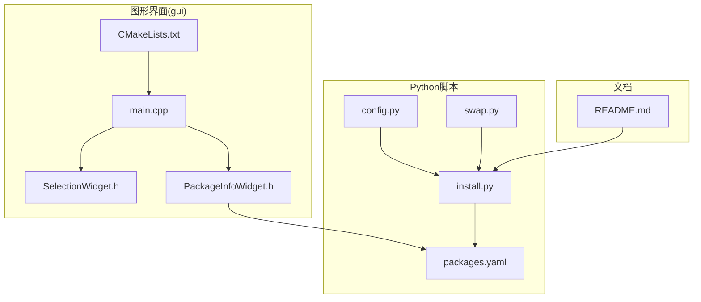
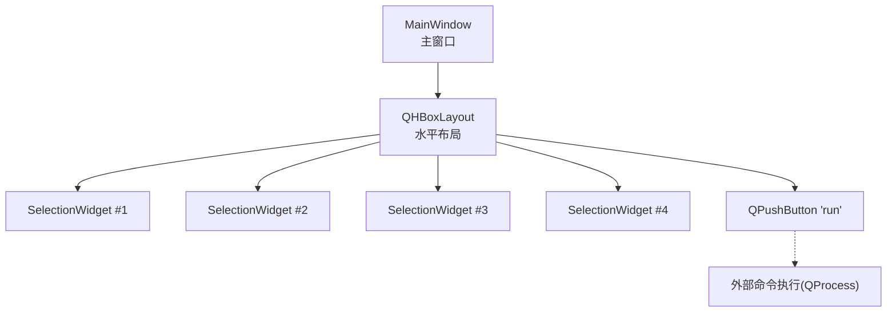
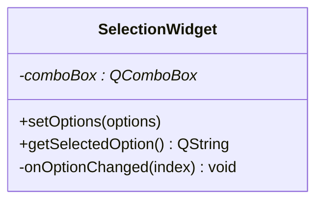
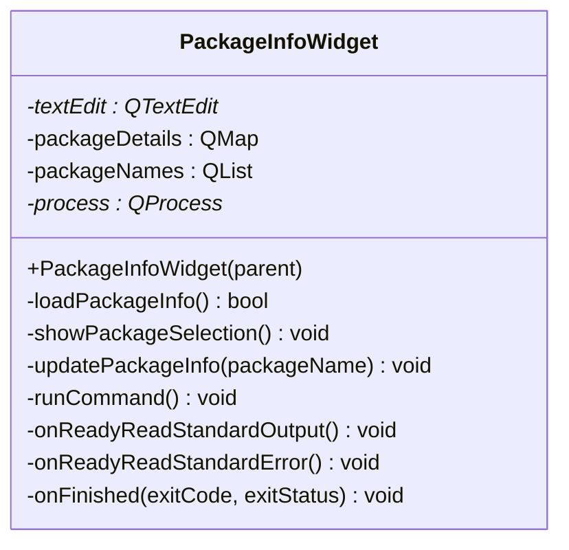
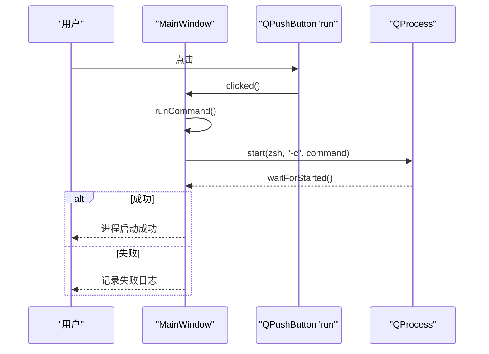
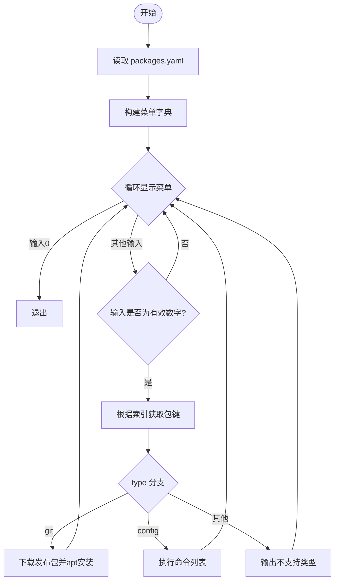
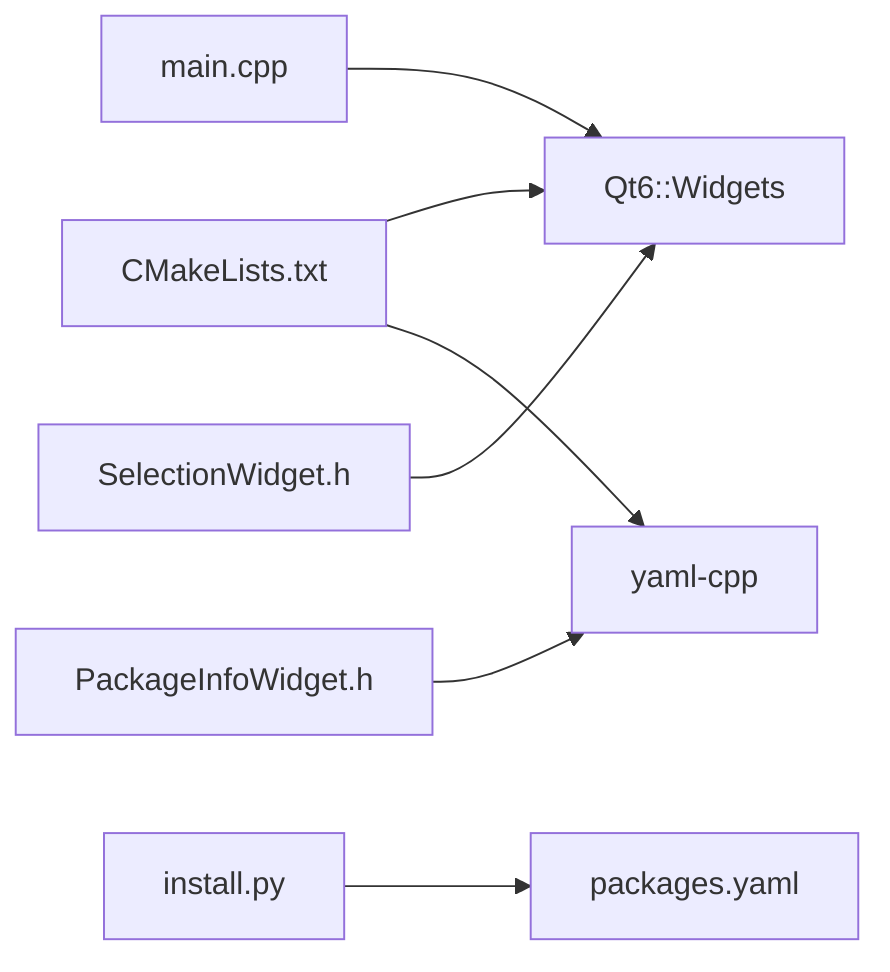

# 用户界面功能

<cite>
**本文引用的文件**
- [gui/main.cpp](file://gui/main.cpp)
- [gui/SelectionWidget.h](file://gui/SelectionWidget.h)
- [gui/PackageInfoWidget.h](file://gui/PackageInfoWidget.h)
- [gui/CMakeLists.txt](file://gui/CMakeLists.txt)
- [install.py](file://install.py)
- [packages.yaml](file://packages.yaml)
- [config.py](file://config.py)
- [swap.py](file://swap.py)
- [README.md](file://README.md)
</cite>

## 目录
1. [简介](#简介)
2. [项目结构](#项目结构)
3. [核心组件](#核心组件)
4. [架构总览](#架构总览)
5. [详细组件分析](#详细组件分析)
6. [依赖关系分析](#依赖关系分析)
7. [性能考虑](#性能考虑)
8. [故障排除指南](#故障排除指南)
9. [结论](#结论)
10. [附录](#附录)

## 简介
本文件面向用户界面功能，系统性介绍命令行与Qt6图形界面的设计与实现，涵盖：
- 命令行界面的交互设计与使用方法（菜单显示、用户选择处理、输入验证机制）
- Qt6图形界面的应用架构（主窗口设计、组件布局、事件处理机制）
- SelectionWidget 与 PackageInfoWidget 组件的功能与实现细节
- GUI 界面的使用示例与定制化指南（如何扩展界面功能）

## 项目结构
该项目采用“多语言混合”的架构：Python 负责命令行安装流程与YAML配置解析；Qt6 C++ 负责图形界面；CMake 管理Qt6与yaml-cpp的编译链接。关键目录与文件如下：
- gui/：Qt6 图形界面源码与构建脚本
  - main.cpp：主窗口与事件连接
  - SelectionWidget.h：下拉选择组件
  - PackageInfoWidget.h：包信息展示与安装执行组件
  - CMakeLists.txt：Qt6与yaml-cpp的构建配置
- Python 脚本与配置
  - install.py：命令行安装菜单与执行逻辑
  - packages.yaml：包清单与安装参数
  - config.py：证书与环境配置脚本
  - swap.py：交换分区设置脚本
- README.md：项目简述与使用说明

图表来源
- [gui/main.cpp:1-73](file://gui/main.cpp#L1-L73)
- [gui/SelectionWidget.h:1-40](file://gui/SelectionWidget.h#L1-L40)
- [gui/PackageInfoWidget.h:1-145](file://gui/PackageInfoWidget.h#L1-L145)
- [gui/CMakeLists.txt:1-26](file://gui/CMakeLists.txt#L1-L26)
- [install.py:1-36](file://install.py#L1-L36)
- [packages.yaml:1-50](file://packages.yaml#L1-L50)
- [config.py:1-8](file://config.py#L1-L8)
- [swap.py:1-10](file://swap.py#L1-L10)
- [README.md:1-7](file://README.md#L1-L7)

章节来源
- [gui/main.cpp:1-73](file://gui/main.cpp#L1-L73)
- [gui/CMakeLists.txt:1-26](file://gui/CMakeLists.txt#L1-L26)
- [install.py:1-36](file://install.py#L1-L36)
- [packages.yaml:1-50](file://packages.yaml#L1-L50)
- [README.md:1-7](file://README.md#L1-L7)

## 核心组件
- SelectionWidget：封装一个下拉选择框，负责选项设置与当前值读取，并通过信号槽机制输出选中项变化日志。
- PackageInfoWidget：负责从 YAML 加载包信息、展示详情、触发安装命令并实时输出标准输出与错误流。
- 主窗口 MainWindow：组合多个 SelectionWidget 并提供“运行”按钮，连接到命令执行逻辑；同时包含 PackageInfoWidget 的替代方案（当前示例中未直接使用）。

章节来源
- [gui/SelectionWidget.h:1-40](file://gui/SelectionWidget.h#L1-L40)
- [gui/PackageInfoWidget.h:1-145](file://gui/PackageInfoWidget.h#L1-L145)
- [gui/main.cpp:1-73](file://gui/main.cpp#L1-L73)

## 架构总览
图形界面采用 Qt6 Widgets 模型，主窗口以水平布局承载四个 SelectionWidget，右侧附加“运行”按钮。点击按钮后，MainWindow 启动外部进程执行命令。PackageInfoWidget 提供独立的包信息展示与安装执行能力，可作为 GUI 的补充或替代模块。

图表来源
- [gui/main.cpp:7-42](file://gui/main.cpp#L7-L42)
- [gui/SelectionWidget.h:8-19](file://gui/SelectionWidget.h#L8-L19)

章节来源
- [gui/main.cpp:1-73](file://gui/main.cpp#L1-L73)

## 详细组件分析

### SelectionWidget 组件
- 功能概述
  - 提供一个下拉选择框，用于从预设选项中选择一项。
  - 支持动态设置选项列表。
  - 通过信号槽记录当前选中项的变化。
- 关键接口
  - setOptions：设置下拉选项集合
  - getSelectedOption：获取当前选中项文本
  - 内部槽 onOptionChanged：打印当前选中项（便于调试）
- 设计要点
  - 使用 QComboBox 承载选项，QVBoxLayout 布局管理。
  - 通过 QOverload<int>::of(&QComboBox::currentIndexChanged) 连接信号，确保类型安全。
  - 未启用 Q_OBJECT 宏，因此不支持自定义信号发射（如 optionChanged），但可通过注释中的信号声明扩展。

图表来源
- [gui/SelectionWidget.h:8-39](file://gui/SelectionWidget.h#L8-L39)

章节来源
- [gui/SelectionWidget.h:1-40](file://gui/SelectionWidget.h#L1-L40)

### PackageInfoWidget 组件
- 功能概述
  - 从 YAML 文件加载包信息，构建名称、描述、URL、版本等字段。
  - 提供按钮触发包选择对话框，更新信息展示区域。
  - 提供“安装”按钮，启动外部命令并通过 QProcess 实时输出标准输出与错误流，并在完成后追加状态信息。
- 关键流程
  - loadPackageInfo：打开 YAML 文件，遍历节点，填充 packageDetails 与 packageNames。
  - showPackageSelection：弹出选择对话框，更新按钮文本并刷新信息。
  - runCommand：启动外部命令，连接标准输出/错误槽与完成槽。
  - 输出槽：onReadyReadStandardOutput/onReadyReadStandardError/onFinished，将输出追加到只读文本编辑器。
- 错误处理
  - 文件打开失败时弹出错误对话框。
  - YAML 解析异常时弹出错误对话框。
  - 进程启动失败时记录日志。

图表来源
- [gui/PackageInfoWidget.h:18-145](file://gui/PackageInfoWidget.h#L18-L145)

章节来源
- [gui/PackageInfoWidget.h:1-145](file://gui/PackageInfoWidget.h#L1-L145)
- [packages.yaml:1-50](file://packages.yaml#L1-L50)

### MainWindow 与事件处理
- 主窗口设计
  - 创建中心部件与水平布局，依次添加四个 SelectionWidget。
  - 添加“运行”按钮，连接到 runCommand。
- 事件处理
  - runCommand：创建 QProcess，启动外部命令（示例为 zsh -c），等待启动结果并记录日志。
- 布局与交互
  - 四个 SelectionWidget 用于选择 SLAM 类型、数据集、传感器与回环开关等参数。
  - “运行”按钮触发命令执行，可用于调用实际的安装或运行流程。

图表来源
- [gui/main.cpp:47-61](file://gui/main.cpp#L47-L61)

章节来源
- [gui/main.cpp:1-73](file://gui/main.cpp#L1-L73)

### 命令行界面（CLI）与输入验证
- 菜单显示与选择
  - install.py 读取 packages.yaml，构建编号到“包名 - 描述”的映射菜单。
  - 循环打印菜单项，提示用户输入序号。
- 输入验证与处理
  - 当输入为 0 时退出循环。
  - 其他输入需为有效数字，否则可能导致异常；当前实现未对非数字输入进行显式校验。
  - 通过菜单索引定位 YAML 中的键，调用 processChoice 执行安装。
- 安装类型分发
  - type: git：下载发布包并使用 apt 安装。
  - type: config：执行一组命令（如修改 GRUB 配置）。
  - 其他类型：输出“不支持的类型”。

图表来源
- [install.py:4-35](file://install.py#L4-L35)
- [packages.yaml:1-50](file://packages.yaml#L1-L50)

章节来源
- [install.py:1-36](file://install.py#L1-L36)
- [packages.yaml:1-50](file://packages.yaml#L1-L50)

## 依赖关系分析
- Qt6 Widgets：图形界面基础，MainWindow、SelectionWidget、PackageInfoWidget 均基于 QWidget。
- yaml-cpp：用于解析 YAML 文件，PackageInfoWidget 依赖该库加载包信息。
- CMake 自动化：AUTOMOC/AUTORCC/AUTOUIC 开启，简化信号槽与资源文件处理。
- Python 依赖：install.py 依赖 YAML 解析与子进程执行；swap.py 与 config.py 依赖系统命令。

图表来源
- [gui/CMakeLists.txt:9-13](file://gui/CMakeLists.txt#L9-L13)
- [gui/PackageInfoWidget.h:12-16](file://gui/PackageInfoWidget.h#L12-L16)
- [gui/main.cpp:1-5](file://gui/main.cpp#L1-L5)
- [install.py:1-2](file://install.py#L1-L2)
- [packages.yaml:1-50](file://packages.yaml#L1-L50)

章节来源
- [gui/CMakeLists.txt:1-26](file://gui/CMakeLists.txt#L1-L26)
- [gui/PackageInfoWidget.h:1-145](file://gui/PackageInfoWidget.h#L1-L145)
- [gui/main.cpp:1-73](file://gui/main.cpp#L1-L73)
- [install.py:1-36](file://install.py#L1-L36)

## 性能考虑
- GUI 响应性
  - 使用 QProcess 异步执行外部命令，避免阻塞主线程。
  - 通过 readyReadStandardOutput/readyReadStandardError 逐块读取输出，减少内存占用。
- I/O 优化
  - PackageInfoWidget 一次性读取 YAML 文件内容，随后在内存中解析与查找，避免重复 I/O。
- 布局与渲染
  - 使用简单布局（QHBoxLayout/QVBoxLayout）降低复杂度，提升渲染效率。
- 可扩展性
  - SelectionWidget 仅承载下拉框，便于替换为更复杂的控件（如复选框组、树形选择）而不影响主窗口。

## 故障排除指南
- YAML 文件无法打开
  - 现象：PackageInfoWidget 弹出错误对话框并返回失败。
  - 排查：确认 packages.yaml 路径正确且具有读权限。
- YAML 解析异常
  - 现象：捕获 YAML::Exception 并弹出错误对话框。
  - 排查：检查 YAML 格式与字段完整性（name/des/url/version）。
- 进程启动失败
  - 现象：runCommand 中记录失败日志。
  - 排查：确认命令路径与参数正确，以及 zsh 可用。
- CLI 输入异常
  - 现象：非数字输入可能导致异常。
  - 建议：在 install.py 中增加输入类型校验与异常捕获。

章节来源
- [gui/PackageInfoWidget.h:53-88](file://gui/PackageInfoWidget.h#L53-L88)
- [gui/PackageInfoWidget.h:109-127](file://gui/PackageInfoWidget.h#L109-L127)
- [install.py:17-35](file://install.py#L17-L35)

## 结论
本项目通过 Qt6 图形界面与 Python 命令行工具形成互补：Qt6 提供直观的参数选择与实时输出展示；Python 负责包清单解析与安装流程。SelectionWidget 与 PackageInfoWidget 分别承担参数选择与包管理的核心职责。建议后续增强：
- 在 SelectionWidget 中启用 Q_OBJECT 并添加 optionChanged 信号，提升组件间通信能力。
- 在 CLI 中完善输入校验与异常处理，提升健壮性。
- 将 MainWindow 的 runCommand 与 YAML 清单结合，实现参数驱动的安装流程。

## 附录

### GUI 使用示例
- 启动图形界面
  - 使用 CMake 构建并运行目标程序，主窗口将显示四个下拉选择框与“运行”按钮。
  - 点击“运行”按钮后，程序会启动外部命令（示例为 zsh -c），并在控制台输出启动结果。
- 包信息与安装
  - PackageInfoWidget 可从 YAML 加载包信息，点击“Select Package”弹出选择对话框，更新信息展示区域。
  - 点击“install”按钮启动安装流程，实时输出标准输出与错误流，并在完成后显示退出状态。

章节来源
- [gui/main.cpp:47-61](file://gui/main.cpp#L47-L61)
- [gui/PackageInfoWidget.h:90-145](file://gui/PackageInfoWidget.h#L90-L145)

### 定制化指南
- 扩展 SelectionWidget
  - 在头文件中启用 Q_OBJECT 宏，并添加 optionChanged 信号，以便在主窗口或其他组件中订阅选中项变化。
  - 可替换为多选控件（如 QCheckBox 列表）以支持组合参数。
- 扩展 PackageInfoWidget
  - 增加更多按钮（如“卸载”、“更新”），并为每类操作绑定对应槽函数。
  - 将 runCommand 与 YAML 清单解耦，通过 SelectionWidget 的参数动态拼接命令。
- 构建与打包
  - 使用 CMake 自动化生成 moc/rcc/uic 文件，确保信号槽与资源文件正确编译。
  - 通过 CPack 生成 DEB 包，便于分发。

章节来源
- [gui/SelectionWidget.h:29-37](file://gui/SelectionWidget.h#L29-L37)
- [gui/PackageInfoWidget.h:18-44](file://gui/PackageInfoWidget.h#L18-L44)
- [gui/CMakeLists.txt:3-13](file://gui/CMakeLists.txt#L3-L13)