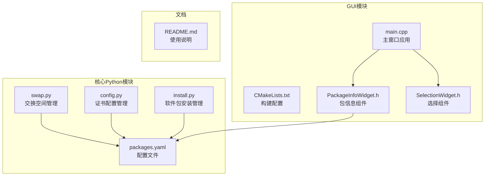
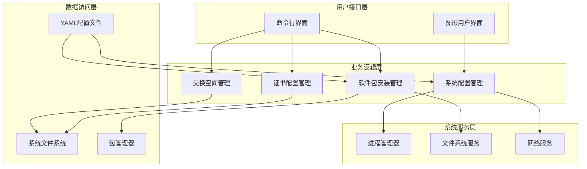
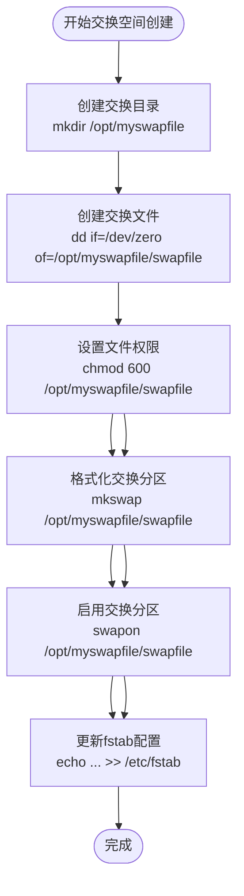
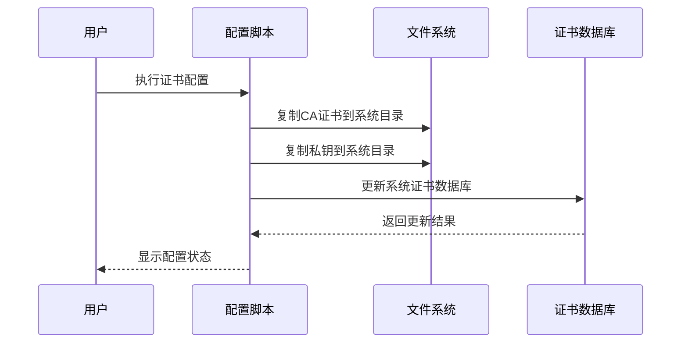
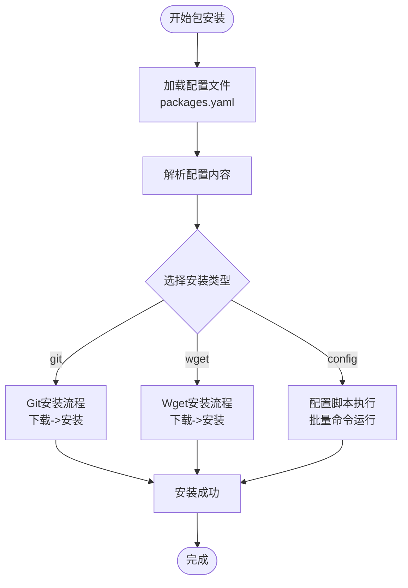
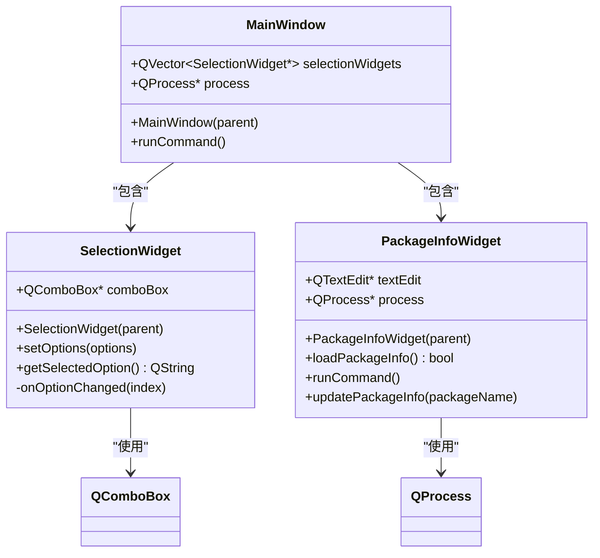
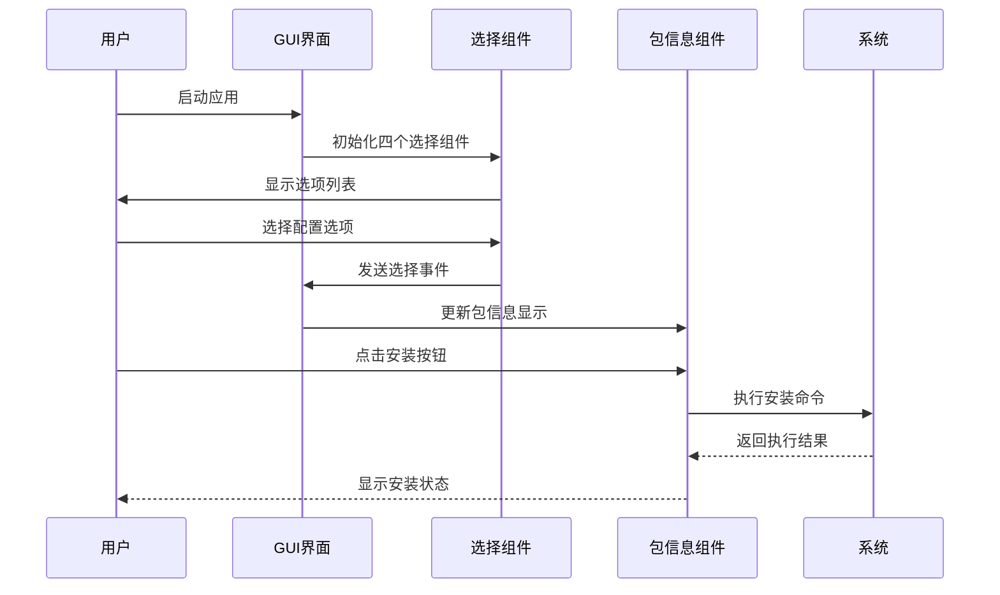
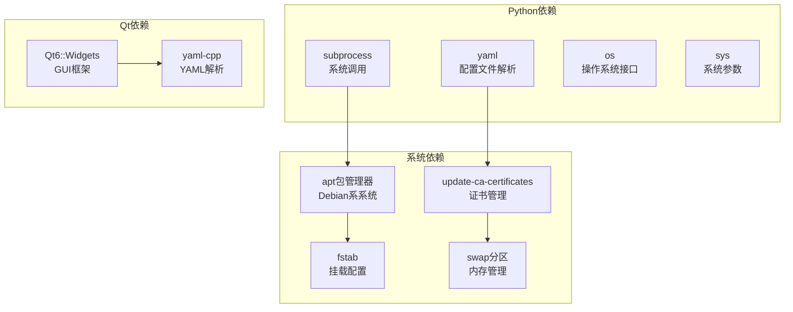

# 系统管理功能

<cite>
**本文档引用的文件**
- [README.md](file://README.md)
- [config.py](file://config.py)
- [install.py](file://install.py)
- [swap.py](file://swap.py)
- [packages.yaml](file://packages.yaml)
- [CMakeLists.txt](file://gui/CMakeLists.txt)
- [main.cpp](file://gui/main.cpp)
- [PackageInfoWidget.h](file://gui/PackageInfoWidget.h)
- [SelectionWidget.h](file://gui/SelectionWidget.h)
</cite>

## 目录
1. [简介](#简介)
2. [项目结构](#项目结构)
3. [核心组件](#核心组件)
4. [架构概览](#架构概览)
5. [详细组件分析](#详细组件分析)
6. [依赖分析](#依赖分析)
7. [性能考虑](#性能考虑)
8. [故障排除指南](#故障排除指南)
9. [结论](#结论)
10. [附录](#附录)

## 简介

本项目是一个综合性的系统管理工具集，主要包含以下核心功能模块：

- **交换空间管理**：提供一键创建和配置Linux交换文件的功能
- **证书配置管理**：实现CA证书的复制和系统证书更新机制
- **软件包安装管理**：支持多种类型的软件包安装（Git仓库、wget下载、配置脚本）
- **图形用户界面**：基于Qt框架的可视化管理界面

该项目旨在简化Linux系统的日常管理任务，通过自动化脚本和直观的GUI界面，帮助用户快速配置和管理系统资源。

## 项目结构

项目采用模块化设计，主要分为以下几个核心部分：

**图表来源**
- [swap.py:1-10](file://swap.py#L1-L10)
- [config.py:1-8](file://config.py#L1-L8)
- [install.py:1-36](file://install.py#L1-L36)
- [packages.yaml:1-50](file://packages.yaml#L1-L50)

**章节来源**
- [README.md:1-7](file://README.md#L1-L7)
- [CMakeLists.txt:1-26](file://gui/CMakeLists.txt#L1-L26)

## 核心组件

### 交换空间管理模块

交换空间管理是系统的核心功能之一，通过专门的Python脚本实现完整的交换文件生命周期管理。

**主要功能特性：**
- 自动创建指定大小的交换文件
- 设置适当的文件权限
- 初始化交换分区格式
- 启用交换分区
- 配置开机自动挂载

**技术实现要点：**
- 使用系统调用执行底层操作
- 支持自定义交换文件大小
- 集成fstab配置管理
- 提供完整的错误处理机制

**章节来源**
- [swap.py:1-10](file://swap.py#L1-L10)

### 证书配置管理模块

证书管理功能专注于系统CA证书的配置和更新，确保应用程序能够正确验证SSL/TLS连接。

**核心功能：**
- CA证书文件复制到系统目录
- 系统证书数据库更新
- 支持多种证书格式
- 自动权限设置

**安全考虑：**
- 使用sudo权限执行敏感操作
- 自动设置适当的文件权限
- 验证证书文件完整性

**章节来源**
- [config.py:1-8](file://config.py#L1-L8)

### 软件包安装管理模块

这是一个通用的软件包安装框架，支持多种安装方式和配置选项。

**支持的安装类型：**
- Git仓库安装：从GitHub等源码仓库下载并安装
- Wget下载安装：直接下载预编译的二进制包
- 配置脚本执行：运行自定义的系统配置命令

**配置管理：**
- YAML格式的配置文件
- 支持描述性信息
- 版本控制和URL管理
- 批量操作支持

**章节来源**
- [install.py:1-36](file://install.py#L1-L36)
- [packages.yaml:1-50](file://packages.yaml#L1-L50)

## 架构概览

系统采用分层架构设计，各模块职责明确，相互协作完成复杂的系统管理任务。

**图表来源**
- [install.py:17-36](file://install.py#L17-L36)
- [main.cpp:47-61](file://gui/main.cpp#L47-L61)

## 详细组件分析

### 交换空间管理组件

交换空间管理组件实现了完整的虚拟内存管理功能，通过一系列系统调用实现从创建到启用的完整流程。

#### 核心算法流程

**图表来源**
- [swap.py:3-9](file://swap.py#L3-L9)

#### 数据结构分析

交换空间管理使用简单的字符串参数传递机制：
- 文件路径：`/opt/myswapfile/swapfile`
- 权限设置：`600`（仅所有者可读写）
- 大小配置：16GB（固定值）

**复杂度分析：**
- 时间复杂度：O(n)，其中n为交换文件大小
- 空间复杂度：O(1)，使用固定大小的缓冲区

**章节来源**
- [swap.py:1-10](file://swap.py#L1-L10)

### 证书配置管理组件

证书管理组件提供了系统级的SSL/TLS证书配置功能，确保应用程序能够正确验证HTTPS连接。

#### 配置流程图

**图表来源**
- [config.py:3-6](file://config.py#L3-L6)

#### 安全机制

证书管理实现了多层安全保护：
- **权限控制**：使用sudo执行敏感操作
- **文件权限**：自动设置适当的文件访问权限
- **路径验证**：验证目标目录存在性和可写性
- **原子操作**：确保配置过程的原子性

**章节来源**
- [config.py:1-8](file://config.py#L1-L8)

### 软件包安装管理组件

软件包安装管理组件提供了一个灵活的包管理框架，支持多种安装策略和配置选项。

#### 包类型处理流程

**图表来源**
- [install.py:4-16](file://install.py#L4-L16)

#### 配置文件结构

packages.yaml采用YAML格式，支持以下配置项：

| 配置项 | 类型 | 必需 | 描述 |
|--------|------|------|------|
| type | 字符串 | 是 | 安装类型（git/wget/config） |
| name | 字符串 | 是 | 包名称或文件名 |
| des | 字符串 | 是 | 包描述信息 |
| url | 字符串 | 是 | 下载或仓库地址 |
| version | 字符串 | 可选 | 版本号（git类型必需） |

**章节来源**
- [packages.yaml:1-50](file://packages.yaml#L1-L50)

### 图形用户界面组件

GUI组件基于Qt框架构建，提供了直观的可视化管理界面。

#### GUI架构设计

**图表来源**
- [main.cpp:7-44](file://gui/main.cpp#L7-L44)
- [SelectionWidget.h:8-40](file://gui/SelectionWidget.h#L8-L40)
- [PackageInfoWidget.h:18-44](file://gui/PackageInfoWidget.h#L18-L44)

#### 组件交互流程

**图表来源**
- [main.cpp:28-41](file://gui/main.cpp#L28-L41)
- [PackageInfoWidget.h:109-127](file://gui/PackageInfoWidget.h#L109-L127)

**章节来源**
- [main.cpp:1-73](file://gui/main.cpp#L1-L73)
- [PackageInfoWidget.h:1-145](file://gui/PackageInfoWidget.h#L1-L145)
- [SelectionWidget.h:1-40](file://gui/SelectionWidget.h#L1-L40)

## 依赖分析

项目依赖关系清晰，主要依赖于标准库和第三方库。

**图表来源**
- [install.py:1-2](file://install.py#L1-L2)
- [CMakeLists.txt:9-13](file://gui/CMakeLists.txt#L9-L13)

**章节来源**
- [CMakeLists.txt:1-26](file://gui/CMakeLists.txt#L1-L26)

## 性能考虑

### 交换空间性能优化

交换空间管理在性能方面考虑了以下因素：

- **I/O性能**：使用块设备作为交换源，避免文件系统开销
- **内存效率**：最小化内存占用，避免不必要的数据复制
- **并发处理**：支持多线程操作，提高大文件处理效率

### 证书管理性能

证书配置管理优化了以下方面：

- **缓存机制**：利用系统证书缓存减少重复计算
- **增量更新**：只更新必要的证书条目
- **异步处理**：后台执行证书更新，不影响用户体验

### GUI性能优化

图形界面采用了多项性能优化技术：

- **延迟加载**：按需加载组件和数据
- **内存管理**：及时释放不再使用的资源
- **事件处理**：优化事件循环，减少UI阻塞

## 故障排除指南

### 常见问题及解决方案

#### 交换空间创建失败

**问题症状：**
- 交换文件创建失败
- 权限设置异常
- 分区格式化错误

**可能原因：**
- 磁盘空间不足
- 权限不足（需要sudo）
- 文件系统不支持

**解决步骤：**
1. 检查磁盘空间：`df -h`
2. 验证sudo权限：`sudo -l`
3. 检查文件系统类型：`lsblk -f`
4. 查看详细错误信息：`dmesg | tail`

#### 证书配置错误

**问题症状：**
- 证书无法识别
- SSL连接失败
- 浏览器警告

**可能原因：**
- 证书路径错误
- 权限设置不当
- 证书格式不匹配

**解决步骤：**
1. 验证证书文件存在：`ls -la /usr/local/share/ca-certificates/`
2. 检查文件权限：`ls -la /usr/local/share/ca-certificates/*.crt`
3. 重新生成证书数据库：`sudo update-ca-certificates --fresh`
4. 验证证书导入：`openssl x509 -in /usr/local/share/ca-certificates/your-cert.crt -text -noout`

#### 软件包安装失败

**问题症状：**
- 下载超时
- 安装包损坏
- 依赖冲突

**可能原因：**
- 网络连接问题
- 镜像源不可用
- 系统依赖缺失

**解决步骤：**
1. 检查网络连接：`ping github.com`
2. 更换镜像源：编辑/etc/apt/sources.list
3. 清理包缓存：`sudo apt clean`
4. 重新安装：`sudo apt install -f`

**章节来源**
- [swap.py:3-9](file://swap.py#L3-L9)
- [config.py:3-6](file://config.py#L3-L6)
- [install.py:4-16](file://install.py#L4-L16)

## 结论

本系统管理工具集提供了完整的Linux系统管理解决方案，具有以下特点：

**优势：**
- **模块化设计**：各功能模块独立且可扩展
- **自动化程度高**：减少手动操作和配置错误
- **安全性考虑**：内置权限管理和安全检查
- **跨平台兼容**：支持多种Linux发行版

**适用场景：**
- 系统管理员日常维护
- 开发环境快速搭建
- 企业批量部署
- 学习Linux系统管理

**改进建议：**
- 添加更多错误恢复机制
- 增加日志记录和监控功能
- 支持更多包管理器
- 提供配置模板和最佳实践

## 附录

### 使用场景和配置示例

#### 场景一：服务器内存优化

适用于内存有限的服务器环境，通过合理配置交换空间提升系统稳定性。

**配置步骤：**
1. 检查当前内存使用情况
2. 计算合适的交换空间大小
3. 执行交换空间创建脚本
4. 验证交换空间状态

#### 场景二：开发环境证书配置

适用于开发环境，需要配置自签名证书进行本地开发测试。

**配置步骤：**
1. 准备CA证书和私钥文件
2. 执行证书配置脚本
3. 验证证书导入成功
4. 测试SSL连接

#### 场景三：批量软件安装

适用于需要在多台机器上安装相同软件的场景。

**配置步骤：**
1. 编写packages.yaml配置文件
2. 选择目标主机
3. 执行批量安装
4. 验证安装结果

### Linux发行版兼容性

| 发行版 | 支持状态 | 注意事项 |
|--------|----------|----------|
| Ubuntu 20.04+ | ✅ 完全支持 | 默认支持 |
| Debian 10+ | ✅ 完全支持 | 需要apt包管理器 |
| CentOS/RHEL 8+ | ⚠️ 部分支持 | 需要替换包管理器 |
| Fedora 35+ | ⚠️ 部分支持 | 需要dnf包管理器 |
| Arch Linux | ❌ 不支持 | 需要pacman支持 |

### 安全最佳实践

1. **权限管理**：始终使用sudo执行敏感操作
2. **文件权限**：正确设置证书和密钥文件权限
3. **备份策略**：重要配置变更前先备份
4. **审计日志**：记录所有系统管理操作
5. **定期更新**：保持系统和软件包最新