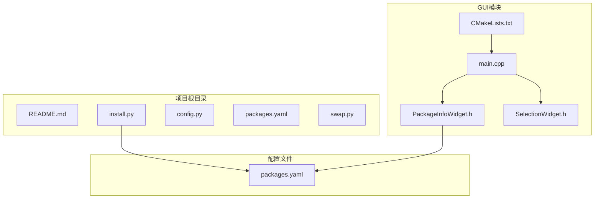
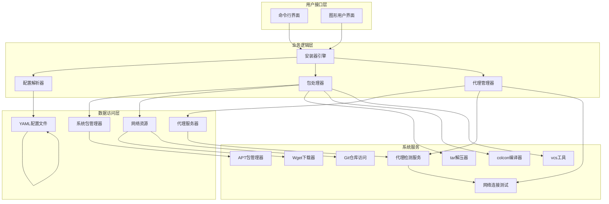
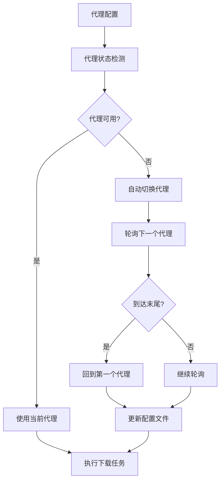
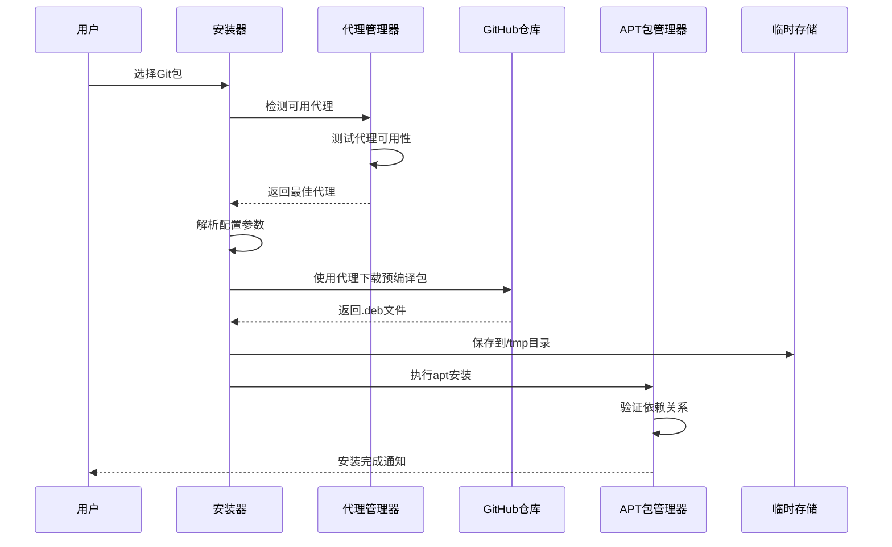
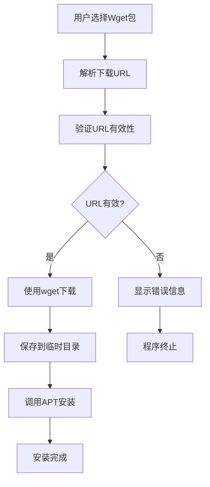
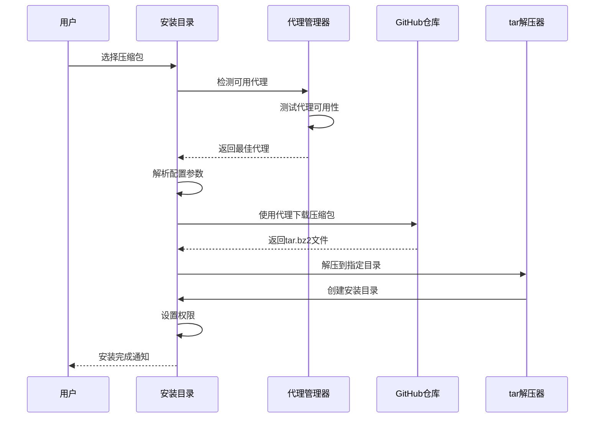
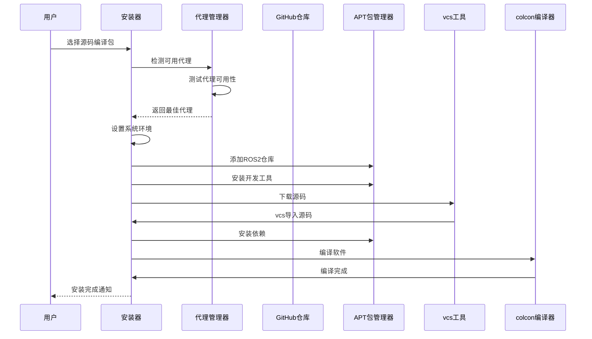
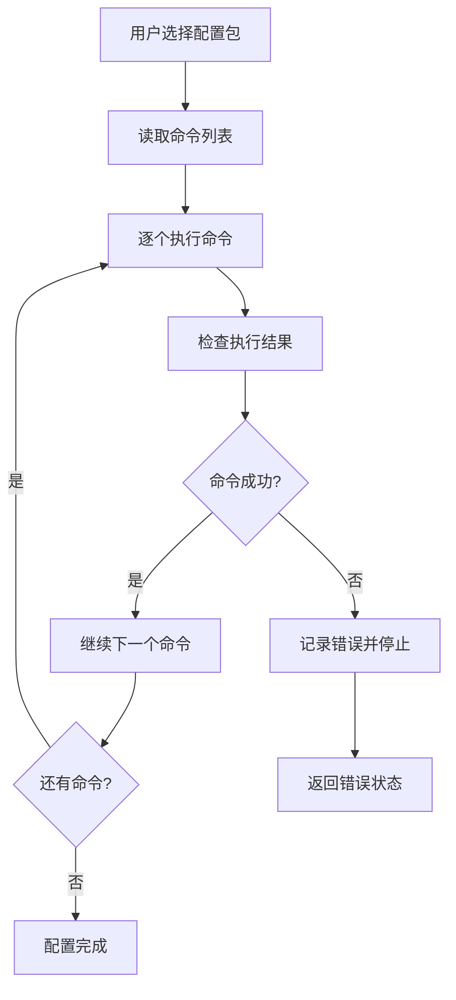
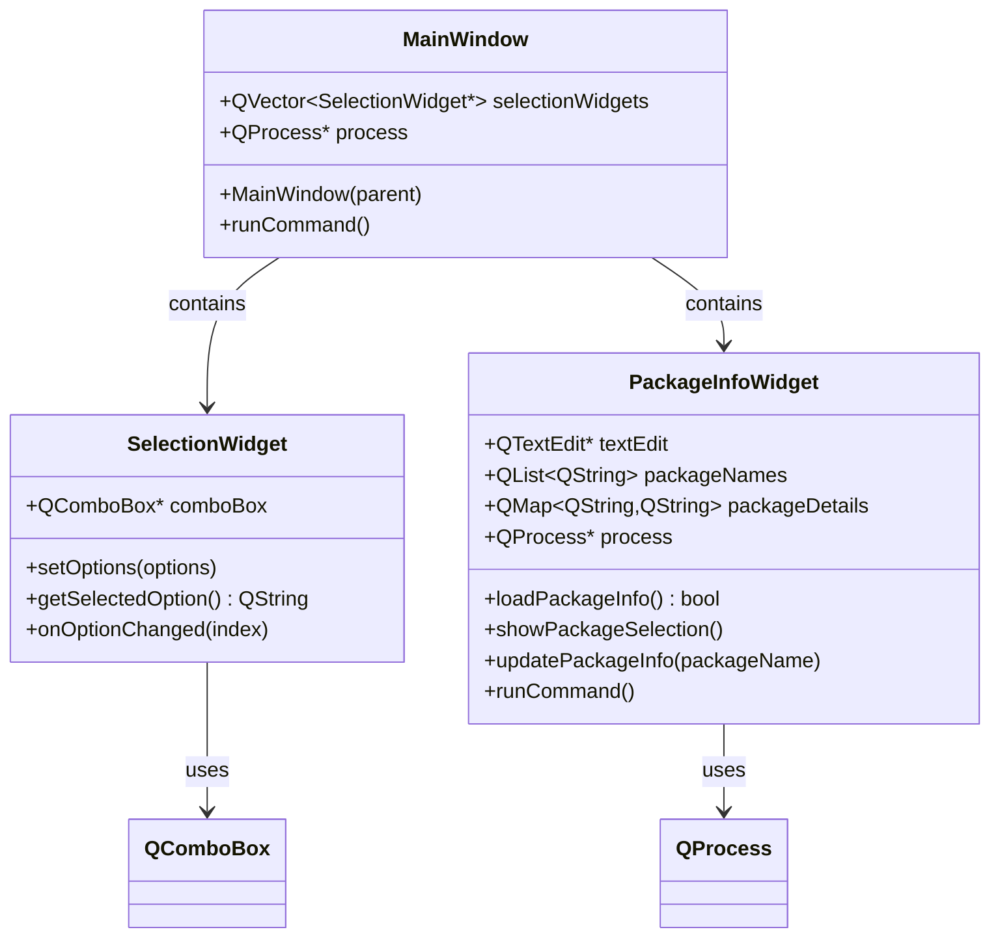
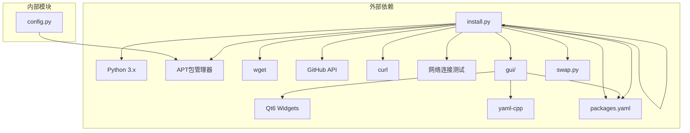

# 软件包管理系统

<cite>
**本文档引用的文件**
- [README.md](file://README.md)
- [install.py](file://install.py)
- [config.py](file://config.py)
- [packages.yaml](file://packages.yaml)
- [swap.py](file://swap.py)
- [CMakeLists.txt](file://gui/CMakeLists.txt)
- [main.cpp](file://gui/main.cpp)
- [PackageInfoWidget.h](file://gui/PackageInfoWidget.h)
- [SelectionWidget.h](file://gui/SelectionWidget.h)
</cite>

## 更新摘要
**变更内容**
- 新增智能代理管理系统，支持13个代理URL的轮询机制
- 增强下载机制，实现代理检测、自动切换和手动选择功能
- 新增压缩包类型（archive）安装支持，支持tar.bz2格式
- 新增源码编译安装类型（source），支持ROS2源码编译
- 改进用户反馈和错误处理机制
- 更新packages.yaml配置文件以支持代理配置和新软件包类型
- 增强Git包安装器的代理支持能力

## 目录
1. [简介](#简介)
2. [项目结构](#项目结构)
3. [核心组件](#核心组件)
4. [架构概览](#架构概览)
5. [详细组件分析](#详细组件分析)
6. [依赖关系分析](#依赖关系分析)
7. [性能考虑](#性能考虑)
8. [故障排除指南](#故障排除指南)
9. [结论](#结论)
10. [附录](#附录)

## 简介

这是一个多功能的软件包管理系统，提供了多种软件包安装方式和用户界面。系统支持四种主要的软件包类型：Git包、Wget包、压缩包（archive）和源码编译包（source）。通过统一的配置文件管理，用户可以轻松安装各种开源工具和应用程序。

**新增功能**：智能代理管理系统，支持13个代理URL的轮询机制，实现自动代理检测、切换和手动选择功能；新增压缩包类型安装支持，可直接解压tar.bz2格式的预编译包。

该系统的核心功能包括：
- Git包安装器：从GitHub仓库下载预编译的.deb包并自动安装，支持智能代理切换
- Wget包安装器：直接从指定URL下载.deb包进行安装
- 压缩包安装器：支持tar.bz2格式的预编译包直接解压安装
- 源码编译安装器：支持ROS2等大型软件的源码编译安装
- 配置包处理器：执行自定义的系统配置命令
- **智能代理管理**：自动检测可用代理、轮询切换、手动选择代理
- 图形用户界面：提供直观的软件包选择和安装体验

## 项目结构

项目采用模块化设计，包含Python脚本、YAML配置文件和Qt图形界面组件。



**图表来源**
- [README.md:1-7](file://README.md#L1-L7)
- [install.py:1-329](file://install.py#L1-L329)
- [packages.yaml:1-74](file://packages.yaml#L1-L74)

**章节来源**
- [README.md:1-7](file://README.md#L1-L7)
- [CMakeLists.txt:1-26](file://gui/CMakeLists.txt#L1-L26)

## 核心组件

### 主要功能模块

系统由以下核心组件构成：

1. **安装器引擎** (`install.py`)
   - 处理不同类型的软件包安装（git/wget/archive/source）
   - 解析YAML配置文件
   - 提供交互式菜单界面
   - **智能代理管理**：代理检测、自动切换、手动选择

2. **配置管理** (`packages.yaml`)
   - 定义软件包清单和安装参数
   - **新增代理配置**：支持13个代理URL的配置和管理
   - 支持多种软件包类型配置（git/wget/archive/source/config）

3. **图形界面** (`gui/`目录)
   - Qt-based用户界面
   - 包信息展示和选择
   - 实时命令执行和输出显示

4. **辅助工具**
   - 交换空间管理 (`swap.py`)
   - SSL证书配置 (`config.py`)

**章节来源**
- [install.py:1-329](file://install.py#L1-L329)
- [packages.yaml:1-74](file://packages.yaml#L1-L74)

## 架构概览

系统采用分层架构设计，实现了清晰的关注点分离，并集成了智能代理管理功能。



**图表来源**
- [install.py:6-329](file://install.py#L6-L329)
- [packages.yaml:1-74](file://packages.yaml#L1-L74)

## 详细组件分析

### 智能代理管理系统

**新增功能**：智能代理管理系统是本次更新的核心改进，提供了完整的代理管理解决方案。

#### 代理管理架构



**图表来源**
- [install.py:56-94](file://install.py#L56-L94)

#### 代理检测机制

智能代理系统实现了多层次的代理检测机制：

1. **代理状态检测** (`get_current_proxy`)
   - 获取当前配置的代理URL
   - 支持空代理（直接连接）和代理URL

2. **代理可用性测试** (`test_proxy`)
   - 优先使用wget进行连接测试
   - 回退到curl进行HTTP响应检查
   - 支持超时控制和错误处理

3. **自动代理切换** (`find_working_proxy`)
   - 测试当前代理的可用性
   - 自动轮询其他代理URL
   - 更新配置文件中的当前代理索引

#### 代理配置管理

代理配置通过packages.yaml文件进行管理：

| 字段名称 | 类型 | 必需 | 描述 |
|---------|------|------|------|
| enabled | boolean | 是 | 代理是否启用 |
| current_index | integer | 是 | 当前使用的代理索引 |
| urls | array | 是 | 代理URL列表（最多13个） |

**章节来源**
- [install.py:6-94](file://install.py#L6-L94)
- [packages.yaml:1-17](file://packages.yaml#L1-L17)

### Git包安装器实现

Git包安装器专门处理从GitHub仓库下载预编译.deb包的流程，并集成了智能代理支持。

#### 工作流程



**图表来源**
- [install.py:115-126](file://install.py#L115-L126)

#### 关键实现细节

Git包安装器的工作原理：
1. **智能代理集成**：在下载前自动检测可用代理
2. **URL构建**：根据配置中的URL、版本和包名构建GitHub releases下载链接
3. **代理感知下载**：使用检测到的代理URL进行文件下载
4. **安装流程**：将下载的包移动到临时目录并调用APT包管理器进行安装
5. **版本控制**：严格匹配配置文件中指定的版本号

**章节来源**
- [install.py:115-126](file://install.py#L115-L126)

### Wget包安装器实现

Wget包安装器提供直接从任意URL下载和安装.deb包的功能。

#### 数据流图



**图表来源**
- [install.py:127-137](file://install.py#L127-L137)

#### 实现特点

Wget包安装器的优势：
- **灵活性**：支持任意HTTP(S) URL
- **简单性**：无需复杂的版本管理
- **通用性**：适用于各种官方软件源

**章节来源**
- [install.py:127-137](file://install.py#L127-L137)

### 压缩包安装器实现

**新增功能**：压缩包安装器支持tar.bz2格式的预编译包直接解压安装。

#### 工作流程



**图表来源**
- [install.py:141-165](file://install.py#L141-L165)

#### 关键实现细节

压缩包安装器的工作原理：
1. **智能代理集成**：在下载前自动检测可用代理
2. **URL构建**：根据配置中的URL、版本和包名构建GitHub releases下载链接
3. **代理感知下载**：使用检测到的代理URL进行文件下载
4. **解压安装**：将下载的tar.bz2文件解压到指定安装目录
5. **路径处理**：支持用户主目录展开（如~/ros2/rolling）
6. **环境配置**：提供使用说明和环境变量设置建议

**章节来源**
- [install.py:141-165](file://install.py#L141-L165)
- [packages.yaml:60-67](file://packages.yaml#L60-L67)

### 源码编译安装器实现

**新增功能**：源码编译安装器支持ROS2等大型软件的源码编译安装。

#### 工作流程



**图表来源**
- [install.py:166-228](file://install.py#L166-L228)

#### 关键实现细节

源码编译安装器的工作原理：
1. **智能代理集成**：在下载前自动检测可用代理
2. **系统设置**：配置locale和系统环境
3. **仓库添加**：添加ROS2官方apt仓库
4. **工具安装**：安装开发所需的工具链
5. **源码下载**：使用vcs工具下载源码
6. **依赖安装**：使用rosdep安装依赖
7. **编译过程**：使用colcon进行编译
8. **工作空间管理**：支持自定义工作空间路径

**章节来源**
- [install.py:166-228](file://install.py#L166-L228)
- [packages.yaml:68-74](file://packages.yaml#L68-L74)

### 配置包处理器

配置包处理器用于执行自定义的系统配置命令。

#### 命令执行流程



**图表来源**
- [install.py:138-140](file://install.py#L138-L140)

**章节来源**
- [install.py:138-140](file://install.py#L138-L140)

### packages.yaml配置文件详解

packages.yaml是系统的核心配置文件，定义了所有可安装软件包的信息，并新增了代理配置支持和新的软件包类型。

#### 代理配置结构

```yaml
proxy:
  enabled: true          # 代理是否启用
  current_index: 4       # 当前使用的代理索引
  urls:                  # 代理URL列表（最多13个）
    - ''                 # 空字符串表示直接连接
    - https://gh-proxy.com/
    - https://v6.gh-proxy.org/
    - https://fastly.gh-proxy.com/
    - https://edgeone.gh-proxy.com/
    - https://ghproxy.cn/
    - https://gh.api.99988866.xyz/
    - https://mirror.ghproxy.com/
    - https://ghps.cc/
    - https://ghproxy.net/
    - https://gh-proxy.ygxz.in/
    - https://github.moeyy.xyz/
    - https://gh.ddlc.top/
```

#### 配置文件结构

| 字段名称 | 类型 | 必需 | 描述 |
|---------|------|------|------|
| type | string | 是 | 软件包类型（git/wget/archive/source/config） |
| name | string | 否 | 包文件名（git/archive类型需要） |
| des | string | 是 | 软件包描述信息 |
| url | string | 是 | 下载URL或仓库地址（git/archive类型） |
| version | string | 否 | 版本号（git/archive类型需要） |
| install_path | string | 否 | 安装目录（archive类型需要） |
| setup_cmd | string | 否 | 环境配置命令（archive类型需要） |
| workspace | string | 否 | 工作空间路径（source类型需要） |
| repos_url | string | 否 | 源码仓库URL（source类型需要） |
| cmd | array | 否 | 命令列表（仅config包需要） |

#### 配置示例分析

**Git包配置示例**：
```yaml
DevSidecar:
  type: git
  name: DevSidecar-2.0.0-linux-amd64.deb
  des: A github tool.
  url: https://github.com/docmirror/dev-sidecar
  version: v2.0.0
```

**Wget包配置示例**：
```yaml
Code:
  type: wget
  des: VisualStudioCode.
  url: https://vscode.download.prss.microsoft.com/dbazure/download/stable/5c5d3ac991df8f1e2b73c3959c77857ac25f9644/code_1.115.0-1744517356_amd64.deb
```

**压缩包配置示例**：
```yaml
ROS2Rolling:
  type: archive
  name: ros2-rolling-nightly-linux-amd64.tar.bz2
  des: ROS 2 Rolling Ridley 二进制安装包（机器人操作系统）
  url: https://github.com/ros2/ros2
  version: release-rolling-nightlies
  install_path: ~/ros2/rolling
  setup_cmd: source ~/ros2/rolling/ros2-linux/setup.zsh
```

**源码编译配置示例**：
```yaml
ROS2RollingSource:
  type: source
  des: ROS 2 Rolling Ridley 源码编译安装（解决Python版本兼容问题）
  workspace: ~/ros2_rolling
  repos_url: https://raw.githubusercontent.com/ros2/ros2/rolling/ros2.repos
  setup_cmd: source ~/ros2_rolling/install/local_setup.zsh
```

**配置包示例**：
```yaml
GrubConfig:
  type: config
  des: 设置默认启动项为保存的上一次启动项
  cmd:
    - echo "GRUB_SAVEDEFAULT=true" | sudo tee -a /etc/default/grub
    - echo "GRUB_DEFAULT=saved" | sudo tee -a /etc/default/grub
    - sudo update-grub
```

**章节来源**
- [packages.yaml:1-74](file://packages.yaml#L1-L74)

### 图形用户界面组件

系统提供了基于Qt的图形用户界面，增强了用户体验。

#### 组件架构



**图表来源**
- [main.cpp:7-42](file://main.cpp#L7-L42)
- [PackageInfoWidget.h:18-44](file://gui/PackageInfoWidget.h#L18-L44)
- [SelectionWidget.h:8-19](file://gui/SelectionWidget.h#L8-L19)

#### GUI功能特性

1. **包信息展示**：实时显示软件包的详细信息
2. **交互式选择**：提供下拉菜单选择软件包
3. **命令执行**：集成命令行执行和输出显示
4. **错误处理**：友好的错误提示和异常处理

**章节来源**
- [main.cpp:1-73](file://main.cpp#L1-L73)
- [PackageInfoWidget.h:1-145](file://gui/PackageInfoWidget.h#L1-L145)
- [SelectionWidget.h:1-40](file://gui/SelectionWidget.h#L1-L40)

## 依赖关系分析

系统依赖关系清晰，模块间耦合度低，新增了代理管理相关的依赖。



**图表来源**
- [CMakeLists.txt:9-13](file://gui/CMakeLists.txt#L9-L13)
- [install.py:1-5](file://install.py#L1-L5)

**章节来源**
- [CMakeLists.txt:1-26](file://gui/CMakeLists.txt#L1-L26)
- [install.py:1-329](file://install.py#L1-L329)

## 性能考虑

### 内存使用优化

- **延迟加载**：GUI组件按需初始化，减少内存占用
- **资源管理**：及时释放QProcess等系统资源
- **配置缓存**：YAML配置文件一次性加载到内存

### 网络性能

- **代理轮询优化**：智能代理系统减少了网络失败重试次数
- **并发下载**：当前实现串行下载，可考虑并发优化
- **缓存策略**：重复下载相同包时可添加缓存机制
- **超时设置**：为网络请求设置合理的超时时间（5-15秒）

### 安装性能

- **依赖解析**：APT安装前进行依赖检查
- **进度反馈**：提供安装进度和状态更新
- **回滚机制**：安装失败时的清理和恢复
- **代理检测优化**：避免不必要的代理切换开销
- **编译优化**：源码编译时跳过不必要的包

### 代理管理性能

- **代理检测缓存**：避免频繁的代理可用性检测
- **智能轮询**：优先使用当前可用代理，减少切换次数
- **配置持久化**：代理状态变化时才更新配置文件

## 故障排除指南

### 常见问题及解决方案

#### 1. GitHub访问问题

**症状**：Git包下载失败
**原因**：网络连接或GitHub访问限制
**解决方案**：
- 检查网络连接状态
- 验证GitHub URL的有效性
- 使用智能代理系统自动切换代理
- 手动选择可用的代理URL

#### 2. 代理检测失败

**症状**：智能代理系统无法找到可用代理
**原因**：所有代理URL都不可用
**解决方案**：
- 检查网络连接状态
- 验证代理URL列表的有效性
- 手动禁用代理系统
- 添加更多可靠的代理URL

#### 3. 压缩包解压失败

**症状**：tar.bz2文件解压失败
**原因**：文件损坏或权限问题
**解决方案**：
- 检查下载的文件完整性
- 验证安装目录的写入权限
- 确认磁盘空间充足
- 手动解压验证文件格式

#### 4. 源码编译失败

**症状**：ROS2源码编译过程中断
**原因**：依赖缺失或编译环境问题
**解决方案**：
- 检查系统依赖是否完整安装
- 验证Python版本兼容性
- 确认有足够的磁盘空间
- 查看编译日志定位具体错误

#### 5. 权限不足问题

**症状**：安装过程中出现权限错误
**原因**：缺少sudo权限
**解决方案**：
- 确保以管理员权限运行
- 检查sudo配置
- 验证APT包管理器权限

#### 6. YAMl配置错误

**症状**：配置文件解析失败
**原因**：YAML格式错误或字段缺失
**解决方案**：
- 使用在线YAML验证器
- 检查缩进和格式
- 验证必需字段完整性
- 检查代理配置的URL列表格式

#### 7. GUI组件问题

**症状**：图形界面无法正常显示
**原因**：Qt依赖未正确安装
**解决方案**：
- 检查Qt6开发环境
- 验证yaml-cpp库安装
- 确认系统图形环境

### 错误处理机制

系统实现了多层次的错误处理：

1. **输入验证**：检查用户输入的有效性
2. **网络检测**：验证网络连接状态和代理可用性
3. **权限检查**：确保足够的系统权限
4. **资源监控**：跟踪系统资源使用情况
5. **异常捕获**：优雅处理各种异常情况
6. **代理降级**：代理失败时自动回退到直接连接
7. **安装回滚**：编译失败时的清理和恢复

**章节来源**
- [install.py:26-53](file://install.py#L26-L53)
- [install.py:107-230](file://install.py#L107-L230)

## 结论

这个软件包管理系统提供了完整而灵活的软件包安装解决方案。通过支持多种安装方式、智能代理管理和提供直观的用户界面，系统能够满足不同用户的需求。

### 主要优势

1. **多格式支持**：同时支持Git、Wget、压缩包和源码编译四种安装方式
2. **智能代理管理**：新增的13个代理URL轮询机制，提高下载成功率
3. **配置灵活**：通过YAML文件实现高度可定制的配置
4. **用户友好**：提供命令行和图形界面两种操作模式
5. **扩展性强**：易于添加新的软件包类型和安装流程
6. **鲁棒性增强**：智能代理系统提高了系统的稳定性和可靠性
7. **大型软件支持**：新增的源码编译安装功能支持ROS2等大型软件

### 改进建议

1. **增强错误处理**：添加更详细的错误报告和恢复机制
2. **性能优化**：实现并发下载和安装功能
3. **安全增强**：添加包签名验证和完整性检查
4. **日志系统**：建立完整的操作日志和审计功能
5. **代理配置管理**：提供动态代理URL添加和删除功能
6. **GUI增强**：为每种软件包类型提供专门的界面组件

## 附录

### 使用示例

#### 添加新的Git包

```yaml
NewPackage:
  type: git
  name: package-name-version.deb
  des: 新软件包描述
  url: https://github.com/user/repo
  version: v1.0.0
```

#### 添加新的Wget包

```yaml
NewPackage:
  type: wget
  des: 新软件包描述
  url: https://example.com/package.deb
```

#### 添加新的压缩包

```yaml
NewPackage:
  type: archive
  name: package-name-version.tar.bz2
  des: 新软件包描述
  url: https://github.com/user/repo
  version: v1.0.0
  install_path: ~/myapp
  setup_cmd: source ~/myapp/setup.zsh
```

#### 添加新的源码编译包

```yaml
NewPackage:
  type: source
  des: 新软件包描述
  workspace: ~/build/myapp
  repos_url: https://raw.githubusercontent.com/user/repo/main/myapp.repos
  setup_cmd: source ~/build/myapp/install/local_setup.zsh
```

#### 添加新的配置包

```yaml
SystemConfig:
  type: config
  des: 系统配置说明
  cmd:
    - command1
    - command2
    - command3
```

#### 配置智能代理系统

```yaml
proxy:
  enabled: true
  current_index: 0
  urls:
    - ''
    - https://gh-proxy.com/
    - https://ghproxy.cn/
    - https://mirror.ghproxy.com/
```

### 自定义安装流程

要添加新的软件包类型，需要：

1. 在`install.py`中添加新的处理分支
2. 更新`packages.yaml`的配置结构
3. 在GUI中添加相应的界面组件
4. 实现错误处理和状态反馈
5. 集成智能代理支持（如适用）

### 代理管理最佳实践

1. **代理选择策略**：优先选择地理位置接近的代理服务器
2. **代理监控**：定期检查代理服务器的可用性和速度
3. **备份代理**：配置多个备用代理以提高成功率
4. **性能优化**：根据网络状况调整代理轮询策略
5. **安全考虑**：使用可信的代理服务提供商
6. **故障转移**：实现自动代理切换和手动选择功能

### 软件包类型对比表

| 软件包类型 | 优点 | 适用场景 | 缺点 |
|-----------|------|----------|------|
| git | 安装快速、版本固定 | 常规软件安装 | 需要GitHub访问 |
| wget | 灵活、通用 | 官方软件源 | 无版本管理 |
| archive | 适合大型软件 | ROS2、CUDA等 | 需要手动配置环境 |
| source | 最灵活、可定制 | 开发环境、特殊需求 | 编译时间长、依赖复杂 |
| config | 简单配置 | 系统设置、环境配置 | 无安装过程 |