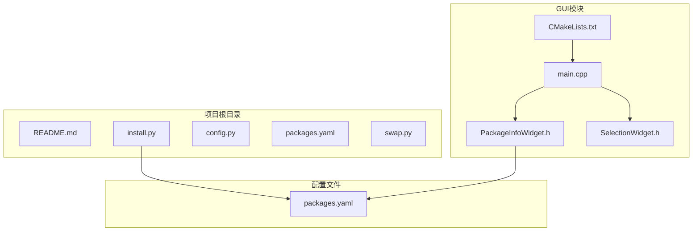
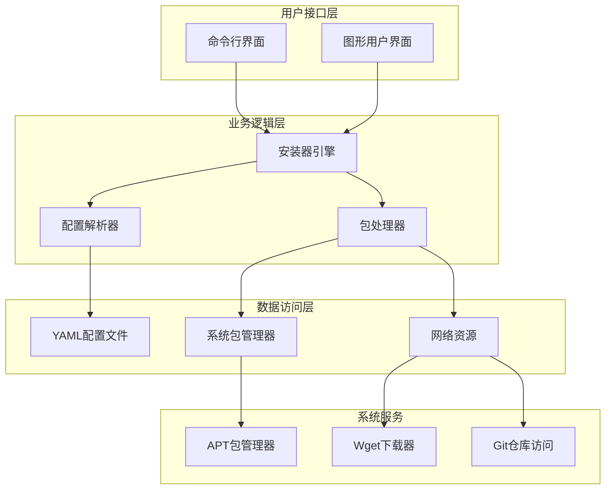
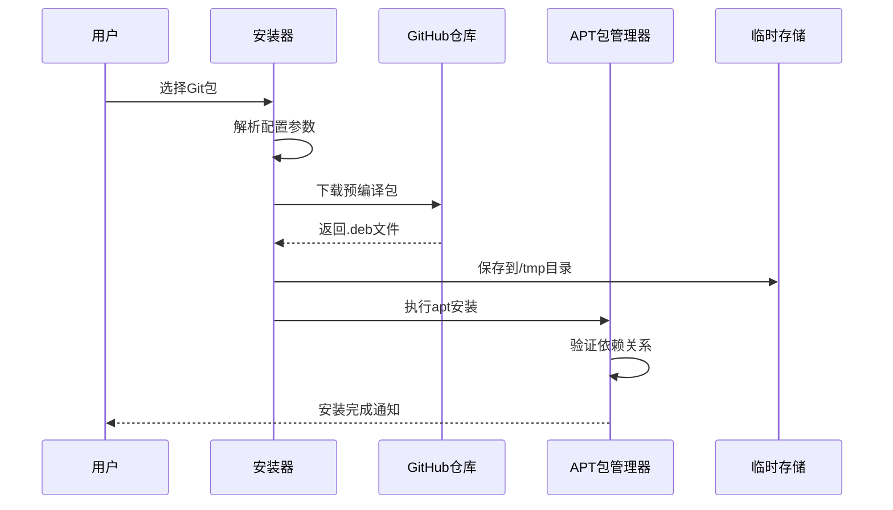
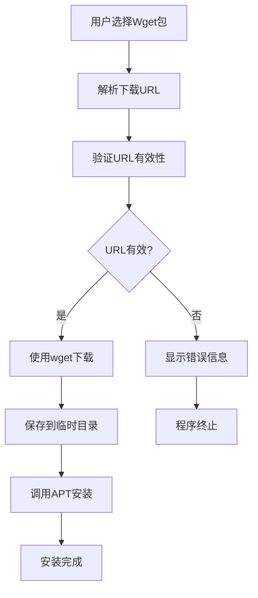
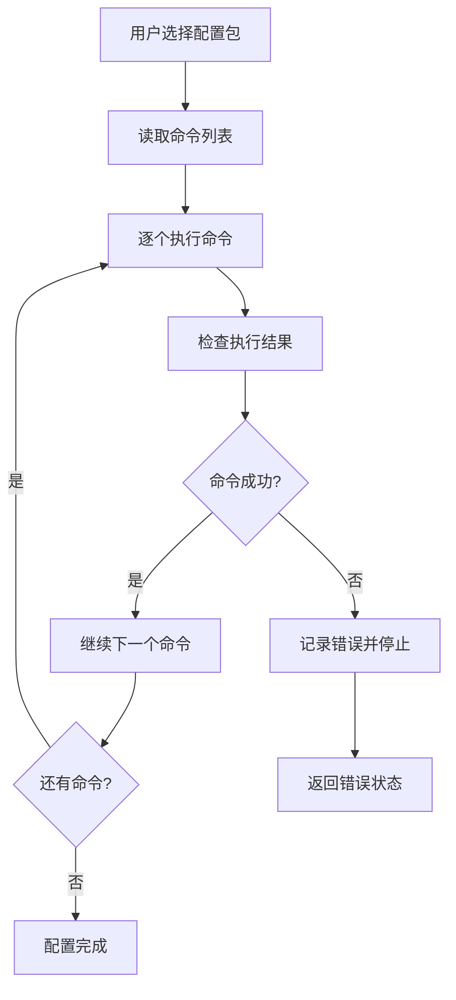
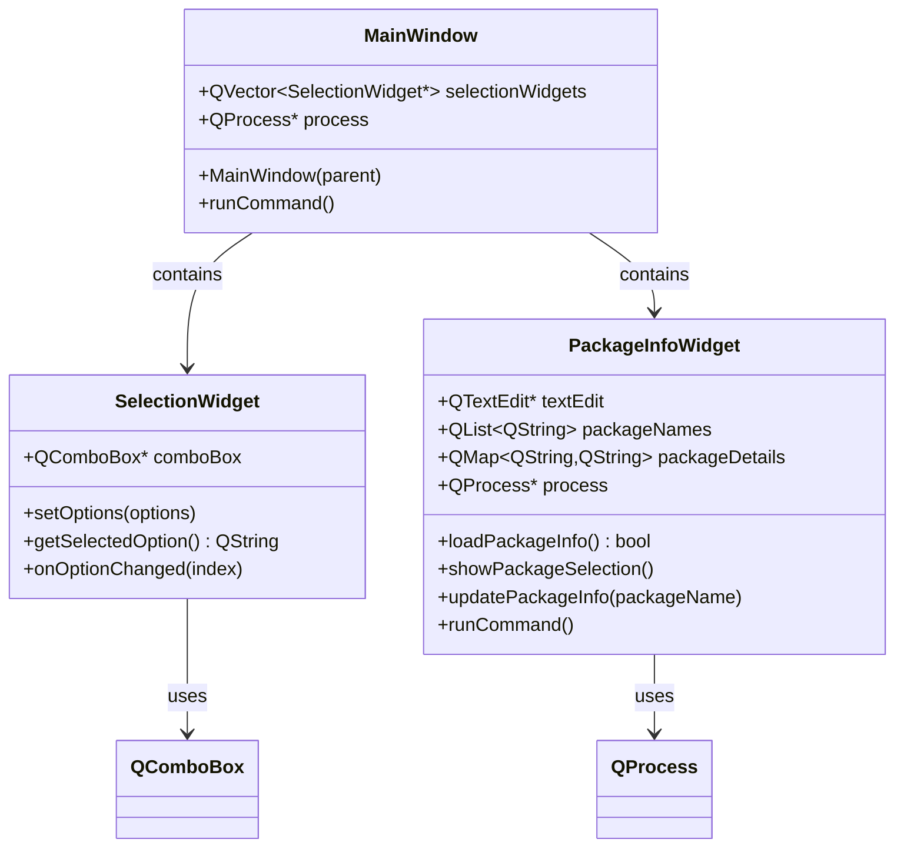
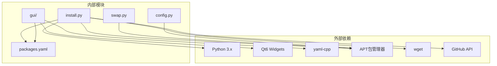

# 软件包管理系统

<cite>
**本文档引用的文件**
- [README.md](file://README.md)
- [install.py](file://install.py)
- [config.py](file://config.py)
- [packages.yaml](file://packages.yaml)
- [swap.py](file://swap.py)
- [CMakeLists.txt](file://gui/CMakeLists.txt)
- [main.cpp](file://gui/main.cpp)
- [PackageInfoWidget.h](file://gui/PackageInfoWidget.h)
- [SelectionWidget.h](file://gui/SelectionWidget.h)
</cite>

## 目录
1. [简介](#简介)
2. [项目结构](#项目结构)
3. [核心组件](#核心组件)
4. [架构概览](#架构概览)
5. [详细组件分析](#详细组件分析)
6. [依赖关系分析](#依赖关系分析)
7. [性能考虑](#性能考虑)
8. [故障排除指南](#故障排除指南)
9. [结论](#结论)
10. [附录](#附录)

## 简介

这是一个多功能的软件包管理系统，提供了多种软件包安装方式和用户界面。系统支持三种主要的软件包类型：Git包、Wget包和配置包。通过统一的配置文件管理，用户可以轻松安装各种开源工具和应用程序。

该系统的核心功能包括：
- Git包安装器：从GitHub仓库下载预编译的.deb包并自动安装
- Wget包安装器：直接从指定URL下载.deb包进行安装
- 配置包处理器：执行自定义的系统配置命令
- 图形用户界面：提供直观的软件包选择和安装体验

## 项目结构

项目采用模块化设计，包含Python脚本、YAML配置文件和Qt图形界面组件。



**图表来源**
- [README.md:1-7](file://README.md#L1-L7)
- [install.py:1-36](file://install.py#L1-L36)
- [packages.yaml:1-50](file://packages.yaml#L1-L50)

**章节来源**
- [README.md:1-7](file://README.md#L1-L7)
- [CMakeLists.txt:1-26](file://gui/CMakeLists.txt#L1-L26)

## 核心组件

### 主要功能模块

系统由以下核心组件构成：

1. **安装器引擎** (`install.py`)
   - 处理不同类型的软件包安装
   - 解析YAML配置文件
   - 提供交互式菜单界面

2. **配置管理** (`packages.yaml`)
   - 定义软件包清单和安装参数
   - 支持多种软件包类型配置

3. **图形界面** (`gui/`目录)
   - Qt-based用户界面
   - 包信息展示和选择
   - 实时命令执行和输出显示

4. **辅助工具**
   - 交换空间管理 (`swap.py`)
   - SSL证书配置 (`config.py`)

**章节来源**
- [install.py:1-36](file://install.py#L1-L36)
- [packages.yaml:1-50](file://packages.yaml#L1-L50)

## 架构概览

系统采用分层架构设计，实现了清晰的关注点分离。



**图表来源**
- [install.py:4-16](file://install.py#L4-L16)
- [packages.yaml:1-50](file://packages.yaml#L1-L50)

## 详细组件分析

### Git包安装器实现

Git包安装器专门处理从GitHub仓库下载预编译.deb包的流程。

#### 工作流程



**图表来源**
- [install.py:5-10](file://install.py#L5-L10)

#### 关键实现细节

Git包安装器的工作原理：
1. **URL构建**：根据配置中的URL、版本和包名构建GitHub releases下载链接
2. **下载机制**：使用wget工具从GitHub镜像站点下载预编译包
3. **安装流程**：将下载的包移动到临时目录并调用APT包管理器进行安装
4. **版本控制**：严格匹配配置文件中指定的版本号

**章节来源**
- [install.py:5-10](file://install.py#L5-L10)

### Wget包安装器实现

Wget包安装器提供直接从任意URL下载和安装.deb包的功能。

#### 数据流图



**图表来源**
- [install.py:27-29](file://install.py#L27-L29)

#### 实现特点

Wget包安装器的优势：
- **灵活性**：支持任意HTTP(S) URL
- **简单性**：无需复杂的版本管理
- **通用性**：适用于各种官方软件源

**章节来源**
- [install.py:27-33](file://install.py#L27-L33)

### 配置包处理器

配置包处理器用于执行自定义的系统配置命令。

#### 命令执行流程



**图表来源**
- [install.py:11-13](file://install.py#L11-L13)

**章节来源**
- [install.py:11-13](file://install.py#L11-L13)

### packages.yaml配置文件详解

packages.yaml是系统的核心配置文件，定义了所有可安装软件包的信息。

#### 配置文件结构

| 字段名称 | 类型 | 必需 | 描述 |
|---------|------|------|------|
| type | string | 是 | 软件包类型（git/wget/config） |
| name | string | 否 | Git包的文件名 |
| des | string | 是 | 软件包描述信息 |
| url | string | 是 | 下载URL或仓库地址 |
| version | string | 否 | 版本号（仅Git包需要） |
| cmd | array | 否 | 命令列表（仅config包需要） |

#### 配置示例分析

**Git包配置示例**：
```yaml
DevSidecar:
  type: git
  name: DevSidecar-2.0.0-linux-amd64.deb
  des: A github tool.
  url: https://ghproxy.cn/https://github.com/docmirror/dev-sidecar
  version: v2.0.0
```

**Wget包配置示例**：
```yaml
Code:
  type: wget
  des: VisualStudioCode.
  url: https://vscode.download.prss.microsoft.com/dbazure/download/stable/5c5d3ac991df8f1e2b73c3959c77857ac25f9644/code_1.115.0-1744517356_amd64.deb
```

**配置包示例**：
```yaml
GrubConfig:
  type: config
  des: 设置默认启动项为保存的上一次启动项
  cmd:
    - echo "GRUB_SAVEDEFAULT=true" | sudo tee -a /etc/default/grub
    - echo "GRUB_DEFAULT=saved" | sudo tee -a /etc/default/grub
    - sudo update-grub
```

**章节来源**
- [packages.yaml:1-50](file://packages.yaml#L1-L50)

### 图形用户界面组件

系统提供了基于Qt的图形用户界面，增强了用户体验。

#### 组件架构



**图表来源**
- [main.cpp:7-42](file://main.cpp#L7-L42)
- [PackageInfoWidget.h:18-44](file://gui/PackageInfoWidget.h#L18-L44)
- [SelectionWidget.h:8-19](file://gui/SelectionWidget.h#L8-L19)

#### GUI功能特性

1. **包信息展示**：实时显示软件包的详细信息
2. **交互式选择**：提供下拉菜单选择软件包
3. **命令执行**：集成命令行执行和输出显示
4. **错误处理**：友好的错误提示和异常处理

**章节来源**
- [main.cpp:1-73](file://main.cpp#L1-L73)
- [PackageInfoWidget.h:1-145](file://gui/PackageInfoWidget.h#L1-L145)
- [SelectionWidget.h:1-40](file://gui/SelectionWidget.h#L1-L40)

## 依赖关系分析

系统依赖关系清晰，模块间耦合度低。



**图表来源**
- [CMakeLists.txt:9-13](file://gui/CMakeLists.txt#L9-L13)
- [install.py:1-2](file://install.py#L1-L2)

**章节来源**
- [CMakeLists.txt:1-26](file://gui/CMakeLists.txt#L1-L26)
- [install.py:1-36](file://install.py#L1-L36)

## 性能考虑

### 内存使用优化

- **延迟加载**：GUI组件按需初始化，减少内存占用
- **资源管理**：及时释放QProcess等系统资源
- **配置缓存**：YAML配置文件一次性加载到内存

### 网络性能

- **并发下载**：当前实现串行下载，可考虑并发优化
- **缓存策略**：重复下载相同包时可添加缓存机制
- **超时设置**：为网络请求设置合理的超时时间

### 安装性能

- **依赖解析**：APT安装前进行依赖检查
- **进度反馈**：提供安装进度和状态更新
- **回滚机制**：安装失败时的清理和恢复

## 故障排除指南

### 常见问题及解决方案

#### 1. GitHub访问问题

**症状**：Git包下载失败
**原因**：网络连接或GitHub访问限制
**解决方案**：
- 检查网络连接状态
- 验证GitHub URL的有效性
- 使用GitHub代理服务（如ghproxy）

#### 2. 权限不足问题

**症状**：安装过程中出现权限错误
**原因**：缺少sudo权限
**解决方案**：
- 确保以管理员权限运行
- 检查sudo配置
- 验证APT包管理器权限

#### 3. YAMl配置错误

**症状**：配置文件解析失败
**原因**：YAML格式错误或字段缺失
**解决方案**：
- 使用在线YAML验证器
- 检查缩进和格式
- 验证必需字段完整性

#### 4. GUI组件问题

**症状**：图形界面无法正常显示
**原因**：Qt依赖未正确安装
**解决方案**：
- 检查Qt6开发环境
- 验证yaml-cpp库安装
- 确认系统图形环境

### 错误处理机制

系统实现了多层次的错误处理：

1. **输入验证**：检查用户输入的有效性
2. **网络检测**：验证网络连接状态
3. **权限检查**：确保足够的系统权限
4. **资源监控**：跟踪系统资源使用情况
5. **异常捕获**：优雅处理各种异常情况

**章节来源**
- [install.py:14-15](file://install.py#L14-L15)
- [PackageInfoWidget.h:82-85](file://gui/PackageInfoWidget.h#L82-L85)

## 结论

这个软件包管理系统提供了完整而灵活的软件包安装解决方案。通过支持多种安装方式和提供直观的用户界面，系统能够满足不同用户的需求。

### 主要优势

1. **多格式支持**：同时支持Git、Wget和配置三种安装方式
2. **配置灵活**：通过YAML文件实现高度可定制的配置
3. **用户友好**：提供命令行和图形界面两种操作模式
4. **扩展性强**：易于添加新的软件包类型和安装流程

### 改进建议

1. **增强错误处理**：添加更详细的错误报告和恢复机制
2. **性能优化**：实现并发下载和安装功能
3. **安全增强**：添加包签名验证和完整性检查
4. **日志系统**：建立完整的操作日志和审计功能

## 附录

### 使用示例

#### 添加新的Git包

```yaml
NewPackage:
  type: git
  name: package-name-version.deb
  des: 新软件包描述
  url: https://github.com/user/repo
  version: v1.0.0
```

#### 添加新的Wget包

```yaml
NewPackage:
  type: wget
  des: 新软件包描述
  url: https://example.com/package.deb
```

#### 添加新的配置包

```yaml
SystemConfig:
  type: config
  des: 系统配置说明
  cmd:
    - command1
    - command2
    - command3
```

### 自定义安装流程

要添加新的软件包类型，需要：

1. 在`install.py`中添加新的处理分支
2. 更新`packages.yaml`的配置结构
3. 在GUI中添加相应的界面组件
4. 实现错误处理和状态反馈