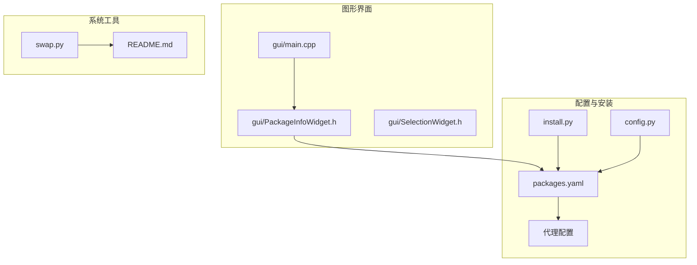
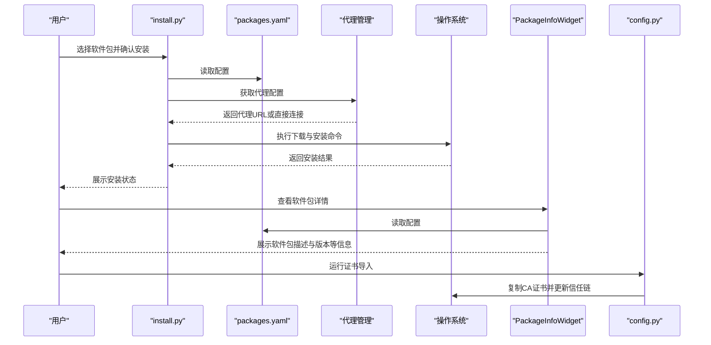
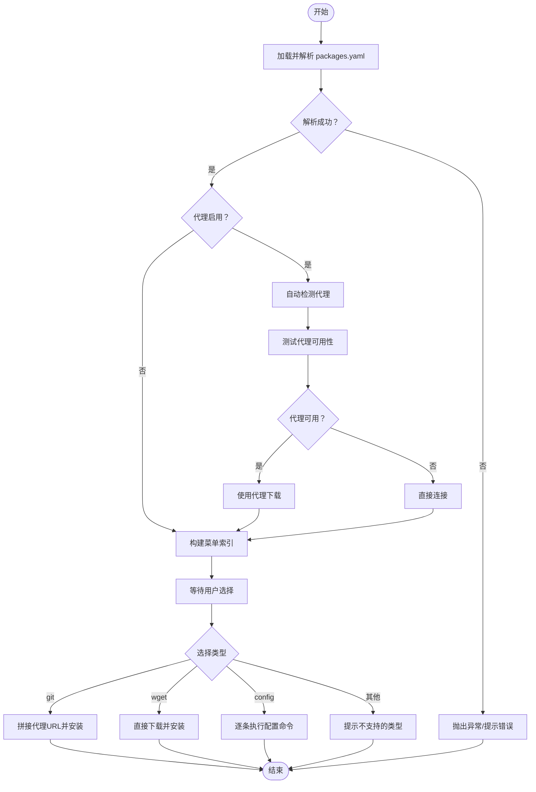
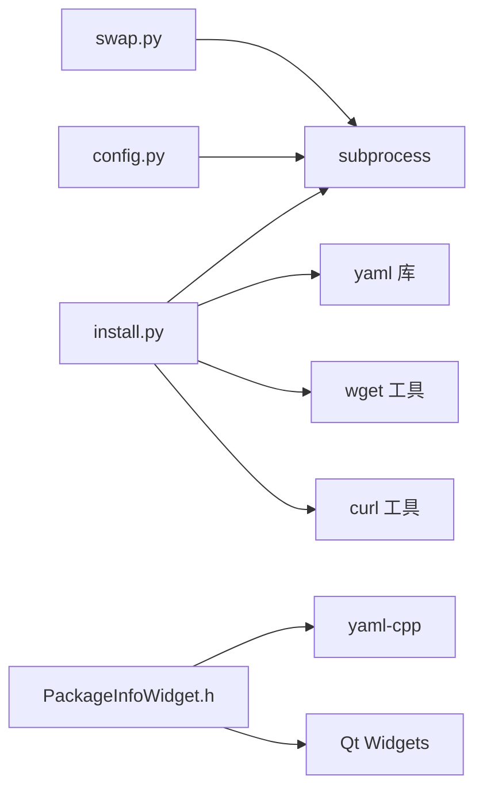

# 配置管理

<cite>
**本文引用的文件**
- [packages.yaml](file://packages.yaml)
- [config.py](file://config.py)
- [install.py](file://install.py)
- [README.md](file://README.md)
- [swap.py](file://swap.py)
- [gui/main.cpp](file://gui/main.cpp)
- [gui/PackageInfoWidget.h](file://gui/PackageInfoWidget.h)
- [gui/SelectionWidget.h](file://gui/SelectionWidget.h)
</cite>

## 更新摘要
**变更内容**
- 新增代理配置结构（proxy配置），包含13个代理URL、启用状态控制、当前代理索引等功能
- 更新多个软件包版本信息，包括ClashVergeRev、LocalSend、BalenaEtcher、Microsoft Edge、Utools等
- 新增代理自动检测、切换和管理功能
- 增强软件包配置的网络访问能力

## 目录
1. [简介](#简介)
2. [项目结构](#项目结构)
3. [核心组件](#核心组件)
4. [架构总览](#架构总览)
5. [详细组件分析](#详细组件分析)
6. [依赖分析](#依赖分析)
7. [性能考虑](#性能考虑)
8. [故障排查指南](#故障排查指南)
9. [结论](#结论)
10. [附录](#附录)

## 简介
本文件系统性梳理 Install 项目的配置管理方案，重点覆盖以下内容：
- packages.yaml 配置文件的结构与语法规则，涵盖软件包配置字段、参数取值范围与组合方式
- **新增**：代理配置结构（proxy配置）的设计与使用方法
- 配置文件的加载机制与验证规则（Python 与 Qt/C++ 两套实现）
- config.py 中证书配置功能与使用方法
- 完整配置示例与最佳实践、常见错误与调试技巧

## 项目结构
项目采用"配置驱动 + 脚本执行"的轻量级安装流程设计，核心文件如下：
- packages.yaml：软件包清单与安装策略的集中配置，**新增代理配置结构**
- install.py：命令行安装器，负责解析配置并执行安装或配置命令，**新增代理管理功能**
- config.py：证书导入脚本，用于将自签 CA 证书注入系统信任链
- gui 子目录：基于 Qt 的图形界面组件，可读取 packages.yaml 并展示软件包信息
- swap.py：系统交换分区初始化工具（与配置管理相关但独立）

**图表来源**
- [install.py:1-235](file://install.py#L1-L235)
- [packages.yaml:1-58](file://packages.yaml#L1-L58)
- [config.py:1-8](file://config.py#L1-L8)
- [gui/main.cpp:1-73](file://gui/main.cpp#L1-L73)
- [gui/PackageInfoWidget.h:1-145](file://gui/PackageInfoWidget.h#L1-L145)
- [gui/SelectionWidget.h:1-40](file://gui/SelectionWidget.h#L1-L40)
- [swap.py:1-10](file://swap.py#L1-L10)
- [README.md:1-7](file://README.md#L1-L7)

**章节来源**
- [install.py:1-235](file://install.py#L1-L235)
- [packages.yaml:1-58](file://packages.yaml#L1-L58)
- [config.py:1-8](file://config.py#L1-L8)
- [gui/main.cpp:1-73](file://gui/main.cpp#L1-L73)
- [gui/PackageInfoWidget.h:1-145](file://gui/PackageInfoWidget.h#L1-L145)
- [gui/SelectionWidget.h:1-40](file://gui/SelectionWidget.h#L1-L40)
- [swap.py:1-10](file://swap.py#L1-L10)
- [README.md:1-7](file://README.md#L1-L7)

## 核心组件
- packages.yaml：定义软件包清单与安装策略，支持两类安装类型：
  - git：通过 GitHub Releases 下载指定版本的二进制包并安装
  - config：执行一组预定义的系统配置命令
  - **新增**：proxy：代理配置，包含代理URL列表、启用状态、当前代理索引等
- install.py：命令行安装器，负责加载 YAML、构建菜单、根据用户选择调用安装逻辑，**新增代理管理功能**
- config.py：证书导入脚本，将特定 CA 证书复制到系统信任目录并更新证书缓存
- gui 子系统：Qt 组件，从 packages.yaml 加载软件包信息并在界面中展示

**章节来源**
- [packages.yaml:1-58](file://packages.yaml#L1-L58)
- [install.py:1-235](file://install.py#L1-L235)
- [config.py:1-8](file://config.py#L1-L8)
- [gui/PackageInfoWidget.h:53-88](file://gui/PackageInfoWidget.h#L53-L88)

## 架构总览
下图展示了配置文件、安装器与图形界面之间的交互关系，以及证书配置在系统中的作用位置，**新增代理配置的动态管理流程**。

**图表来源**
- [install.py:100-136](file://install.py#L100-L136)
- [packages.yaml:1-58](file://packages.yaml#L1-L58)
- [gui/PackageInfoWidget.h:53-88](file://gui/PackageInfoWidget.h#L53-L88)
- [config.py:3-6](file://config.py#L3-L6)

## 详细组件分析

### packages.yaml 配置规范
- 文件格式：YAML
- 结构要点：
  - **新增**：proxy 顶级节点，包含代理配置
  - 每个顶级键代表一个软件包标识（如 ClashVergeRev、LocalSend 等）
  - 常用字段：
    - type：安装类型，支持 git、config、wget
    - name：软件包文件名（用于下载与安装）
    - des：软件包描述（用于展示）
    - url：下载地址或仓库地址（根据 type 决定具体含义）
    - version：版本号（仅当 type 为 git 时使用）
    - cmd：一组命令列表（仅当 type 为 config 时使用）
- **新增**：代理配置字段：
  - enabled：布尔值，控制代理是否启用
  - current_index：整数，表示当前使用的代理索引
  - urls：字符串数组，包含13个代理URL
- 字段约束与取值建议：
  - type 必填且必须为 git、config 或 wget
  - git 类型需提供 name、url、version
  - config 类型需提供 cmd 列表
  - **新增**：代理配置的 urls 数组长度固定为13个
  - des 与 url 为可选，但建议填写以提升可读性
- 示例参考：
  - git 类型示例：见 [packages.yaml:18-23](file://packages.yaml#L18-L23)
  - config 类型示例：见 [packages.yaml:52-57](file://packages.yaml#L52-L57)
  - **新增**：代理配置示例：见 [packages.yaml:1-17](file://packages.yaml#L1-L17)

**章节来源**
- [packages.yaml:1-58](file://packages.yaml#L1-L58)

### 代理配置结构详解
- **新增**：代理配置位于文件顶部，包含以下字段：
  - enabled：布尔值，默认true，控制代理功能是否启用
  - current_index：整数，默认0，表示当前使用的代理索引
  - urls：字符串数组，包含13个代理URL，其中第0个为空字符串表示直接连接
- **新增**：代理管理功能：
  - 自动检测：find_working_proxy 函数会自动测试可用代理
  - 手动切换：switch_proxy 函数允许用户选择代理
  - 状态切换：toggle_proxy 函数可以启用/禁用代理
  - 实时更新：代理切换后会自动更新配置文件

**章节来源**
- [packages.yaml:1-17](file://packages.yaml#L1-L17)
- [install.py:6-87](file://install.py#L6-L87)
- [install.py:138-180](file://install.py#L138-L180)

### 配置加载机制与验证规则
- Python 安装器（install.py）：
  - 使用 YAML 解析器加载配置
  - **新增**：代理配置的动态加载与管理
  - 构建菜单索引与描述映射
  - 根据 type 分派处理逻辑：git、config 或 wget
  - **新增**：git 类型安装时自动应用代理配置
  - 对未知类型输出提示信息
- Qt 图形界面（PackageInfoWidget）：
  - 从 packages.yaml 读取并解析 YAML
  - 提取 name、des、url、version 字段并缓存
  - 异常捕获：对 YAML 解析异常进行错误提示
- 验证规则：
  - 必填字段缺失将导致解析失败或运行时错误
  - type 不在支持集合内会触发提示
  - **新增**：代理配置的索引有效性检查
  - 建议在配置中保持字段命名一致性与缩进规范

**图表来源**
- [install.py:4-16](file://install.py#L4-L16)
- [install.py:55-87](file://install.py#L55-L87)
- [install.py:100-136](file://install.py#L100-L136)
- [gui/PackageInfoWidget.h:64-85](file://gui/PackageInfoWidget.h#L64-L85)

**章节来源**
- [install.py:4-16](file://install.py#L4-L16)
- [install.py:55-87](file://install.py#L55-L87)
- [install.py:100-136](file://install.py#L100-L136)
- [gui/PackageInfoWidget.h:53-88](file://gui/PackageInfoWidget.h#L53-L88)

### config.py 证书配置功能
- 功能概述：将特定路径下的 CA 证书与私钥复制到系统受信证书目录，并更新系统证书缓存
- 使用场景：当使用自签证书或代理服务需要系统信任特定 CA 时
- 执行步骤：
  1) 复制 CA 证书至系统受信目录
  2) 复制 CA 私钥至系统受信目录
  3) 更新系统证书缓存
- 注意事项：
  - 需要管理员权限
  - 建议在安装前备份原证书缓存
  - 确保目标路径存在且具有写权限

**章节来源**
- [config.py:3-6](file://config.py#L3-L6)

### 完整配置示例与最佳实践
- 示例一：git 类型（GitHub Releases）
  - 参考路径：[packages.yaml:18-23](file://packages.yaml#L18-L23)
  - 关键点：type 为 git；name、url、version 必填；安装器会按模板拼接下载链接
- 示例二：config 类型（系统配置命令）
  - 参考路径：[packages.yaml:52-57](file://packages.yaml#L52-L57)
  - 关键点：type 为 config；cmd 为命令列表；安装器会逐条执行
- **新增**：代理配置示例
  - 参考路径：[packages.yaml:1-17](file://packages.yaml#L1-L17)
  - 关键点：enabled 控制代理开关；current_index 指定当前代理；urls 包含13个代理URL
- **新增**：软件包版本更新示例
  - ClashVergeRev: v2.4.7
  - LocalSend: v1.17.0
  - BalenaEtcher: v2.1.0
  - Microsoft Edge: 135.0.3179.73
  - Utools: 7.7.0
- 最佳实践：
  - 保持 YAML 缩进一致，避免混合空格与制表符
  - 为每个软件包提供清晰的 des 描述
  - git 类型的 version 应与 GitHub Releases 版本一致
  - config 类型的命令应具备幂等性，避免重复执行造成副作用
  - **新增**：代理配置的 urls 数组应保持13个元素，第0个为空字符串表示直接连接
  - **新增**：定期测试代理可用性，确保网络访问稳定性
  - 在变更配置后，先在测试环境中验证安装流程

**章节来源**
- [packages.yaml:1-58](file://packages.yaml#L1-L58)
- [install.py:4-16](file://install.py#L4-L16)

## 依赖分析
- install.py 依赖：
  - YAML 解析库：用于读取 packages.yaml
  - subprocess：用于执行系统命令
  - **新增**：代理测试功能依赖 wget 和 curl 工具
- gui/PackageInfoWidget 依赖：
  - yaml-cpp：用于解析 YAML
  - Qt Widgets：用于界面展示与事件处理
- config.py 依赖：
  - subprocess：用于执行系统命令
- swap.py 与 README.md：
  - 与配置管理无直接耦合，但作为系统准备工具与使用说明存在关联

**图表来源**
- [install.py:1-2](file://install.py#L1-L2)
- [gui/PackageInfoWidget.h:12](file://gui/PackageInfoWidget.h#L12)
- [config.py:1](file://config.py#L1)
- [swap.py:1](file://swap.py#L1)

**章节来源**
- [install.py:1-2](file://install.py#L1-L2)
- [gui/PackageInfoWidget.h:12](file://gui/PackageInfoWidget.h#L12)
- [config.py:1](file://config.py#L1)
- [swap.py:1](file://swap.py#L1)

## 性能考虑
- YAML 解析开销：packages.yaml 规模较小，解析成本可忽略
- **新增**：代理检测开销：自动代理检测会增加网络请求，但只在git类型安装时触发
- 命令执行时间：git 类型安装涉及网络下载与 apt 安装，整体耗时主要由网络与包体积决定
- GUI 渲染：PackageInfoWidget 在首次加载时一次性解析并缓存软件包信息，后续展示无额外解析开销
- **新增**：代理配置持久化：代理切换会实时更新配置文件，避免重复配置
- 建议：
  - 将大型软件包的下载源切换为更稳定的镜像或本地缓存
  - 对 config 类型命令进行分组与去重，减少重复执行
  - **新增**：合理配置代理URL列表，优先放置可用性高的代理
  - **新增**：定期清理不可用的代理URL，优化代理检测效率

## 故障排查指南
- YAML 解析错误
  - 现象：安装器或 GUI 报错，无法读取配置
  - 排查：检查缩进、特殊字符与字段拼写；确保使用一致的缩进方式
  - 参考：[install.py:18](file://install.py#L18)、[gui/PackageInfoWidget.h:64-85](file://gui/PackageInfoWidget.h#L64-L85)
- 字段缺失或类型不匹配
  - 现象：运行时报错或安装器提示不支持的类型
  - 排查：确认 type、name、url、version、cmd 等字段是否齐全且符合预期
  - 参考：[install.py:4-16](file://install.py#L4-L16)
- **新增**：代理配置错误
  - 现象：代理功能异常或下载失败
  - 排查：检查 proxy.enabled、proxy.current_index、proxy.urls 配置；验证代理URL可用性
  - 参考：[install.py:6-22](file://install.py#L6-L22)、[install.py:138-180](file://install.py#L138-L180)
- **新增**：代理检测失败
  - 现象：自动代理检测超时或失败
  - 排查：检查网络连接；验证 wget 和 curl 工具可用性；手动测试代理URL
  - 参考：[install.py:25-52](file://install.py#L25-L52)
- 权限问题
  - 现象：安装或证书导入失败
  - 排查：确认当前用户具备 sudo 权限；检查目标路径权限
  - 参考：[config.py:3-6](file://config.py#L3-L6)
- 网络与下载失败
  - 现象：git 类型安装中断
  - 排查：更换下载源、检查代理设置、确认版本号与文件名匹配
  - 参考：[install.py:9](file://install.py#L9)
- GUI 无法显示软件包信息
  - 现象：界面空白或报错
  - 排查：确认 packages.yaml 路径正确；检查文件权限与编码
  - 参考：[gui/PackageInfoWidget.h:53-88](file://gui/PackageInfoWidget.h#L53-L88)

**章节来源**
- [install.py:4-16](file://install.py#L4-L16)
- [install.py:18](file://install.py#L18)
- [install.py:6-22](file://install.py#L6-L22)
- [install.py:25-52](file://install.py#L25-L52)
- [config.py:3-6](file://config.py#L3-L6)
- [gui/PackageInfoWidget.h:53-88](file://gui/PackageInfoWidget.h#L53-L88)

## 结论
本项目通过 packages.yaml 将软件包配置与安装逻辑解耦，配合 install.py 与 Qt GUI 实现了简洁高效的安装体验。**新增的代理配置功能**进一步增强了网络访问能力，支持自动代理检测、手动切换和状态管理。config.py 提供了证书导入能力，满足企业或开发环境对自签证书的信任需求。遵循本文档的配置规范与最佳实践，可显著降低配置复杂度与维护成本。

## 附录
- 快速参考
  - git 类型：type=git，必填 name、url、version
  - config 类型：type=config，必填 cmd 列表
  - **新增**：代理配置：proxy.enabled 控制开关，proxy.current_index 指定当前代理，proxy.urls 包含13个代理URL
  - 建议：为每个软件包提供 des 描述，保持 YAML 缩进一致
  - **新增**：代理配置的 urls 数组应保持13个元素，第0个为空字符串表示直接连接
- 相关文件
  - packages.yaml：软件包清单与安装策略，**包含代理配置**
  - install.py：命令行安装器，**包含代理管理功能**
  - config.py：证书导入脚本
  - gui/PackageInfoWidget.h：图形界面解析与展示
  - swap.py：系统交换分区初始化（与配置管理独立）