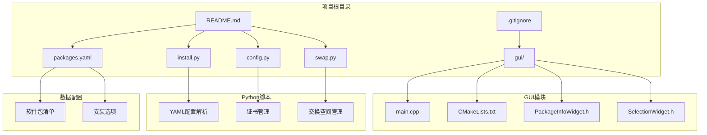
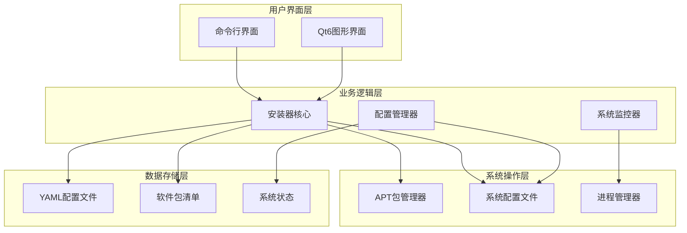
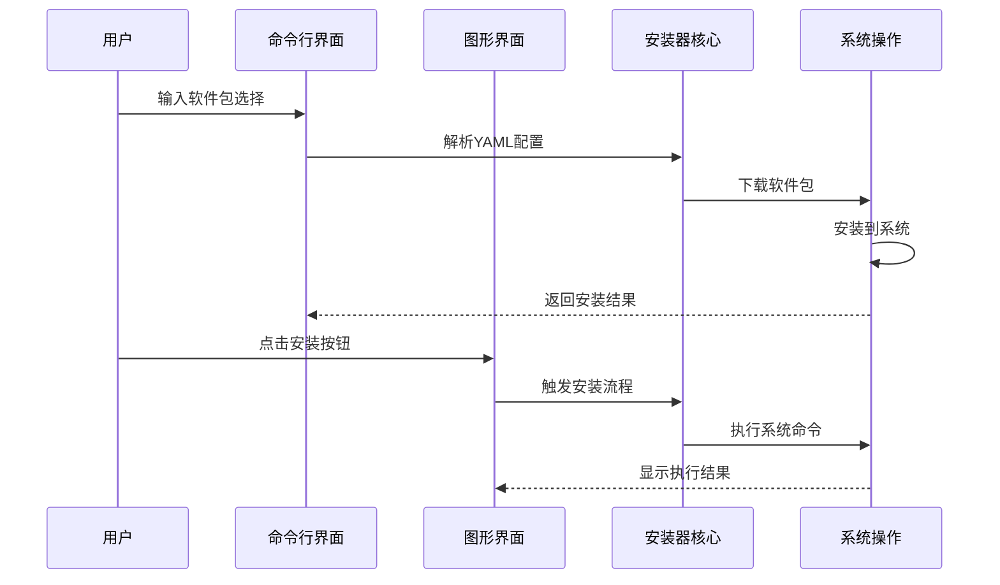
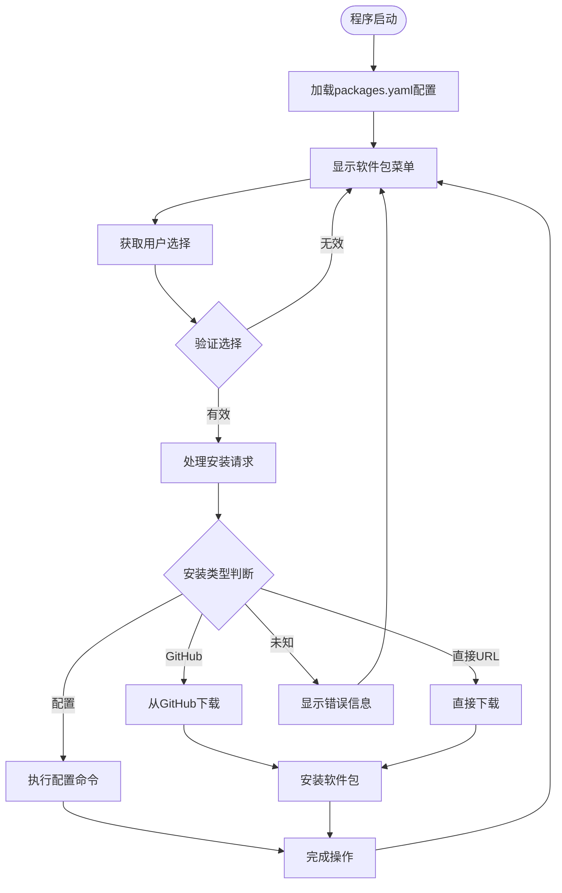
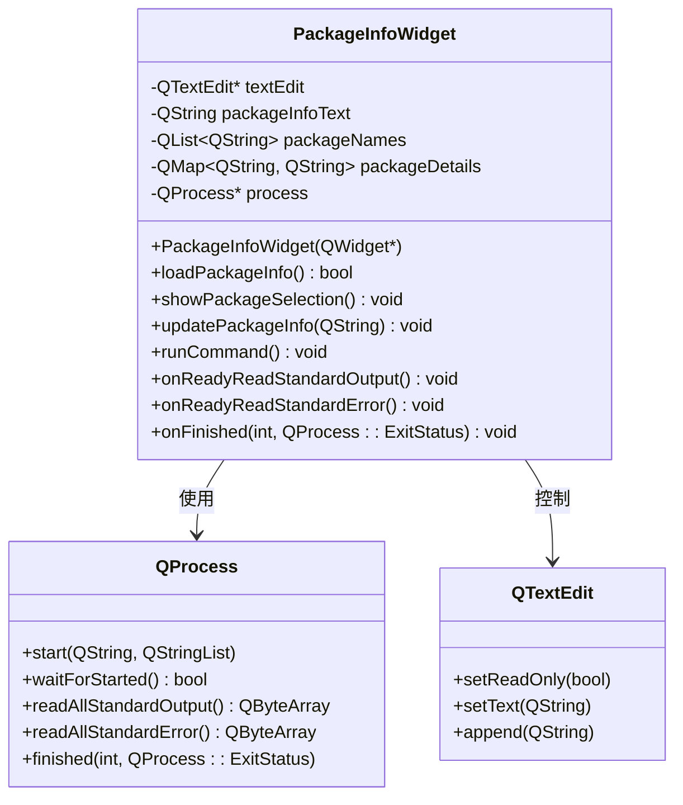
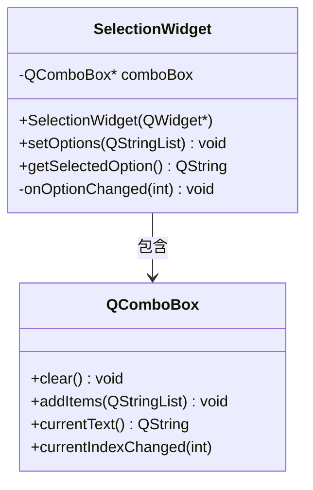
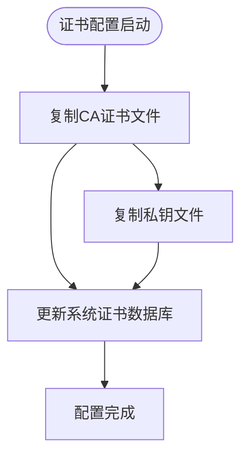
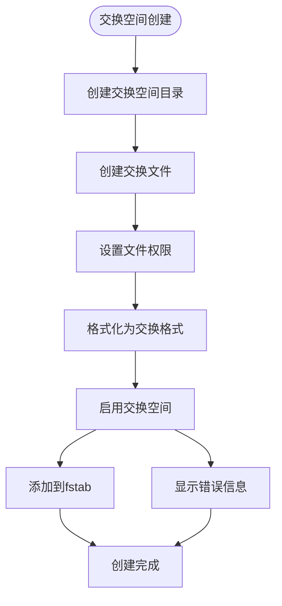
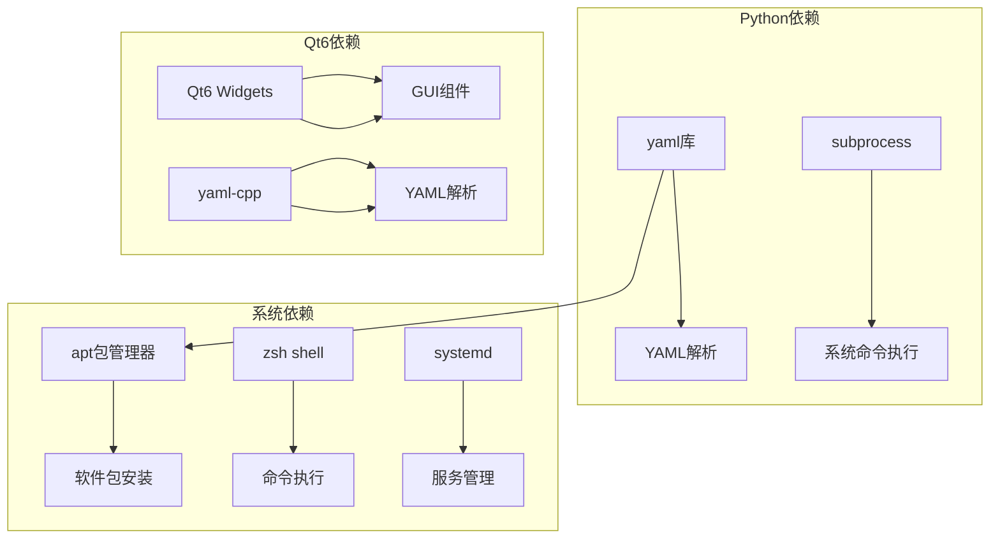
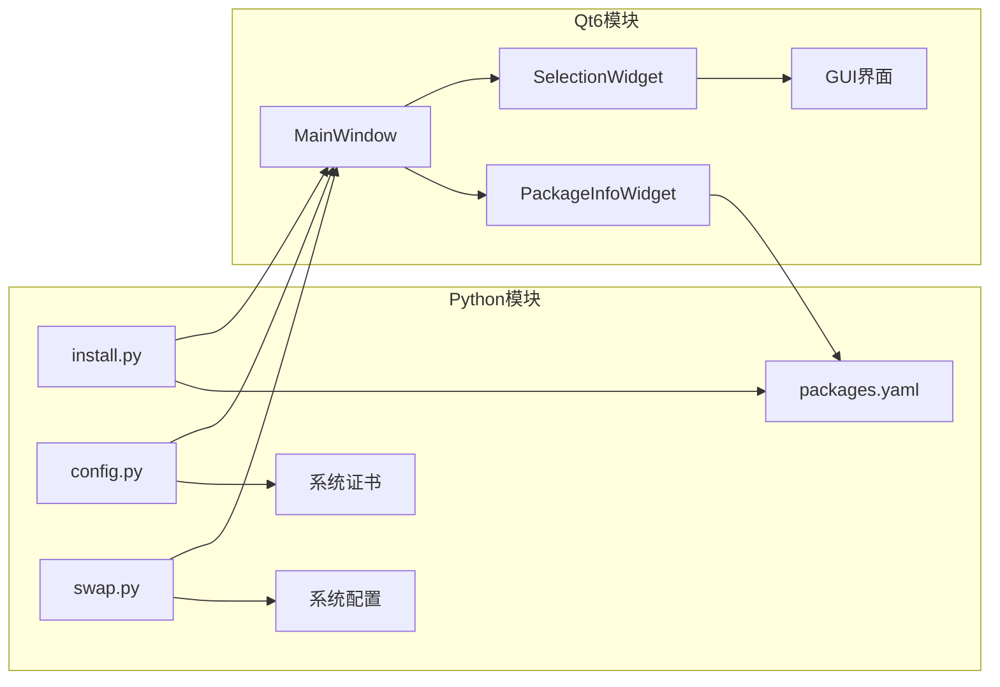

# 项目概述

<cite>
**本文档引用的文件**
- [README.md](file://README.md)
- [.gitignore](file://.gitignore)
- [install.py](file://install.py)
- [config.py](file://config.py)
- [swap.py](file://swap.py)
- [packages.yaml](file://packages.yaml)
- [gui/main.cpp](file://gui/main.cpp)
- [gui/CMakeLists.txt](file://gui/CMakeLists.txt)
- [gui/PackageInfoWidget.h](file://gui/PackageInfoWidget.h)
- [gui/SelectionWidget.h](file://gui/SelectionWidget.h)
</cite>

## 目录
1. [简介](#简介)
2. [项目结构](#项目结构)
3. [核心组件](#核心组件)
4. [架构概览](#架构概览)
5. [详细组件分析](#详细组件分析)
6. [依赖关系分析](#依赖关系分析)
7. [性能考虑](#性能考虑)
8. [故障排除指南](#故障排除指南)
9. [结论](#结论)

## 简介

Install项目是一个基于Python和Qt6的Linux桌面应用程序，旨在简化软件包安装和系统配置管理。该项目提供了两种主要的用户交互方式：命令行界面（CLI）和图形用户界面（GUI），使不同技术水平的用户都能方便地管理系统软件包和配置。

### 项目目的

Install项目的核心目标是为Linux用户提供一个统一的工具集，用于：
- 从GitHub和直接URL安装软件包
- 管理系统配置设置
- 管理交换空间（Swap）配置
- 配置系统证书

### 目标用户群体

- **Linux系统管理员**：需要批量管理软件包和系统配置的专业用户
- **开发人员**：需要快速安装开发工具和IDE的程序员
- **普通用户**：希望简化软件安装过程的非技术用户
- **系统集成商**：需要自动化部署解决方案的技术人员

### 核心功能特性

1. **多源软件包安装**：支持从GitHub releases和直接URL下载安装
2. **系统配置管理**：通过YAML配置文件管理各种系统设置
3. **交换空间管理**：自动创建和配置虚拟内存
4. **证书配置**：管理CA证书和SSL证书
5. **双界面支持**：CLI和GUI两种操作模式

## 项目结构

项目采用模块化设计，分为Python脚本和Qt6 GUI两大部分：

**图表来源**
- [README.md:1-7](file://README.md#L1-L7)
- [gui/CMakeLists.txt:1-26](file://gui/CMakeLists.txt#L1-L26)

**章节来源**
- [README.md:1-7](file://README.md#L1-L7)
- [.gitignore:1-164](file://.gitignore#L1-L164)

## 核心组件

### Python核心组件

项目的核心功能由三个主要Python脚本实现：

1. **install.py**：主安装程序，处理软件包选择和安装流程
2. **config.py**：系统配置管理脚本
3. **swap.py**：交换空间管理脚本

### GUI组件

Qt6 GUI部分包含以下关键组件：

1. **PackageInfoWidget**：显示软件包信息和处理安装操作
2. **SelectionWidget**：提供下拉选择界面
3. **MainWindow**：主窗口控制器

**章节来源**
- [install.py:1-36](file://install.py#L1-L36)
- [config.py:1-8](file://config.py#L1-L8)
- [swap.py:1-10](file://swap.py#L1-L10)

## 架构概览

Install项目采用分层架构设计，清晰分离了用户界面、业务逻辑和系统操作：

**图表来源**
- [install.py:4-16](file://install.py#L4-L16)
- [gui/main.cpp:7-42](file://gui/main.cpp#L7-L42)

### 控制流架构

**图表来源**
- [install.py:17-36](file://install.py#L17-L36)
- [gui/PackageInfoWidget.h:109-127](file://gui/PackageInfoWidget.h#L109-L127)

## 详细组件分析

### 安装器核心组件

#### install.py - 主安装程序

install.py实现了完整的软件包安装流程，支持多种安装类型：

**图表来源**
- [install.py:4-16](file://install.py#L4-L16)
- [install.py:17-36](file://install.py#L17-L36)

#### packages.yaml - 软件包配置

packages.yaml文件定义了所有可安装的软件包及其属性：

| 字段名称 | 类型 | 描述 | 示例值 |
|---------|------|------|--------|
| type | 字符串 | 安装类型 | git, wget, config |
| name | 字符串 | 软件包名称 | DevSidecar-2.0.0-linux-amd64.deb |
| des | 字符串 | 软件包描述 | A github tool. |
| url | 字符串 | 下载地址或GitHub仓库 | https://github.com/docmirror/dev-sidecar |
| version | 字符串 | 版本号 | v2.0.0 |
| cmd | 数组 | 配置命令列表 | update-grub等 |

**章节来源**
- [install.py:4-16](file://install.py#L4-L16)
- [packages.yaml:1-50](file://packages.yaml#L1-L50)

### GUI组件分析

#### PackageInfoWidget - 软件包信息显示

PackageInfoWidget是GUI系统的核心组件，负责：

1. **YAML文件解析**：使用yaml-cpp库解析packages.yaml
2. **软件包信息展示**：动态生成软件包详情
3. **安装流程控制**：触发系统命令执行
4. **实时输出显示**：显示命令执行结果

**图表来源**
- [gui/PackageInfoWidget.h:18-145](file://gui/PackageInfoWidget.h#L18-L145)

#### SelectionWidget - 选择组件

SelectionWidget提供简单的下拉选择功能：

**图表来源**
- [gui/SelectionWidget.h:8-40](file://gui/SelectionWidget.h#L8-L40)

**章节来源**
- [gui/PackageInfoWidget.h:18-145](file://gui/PackageInfoWidget.h#L18-L145)
- [gui/SelectionWidget.h:8-40](file://gui/SelectionWidget.h#L8-L40)

### 系统管理组件

#### config.py - 系统配置管理

config.py专门用于管理系统的CA证书配置：

**图表来源**
- [config.py:3-7](file://config.py#L3-L7)

#### swap.py - 交换空间管理

swap.py实现了完整的交换空间管理功能：

**图表来源**
- [swap.py:3-9](file://swap.py#L3-L9)

**章节来源**
- [config.py:1-8](file://config.py#L1-L8)
- [swap.py:1-10](file://swap.py#L1-L10)

## 依赖关系分析

### 外部依赖

项目依赖于以下关键外部组件：

**图表来源**
- [gui/CMakeLists.txt:9-13](file://gui/CMakeLists.txt#L9-L13)
- [install.py:1-2](file://install.py#L1-L2)

### 内部模块依赖

**图表来源**
- [gui/main.cpp:4-5](file://gui/main.cpp#L4-L5)
- [gui/PackageInfoWidget.h:12](file://gui/PackageInfoWidget.h#L12)

**章节来源**
- [gui/CMakeLists.txt:1-26](file://gui/CMakeLists.txt#L1-L26)
- [install.py:1-36](file://install.py#L1-L36)

## 性能考虑

### 代码性能优化

1. **异步处理**：GUI组件使用QProcess进行异步命令执行
2. **内存管理**：合理使用智能指针和对象生命周期管理
3. **I/O优化**：批量读取和写入配置文件

### 系统资源管理

1. **进程监控**：实时监控系统命令执行状态
2. **资源清理**：自动清理临时文件和进程资源
3. **错误恢复**：提供完善的错误处理和恢复机制

## 故障排除指南

### 常见问题及解决方案

#### 安装问题

| 问题症状 | 可能原因 | 解决方案 |
|---------|---------|---------|
| 软件包无法下载 | 网络连接问题 | 检查网络连接，使用代理服务器 |
| 权限不足 | 缺少sudo权限 | 确保以root权限运行 |
| 依赖冲突 | 系统依赖版本不兼容 | 更新系统包管理器 |

#### GUI界面问题

| 问题症状 | 可能原因 | 解决方案 |
|---------|---------|---------|
| 界面无响应 | 进程阻塞 | 检查后台进程状态 |
| 组件显示异常 | Qt库版本不匹配 | 更新Qt6库 |
| YAML解析错误 | 配置文件格式错误 | 验证YAML语法 |

#### 系统配置问题

| 问题症状 | 可能原因 | 解决方案 |
|---------|---------|---------|
| 证书配置失败 | 文件路径错误 | 检查证书文件存在性 |
| 交换空间创建失败 | 磁盘空间不足 | 清理磁盘空间 |
| 配置修改未生效 | 权限不足 | 重新应用配置 |

**章节来源**
- [install.py:14-15](file://install.py#L14-L15)
- [gui/PackageInfoWidget.h:82-85](file://gui/PackageInfoWidget.h#L82-L85)

## 结论

Install项目是一个功能完整、架构清晰的Linux系统管理工具。它成功地结合了Python的易用性和Qt6的强大GUI能力，为用户提供了直观的软件包安装和系统管理体验。

### 主要优势

1. **多平台支持**：同时支持命令行和图形界面操作
2. **灵活配置**：通过YAML文件轻松管理软件包和配置
3. **系统集成**：深度集成Linux系统功能
4. **扩展性强**：模块化设计便于功能扩展

### 技术特色

- **双入口设计**：满足不同用户需求
- **异步处理**：提供流畅的用户体验
- **错误处理**：完善的异常处理机制
- **配置驱动**：通过配置文件管理功能

### 发展建议

1. **增强日志系统**：添加详细的操作日志记录
2. **添加进度指示**：为长时间操作提供进度反馈
3. **国际化支持**：添加多语言界面支持
4. **插件系统**：允许第三方扩展功能

Install项目为Linux系统管理提供了一个优秀的解决方案，既适合初学者使用，又为高级用户提供了足够的灵活性和控制力。